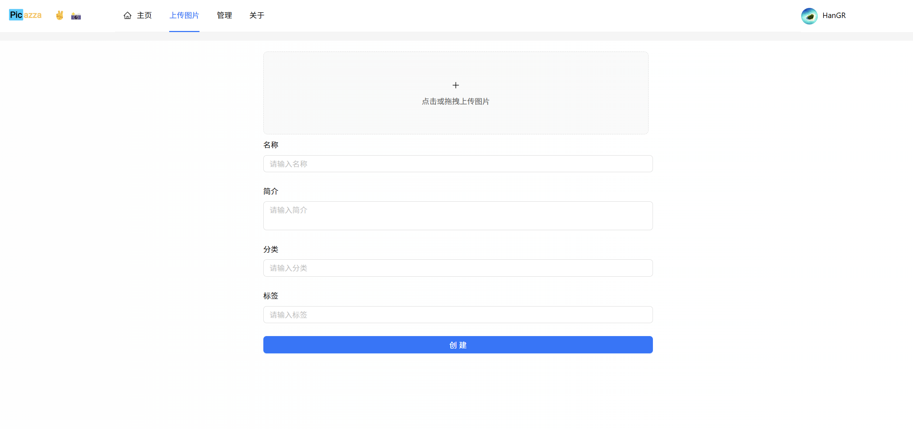
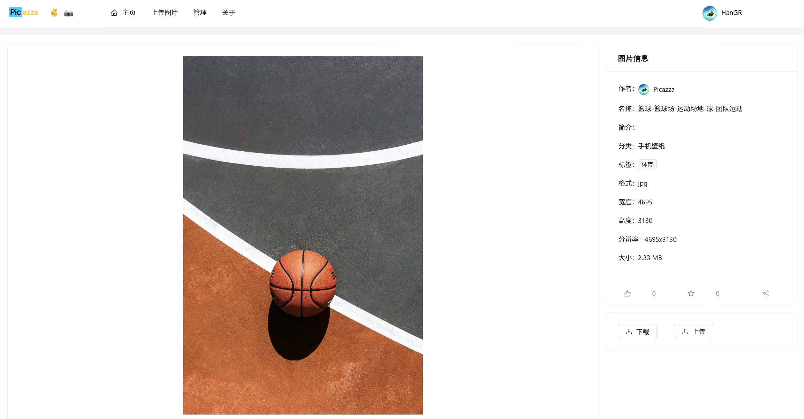

 

### 背景

之前已经开发了一个简单的浏览器扩展插件，现在我又有新需求了,所以想要重新开发一个插件。

### 需求

- 浏览网页时想清除浏览记录,但不能清除所有浏览记录,只想清除当前标签页的浏览记录
- 使用无痕浏览器也可以,但是每次都需要登录,不太方便,所以不想清除cookie,只想清除浏览记录

### 功能

- 关闭当前标签页,自动清除该标签页的浏览记录
- 可添加域名白名单,白名单内的域名不会被清除浏览记录
- 可设置关闭浏览器时自动清除浏览记录
- 可根据浏览器语言自动切换语言
- 
- 
- 

### 安装

- [edge 浏览器 - Tab Eraser](https://microsoftedge.microsoft.com/addons/detail/tab-eraser/llibhfpkecjddfdbjoacpgeglgenmbji)
- [chrome 浏览器 - Tab Eraser](https://chromewebstore.google.com/detail/tab-eraser/amacdkkhoacejnfdlplfalgmmbhodiik)

### 项目地址

- [Tab Eraser](https://github.com/Han-GR/Browser-Extensions/tree/master/Tab%20Eraser)
- 现在合集里面已经有两个插件了, 以后我还会继续更新
- 要是有什么问题,欢迎提issue
- 要是对你有帮助,欢迎star
