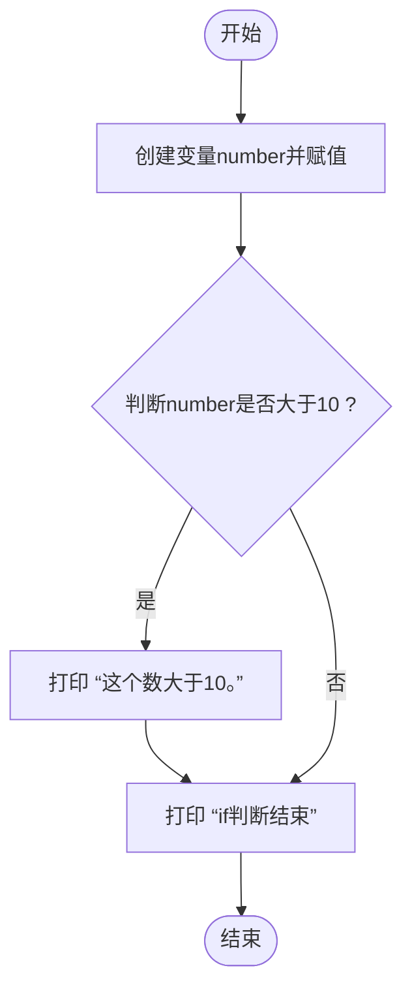
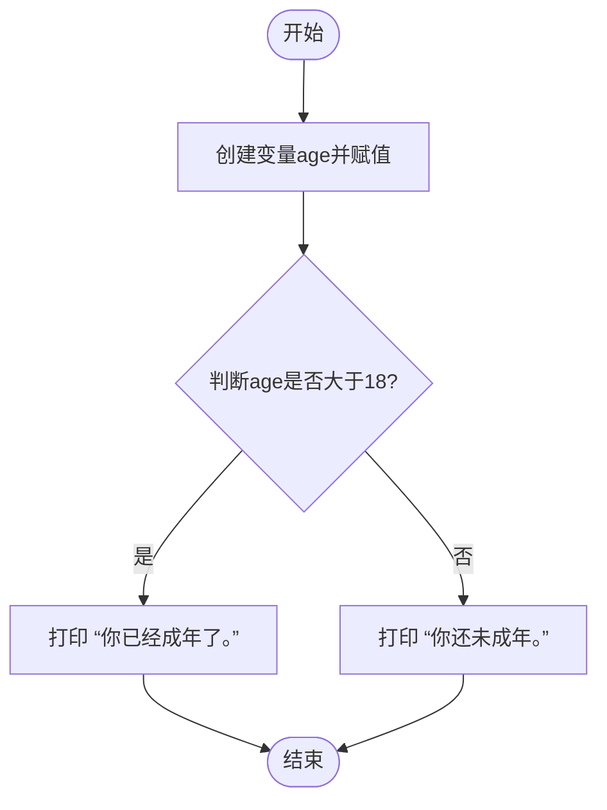

### 流程控制-选择结构

> Python的流程控制是编程中非常重要的一部分，它决定了程序如何根据不同的条件执行不同的代码块。在Python中，流程控制主要包括三种结构：顺序结构、选择结构（条件结构）和循环结构。这里我们重点详解选择结构（条件结构）。 选择结构允许程序根据条件判断来执行不同的代码块。Python中使用`if`、`elif`（else if的缩写）、`else`关键字来实现选择结构。

### if语句

> Python中的`if`选择结构（也称为条件结构）是一种基本的流程控制语句，它允许程序根据条件的真假来决定执行哪个代码块。下面我将详细解释`if`选择结构的语法参数，并提供案例代码和进阶案例来确保各个知识点得到充分描述。

#### 单分支选择结构

> Python中的`if`单分支选择结构是一种基本的流程控制语句，它允许程序根据条件的真假来决定是否执行某个代码块。当条件为真（True）时，执行`if`语句下的代码块；当条件为假（False）时，则跳过该代码块，继续执行`if`语句之后的代码。

##### 语法：

```python
if 条件表达式:  
    # 条件为真时执行的代码块  
    # 注意：这里的代码块需要缩进  
    pass
```

-   **条件表达式**：这是一个返回布尔值（True或False）的表达式。它可以是任何可以计算为布尔值的Python表达式，包括比较运算符（如`==`、`!=`、`<`、`>`、`<=`、`>=`）、逻辑运算符（如`and`、`or`、`not`）以及复杂的表达式组合。
-   **代码块**：如果条件表达式为真，则执行该代码块。在Python中，代码块的开始是通过缩进来表示的，而不是使用大括号（`{}`）或其他关键字。
-   **`pass`**：是一个占位符，表示什么都不做。在上面的语法中，`pass`是可选的，通常用于表示这里将会有一些代码，但目前还没有写。在实际应用中，你会用具体的语句替换`pass`。

##### 代码案例

```python
number = 15  
  
# 检查number是否大于10  
if number > 10:  
    # 如果条件为真（即number确实大于10），则执行以下代码块  
    print("这个数大于10。")  
print('if判断结束')
# 注意：如果number不大于10，则不会执行上面的print语句，程序会继续执行if语句之后的代码
```

##### 代码解释

在这个例子中，`number`的值是15，它大于10，所以条件表达式`number > 10`为真。因此，Python会执行`if`语句下的代码块，即打印出“这个数大于10。然后打印if判断结束，但是如果条件表达式不为真的话也会打印if判断结束，因为这段语句不在if判断中。

##### 流程图




#### 双分支选择结构

> Python的`if`双分支选择结构是一种流程控制语句，它允许程序根据条件的真假来决定执行两个可能的代码块之一。具体来说，如果条件为真（True），则执行`if`语句下的代码块；如果条件为假（False），则执行`else`语句下的代码块。

##### 语法：

```python
if 条件表达式:  
    # 条件为真时执行的代码块  
    # 注意：这里的代码块需要缩进  
    pass  
else:  
    # 条件为假时执行的代码块  
    # 同样，这里的代码块也需要缩进  
    pass
```

-   **条件表达式**：与单分支`if`结构相同，这是一个返回布尔值（True或False）的表达式。
-   **`if`代码块**：如果条件表达式为真，则执行该代码块。
-   **`else`代码块**：如果条件表达式为假，则执行该代码块。
-   **缩进**：Python使用缩进来定义代码块的范围，这是Python语法的重要部分。在`if`和`else`语句后，紧跟的下一行（以及随后的行，直到缩进结束）构成了相应的代码块。

##### 代码案例

```python
age = 20  # 设置年龄为20  
  
# 如果年龄大于等于18：  
if age >= 18:    
    # 打印“你已经成年了。”  
    print("你已经成年了。")    
# 否则：  
else:    
    # 打印“你还未成年。”  
    print("你还未成年。")
```

##### 代码解释：

`age` 被设置为 20，因此条件 `age >= 18` 是真的，所以程序会执行 `if` 代码块中的 `print("你已经成年了。")` 语句，输出“你已经成年了。”。`else` 代码块中的语句则不会被执行。

##### 流程图



#### 多条件选择结构

> Python的`if`多分支选择结构是一种更加灵活的条件控制语句，它允许程序根据多个条件的真假来决定执行不同的代码块。在`if`多分支结构中，通常会结合使用`if`、`elif`（else if的缩写）和`else`语句来实现多条件判断。

##### 语法：

```python
if 条件表达式1:  
    # 条件表达式1为真时执行的代码块  
    pass  
elif 条件表达式2:  
    # 条件表达式1为假且条件表达式2为真时执行的代码块  
    pass  
# 可以继续添加更多的elif语句来检查更多的条件  
elif 条件表达式N:  
    # 条件表达式1到条件表达式N-1都为假，且条件表达式N为真时执行的代码块  
    pass  
else:  
    # 所有前面的条件表达式都为假时执行的代码块  
    pass
```

-   **条件表达式**：这是返回布尔值（True或False）的表达式。程序会按照`if`、`elif`、`else`的顺序检查每个条件表达式，直到找到一个为真的表达式。
-   **`if`代码块**：如果第一个条件表达式为真，则执行该代码块，并忽略后面的所有`elif`和`else`代码块。
-   **`elif`代码块**（可选）：如果前面的`if`条件为假，程序会检查每个`elif`条件。一旦找到为真的`elif`条件，就执行对应的代码块，并忽略后面的所有`elif`和`else`代码块。
-   **`else`代码块**（可选）：如果所有的`if`和`elif`条件都为假，则执行`else`代码块。如果没有`else`语句，并且所有条件都不满足，则不执行任何操作。
-   **缩进**：Python使用缩进来定义代码块的范围。每个`if`、`elif`、`else`语句后跟随的下一行（以及随后的行，直到缩进结束）构成了相应的代码块。

##### 代码案例

```python
score = 85  # 分数为85  
  
# 如果分数大于等于90：  
if score >= 90:    
    # 打印“优秀”  
    print("优秀")    
# 否则，如果分数大于等于80：  
elif score >= 80:    
    # 打印“良好”  
    print("良好")    
# 否则，如果分数大于等于60：  
elif score >= 60:    
    # 打印“及格”  
    print("及格")    
# 否则：  
else:    
    # 打印“不及格”  
    print("不及格")
```

##### 代码解释

`score`的值是85。程序首先检查`score >= 90`是否为真，发现不是，于是继续检查`score >= 80`。因为85确实大于等于80，所以这个条件为真，程序执行对应的`print("良好")`语句，并忽略后面的`elif`和`else`代码块。

#### 嵌套if选择结构

> Python中的嵌套`if`语句指的是在一个`if`语句或`elif`语句的代码块内部再使用`if`语句。这种结构允许你在满足某个条件的基础上进一步细化条件判断。嵌套`if`语句可以非常灵活地处理复杂的逻辑条件。

##### 语法

```python
if 条件表达式1:  
    # 条件表达式1为真时执行的代码块  
    # 可以在这里嵌套另一个if语句  
    if 条件表达式2:  
        # 条件表达式1和条件表达式2都为真时执行的代码块  
        pass  
    # 条件表达式1为真，但条件表达式2为假时，可以继续执行这里的代码  
    pass  
# 条件表达式1为假时，跳过整个内嵌的代码块，继续执行后面的代码
```

##### 代码案例

```python
# 假设有一个人的年龄和学生身份  
age = 20  
is_student = True  
  
# 首先判断年龄是否小于18岁  
if age < 18:  
    print("未成年人，需要监护人陪同。")  
    # 如果年龄小于18岁，则不再进行后续判断  
else:  
    # 年龄大于等于18岁，进行进一步判断  
    # 判断是否为学生  
    if is_student:  
        # 如果是学生  
        print("学生优惠：享受8折优惠。")  
    else:  
        # 如果不是学生  
        if age < 60:  
            # 如果年龄在18到59岁之间  
            print("普通优惠：享受9折优惠。")  
        else:  
            # 如果年龄大于等于60岁  
            print("老年优惠：享受7折优惠。")
```

##### **代码解释**

1.  首先，我们定义了两个人的属性：`age`（年龄）和`is_student`（是否为学生）。
2.  接着，我们使用了一个`if`语句来判断年龄是否小于18岁。如果是，则打印出未成年人需要监护人陪同的信息，并且不再进行后续的判断（因为没有嵌套`if`）。
3.  如果年龄不小于18岁，则进入`else`代码块。在`else`代码块中，我们首先使用了一个嵌套的`if`语句来判断这个人是否为学生。如果是学生，则打印出学生优惠的信息。
4.  如果这个人不是学生，则我们再次使用了一个`if-else`结构来判断他的年龄是否小于60岁。如果是，则打印出普通优惠的信息；如果不是（即年龄大于等于60岁），则打印出老年优惠的信息。

#### match匹配模式

> Python中的`match`语句是Python 3.10及以后版本中引入的一个新特性，它提供了一种更直观、更强大的方式来执行模式匹配（pattern matching）。`match`语句允许你根据值的结构或类型来执行不同的代码块，这在处理复杂数据结构或进行条件分支时特别有用。

##### 语法

```python
match subject:  
    case pattern1:  
        # 如果subject匹配pattern1，则执行这里的代码  
        ...  
    case pattern2:  
        # 如果subject匹配pattern2，则执行这里的代码  
        ...  
    case pattern3 if guard:  
        # 如果subject匹配pattern3且满足guard条件，则执行这里的代码  
        ...  
    case _:  
        # 如果subject不匹配以上任何模式，则执行这里的代码（类似于default）  
        ...
```

##### 字面量匹配

字面量匹配是最简单的匹配模式，它直接比较值是否相等。

```python
# 字面量匹配  
# 定义一个变量number并将其赋值为42  
number = 42  
  
# 使用match语句来匹配number的值  
match number:  
    # 如果number的值等于42，则执行这个case块  
    case 42:  # 这里匹配的是字面量42  
        # 打印结果  
        print("The answer to life, the universe, and everything.")  # 这是当匹配成功时执行的结果  
      
    # 如果number的值不是42，则执行这个case块，_代表任何不匹配前面的case的值  
    case _:  # 这是一个通配符，用于匹配所有其他情况  
        # 打印不是答案的提示  
        print("Not the answer.")  
  
# 输出: The answer to life, the universe, and everything.
```

`match`语句检查`number`变量的值，并根据它是否等于42来执行不同的代码块。如果`number`等于42，它将打印出“The answer to life, the universe, and everything.”，否则，它将打印出“Not the answer.”。

##### 变量模式

变量模式会将匹配的值赋给变量，以便在后续的代码块中使用。

```python
# 变量模式  
# 定义一个变量value并将其赋值为10  
value = 10  
  
# 使用match语句来匹配value的值，但这里实际上是捕获所有可能的值并将其赋给变量x  
match value:  
    case x:  # 匹配任意值，并将这个值赋给变量x  
        # 使用变量x来格式化并打印结果  
        print(f"The value is {x}")  # 这将打印出变量x的值，即value的值  
  
# 输出: The value is 10
```

`match`语句实际上只有一个`case`，它匹配所有可能的值（因为这里只有一个模式，即变量`x`，它会捕获所有传入的值）。因此，无论`value`变量的值是什么，它都会被赋给变量`x`，并在接下来的代码块中使用。在这个特定的例子中，`value`被设置为10，所以`x`也被设置为10，并且程序会打印出“The value is 10

##### 类实例匹配

类实例匹配允许你根据类的实例来匹配，并可以进一步访问实例的属性或方法。

```python
# 类实例匹配  
# 定义一个Point类，它有两个属性x和y  
class Point:    
    def __init__(self, x, y):    
        # 在初始化时，将传入的x和y值分别赋给实例的x和y属性  
        self.x = x    
        self.y = y    
    
# 创建一个Point类的实例，传入3和4作为x和y的值  
point = Point(3, 4)    
  
# 使用match语句来匹配point实例  
# 注意：这里的Point(x, y)是结构化模式匹配，要求point是一个Point类的实例，并且其x和y属性的值能够被捕获到变量x和y中  
match point:    
    case Point(x, y):  # 匹配Point类的实例，并捕获其x和y属性的值到变量x和y中  
        # 使用捕获到的x和y变量的值来打印出点的坐标  
        print(f"Point at ({x}, {y})")    
    
# 输出: Point at (3, 4)
```

##### 序列匹配

序列匹配允许你匹配列表、元组等序列类型的数据，并可以捕获序列中的元素。

```python
# 序列匹配  
# 定义一个名为coordinates的元组，包含两个元素3和4  
coordinates = (3, 4)  
  
# 使用match语句来匹配coordinates元组  
# case (x, y): 这一行匹配一个元组，并假设元组中有两个元素，这两个元素将被分别捕获到变量x和y中  
match coordinates:    
    case (x, y):  # 匹配一个元组，并捕获其前两个元素到变量x和y  
        # 使用捕获到的变量x和y来打印出元组的值  
        print(f"x: {x}, y: {y}")    
    
# 输出: x: 3, y: 4
```

`match`语句用于检查`coordinates`元组是否匹配`(x, y)`这个模式，其中`x`和`y`是待捕获的变量。由于`coordinates`确实是一个包含两个元素的元组，所以匹配成功，并且这两个元素分别被赋值给`x`和`y`，然后程序打印出这两个变量的值。

##### 映射匹配

映射匹配允许你匹配字典等映射类型的数据，并可以捕获键对应的值。

```python
# 映射匹配  
# 定义一个名为person的字典，包含两个键值对："name" 对应 "Alice"，"age" 对应 30  
person = {"name": "Alice", "age": 30}  
  
# 使用match语句来匹配person字典  
# case {"name": name, "age": age}: 这一行匹配一个字典，它必须包含键"name"和"age"，并将这两个键对应的值捕获到变量name和age中  
match person:    
    case {"name": name, "age": age}:  # 匹配字典，并捕获name和age键对应的值到变量name和age  
        # 使用捕获到的变量name和age来打印出字典中的值  
        print(f"Name: {name}, Age: {age}")    
    
# 输出: Name: Alice, Age: 30
```

`match`语句用于检查`person`字典是否匹配一个特定的模式，该模式是一个包含`"name"`和`"age"`两个键的字典，并且这两个键的值将被捕获到同名的变量`name`和`age`中。由于`person`字典确实符合这个模式，匹配成功，并且这两个键的值（即`"Alice"`和`30`）被分别赋值给变量`name`和`age`，然后程序打印出这两个变量的值。

##### 星号表达式（\*rest）

在序列匹配中，星号表达式用于捕获剩余的元素。

```python
# 星号表达式  
# 定义一个名为numbers的列表，包含五个元素：1, 2, 3, 4, 5  
numbers = [1, 2, 3, 4, 5]  
  
# 使用match语句来匹配numbers列表  
# case [first, *rest]: 这一行使用了星号表达式来捕获列表的第一个元素到变量first中，并将剩余的元素捕获到一个名为rest的新列表中  
match numbers:    
    case [first, *rest]:  # 捕获列表的第一个元素到first，并将剩余的元素作为列表捕获到rest  
        # 使用捕获到的变量first和rest来打印出第一个元素和剩余的元素  
        print(f"First: {first}, Rest: {rest}")    
    
# 输出: First: 1, Rest: [2, 3, 4, 5]
```

`match`语句用于检查`numbers`列表是否匹配一个特定的模式，该模式是一个列表，它首先捕获列表的第一个元素到变量`first`中，然后使用星号表达式`*rest`来捕获列表中剩余的所有元素到一个新的列表`rest`中。由于`numbers`列表确实符合这个模式，匹配成功，并且第一个元素`1`被赋值给变量`first`，而剩余的元素`[2, 3, 4, 5]`被捕获并作为一个新的列表赋值给变量`rest`，然后程序打印出这两个变量的值。

##### 守卫（Guards）

守卫是与模式关联的额外条件，用于进一步限制匹配。

```python
# 守卫  
# 定义一个名为number的变量，并将其赋值为10  
number = 10  
  
# 使用match语句来匹配number的值  
# case n if n > 5: 这一行是一个带有守卫的case，它首先检查变量n（在这里n就是number的值）是否大于5  
# 如果条件为真（即number大于5），则执行该case下的代码块  
match number:    
    case n if n > 5:  # 匹配大于5的n  
        # 如果number大于5，则打印这条消息  
        print("Number is greater than 5")    
    # case _: 是一个通配符模式，它会匹配任何未被前面case捕获的值  
    # 在这个例子中，如果number不大于5，则会执行这个case下的代码块  
    case _:    
        # 如果number不大于5（但在这个例子中，由于number是10，所以不会执行到这里）  
        # 则打印这条消息  
        print("Number is not greater than 5")    
    
# 输出: Number is greater than 5  
# 因为number的值是10，大于5，所以第一个case匹配成功，并打印出相应的消息。
```

`match`语句通过带有守卫的`case`来检查`number`的值是否大于5。由于`number`的值是10，大于5，所以第一个`case`匹配成功，并执行了相应的代码块，打印出了“Number is greater than 5”。如果`number`的值不大于5，那么第一个`case`将不匹配，此时会检查下一个`case`，即通配符模式`case _:`，但在这个例子中，由于第一个`case`已经匹配成功，所以不会执行到那里。

##### 联合模式（使用`|`）

从Python 3.10开始，联合模式允许你在单个`case`中指定多个模式。

```python
# 联合模式  
# 定义一个名为shape的变量，并将其赋值为"circle"  
shape = "circle"  
  
# 使用match语句来匹配shape变量的值  
# match语句检查shape的值，并与各个case中的模式进行匹配  
# case "square" | "rectangle": 这一行使用了联合模式，它表示匹配"square"或"rectangle"中的任意一个  
match shape:    
    case "square" | "rectangle":    
        # 如果shape的值是"square"或"rectangle"，则执行这里的代码块  
        # 但在这个例子中，shape的值是"circle"，所以不会执行到这里  
        print("Rectangle-ish shape")    
    case "circle":    
        # 如果shape的值是"circle"，则执行这里的代码块  
        # 因为shape的值确实是"circle"，所以这里会匹配成功  
        print("Perfectly round")    
    # case _: 是一个通配符模式，它会匹配任何未被前面case捕获的值  
    # 如果shape的值既不是"square"也不是"rectangle"，同时也不是"circle"，则会执行这个case下的代码块  
    # 但在这个例子中，由于前面已经有一个case匹配成功，所以不会执行到这里  
    case _:    
        print("Unknown shape")    
    
# 输出: Perfectly round  
# 因为shape的值是"circle"，所以第二个case匹配成功，并打印出相应的消息。
```

`match`语句通过联合模式`case "square" | "rectangle":`来尝试匹配`shape`变量的值是否是"square"或"rectangle"中的任意一个。但是，由于`shape`的值是"circle"，所以这个`case`不匹配。接着，程序检查下一个`case`，即`case "circle":`，这个`case`与`shape`的值匹配成功，因此执行了相应的代码块，打印出了"Perfectly round"。由于已经有一个`case`匹配成功，所以不会继续检查后续的`case`。