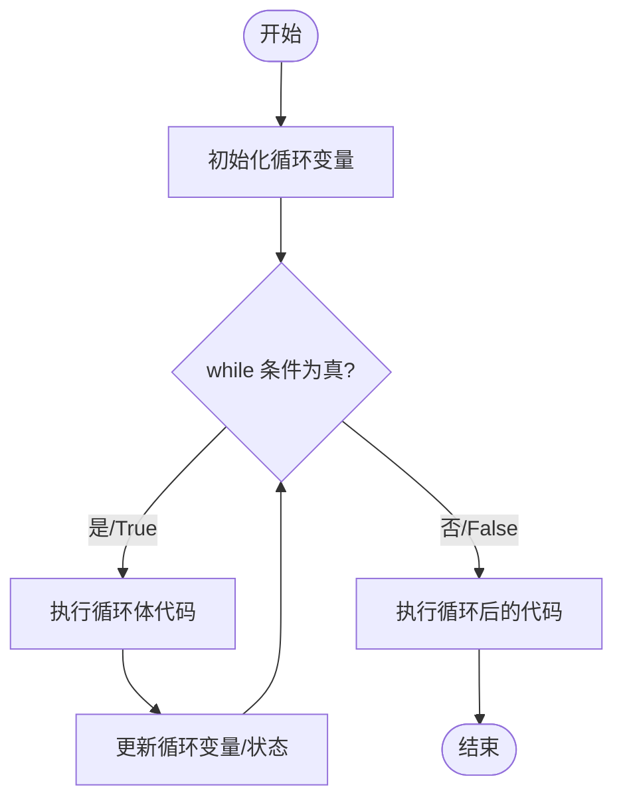
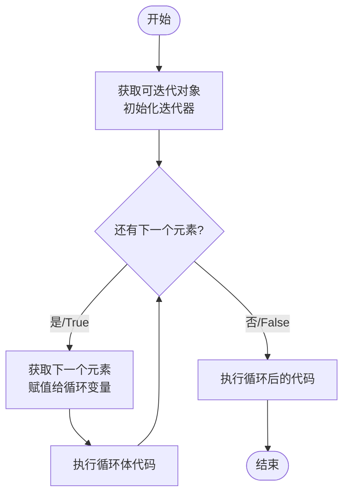

### 循环结构

> Python中的循环结构允许你重复执行某段代码块直到满足特定条件。Python主要有两种循环结构：`for`循环和`while`循环。

### while循环

> 在Python中，`while`循环是一种基本的控制流语句，它允许你重复执行一段代码块，直到指定的条件不再满足（即条件表达式的结果为`False`）。 循环的作用就是让 指定的代码 重复的执行，while 循环最常用的应用场景就是 让执行的代码 按照 指定的次数 重复 执行。

#### 工作原理

`while`循环的工作原理可以概括为以下几个步骤：

1.  **评估条件**：首先，Python评估`while`语句中的条件表达式。
2.  **条件为真**：如果条件为真（即表达式的结果为`True`），则执行循环体内的代码块。
3.  **重复评估**：执行完循环体后，Python会再次评估条件表达式。
4.  **条件为假**：如果条件为假（即表达式的结果为`False`），则退出循环，继续执行`while`循环之后的代码。
5.  **无限循环**：如果条件永远为真，或者循环体内没有修改条件表达式中涉及的变量，那么`while`循环将成为一个无限循环，程序将永远停留在循环体内，无法继续执行后续代码。

#### 流图图



#### 使用场景

`while`循环适用于以下场景：

-   当你不知道循环需要执行多少次时。
-   当你需要在满足特定条件时继续执行循环时。
-   当你需要在循环体中根据某些条件动态地改变循环的控制变量时。

#### 注意事项

-   **避免无限循环**：确保循环条件在某种情况下会变为假，以避免无限循环。
-   **注意变量作用域**：在循环体内定义的变量在循环外部是不可见的（除非它们被声明为全局变量或作为非局部变量捕获）。
-   **性能考虑**：如果循环体内的代码非常复杂或耗时，并且循环次数非常多，那么`while`循环可能会影响程序的性能。在这种情况下，考虑优化循环体或使用其他数据结构/算法来减少循环次数。
-   **循环控制语句**：`break`语句用于立即退出循环，而`continue`语句用于跳过当前循环的剩余部分，并继续下一次迭代（如果条件仍然为真）。

#### 语法

```python
while 条件表达式:  
    # 循环体  
    # 这里是重复执行的代码块  
    # 可以包含改变条件表达式的语句，以避免无限循环
```

-   **条件表达式**：这是一个布尔表达式，每次循环开始前都会对其进行评估。如果表达式的结果为`True`，则执行循环体内的代码块；如果为`False`，则跳过循环体，继续执行`while`循环之后的代码。

#### 基本使用

```python
count = 0  
while count < 5:  
    print(f"这是第 {count + 1} 次循环")  
    count += 1
```

`count`变量在每次循环开始时被检查。只要`count`小于5，循环就会继续执行。每次循环结束时，`count`的值都会增加1，直到它不再小于5，循环结束。

#### 死循环

> 在Python中，死循环（也称为无限循环）是一种循环结构，它永远不会自然结束，因为循环条件永远为真，或者循环体内没有修改条件表达式以允许循环退出。死循环在编程中有时是有意为之的（例如，等待用户输入、运行服务程序等），但大多数情况下，它们是编程错误的结果，需要被避免或修复。

##### 1.条件永远为真的`while`循环

```python
while True:  
    print("这是一个死循环！")
```

在这个例子中，`while`循环的条件是`True`，它永远为真，因此循环体会无限次地执行。

##### 2.条件变量在循环体内未修改的`while`循环

```python
i = 1  
while i < 10:  
    print("i的值是：", i)  
    # 注意：这里缺少修改i的代码
```

在这个例子中，尽管循环的初衷看起来是当`i`小于10时执行循环体，但由于在循环体内没有修改`i`的值，`i`将永远保持为1，从而导致死循环。

##### 3\. 错误地使用了循环控制语句

```python
i = 0  
while i < 10:  
    print("i的值是：", i)  
    i += 1  
    if i == 5:  
        continue  # 这里使用continue是正确的，但如果错误地使用了break以外的逻辑，可能会导致问题  
    # 如果这里错误地使用了i = 0而不是i += 1，也会导致死循环
```

在这个例子中，虽然`while`循环本身不是死循环，但如果在修改`i`的值的代码行中出现了错误（比如不小心将`i += 1`改为了`i = 0`），那么就会导致死循环。

##### 如何避免死循环

-   **确保循环条件会改变**：在循环体内，确保有代码能够改变循环条件，以便在某个时间点条件变为假，从而允许循环退出。
-   **使用适当的循环控制语句**：根据需要，使用`break`语句来完全退出循环，或者使用`continue`语句来跳过循环的剩余部分并继续下一次迭代（但确保这不会导致条件永远为真）。
-   **测试循环**：在编写循环时，考虑添加一些打印语句来显示循环变量的值，以便在运行时观察循环的行为。
-   **代码审查**：在编写完代码后，进行彻底的代码审查，以查找可能导致死循环的逻辑错误。

#### while循环案例

##### 计算1到10的和

```python
# 初始化求和变量和计数器
sum_value = 0
counter = 1

# 当计数器小于或等于10时，执行循环
while counter <= 10:
    sum_value += counter  # 将计数器的值加到求和变量上
    counter += 1  # 计数器自增1

# 打印求和结果 
print("1到10的和是:", sum_value) # 1到10的和是: 55
```

##### 用户输入密码，直到正确为止

```python
# 设定正确的密码
correct_password = "123123"

# 无限循环，直到密码正确
while True:
    # 用户输入密码
    input_password = input("请输入密码: ")

    # 检查密码是否正确
    if input_password == correct_password:
        print("密码正确，欢迎进入！")
        break  # 密码正确时退出循环
    else:
        print("密码错误，请重试。")
```

运行结果

```text
请输入密码: 123
密码错误，请重试。
请输入密码: 1232
密码错误，请重试。
请输入密码: 123123
密码正确，欢迎进入！
```

##### 使用while循环打印斐波那契数列的前N项

```python
# 初始化斐波那契数列的前两项
a, b = 0, 1
n = 10  # 假设我们想要打印前10项

# 计数器，用于跟踪已打印的项数
count = 0

# 当已打印的项数小于n时，执行循环
while count < n:
    print(a, end=' ')  # 打印当前斐波那契数
    a, b = b, a + b  # 更新斐波那契数列的下一项
    count += 1  # 已打印项数自增  

# 注意：end=' ' 是为了在打印时不在每个数后面换行，而是用空格分隔

#输出结果：0 1 1 2 3 5 8 13 21 34
```

### for循环

> Python中的`for`循环是一种非常强大的迭代工具，它允许你遍历任何序列（如列表、元组或字符串）或其他可迭代对象（如字典、集合或文件对象）。`for`循环的基本结构使得代码更加简洁易读，是处理集合中元素时的首选方式。

#### 流程图



#### 语法

```python
for 变量 in 可迭代对象:  
    # 循环体  
    # 使用变量进行操作
```

-   **变量**：在每次迭代中，变量会被赋予可迭代对象中的下一个元素。
-   **可迭代对象**：任何实现了`__iter__()`方法的对象都是可迭代的。常见的可迭代对象包括列表（list）、元组（tuple）、字符串（str）、字典（dict，但迭代的是键）、集合（set）以及生成器（generator）等。
-   **循环体**：每次迭代时执行的代码块。

#### 工作原理

1.  **迭代准备**：Python首先调用可迭代对象的`__iter__()`方法，获取一个迭代器对象。
2.  **迭代过程**：然后，Python在每次循环时调用迭代器的`__next__()`方法，获取序列中的下一个元素。
3.  **条件检查**：如果`__next__()`方法返回一个元素，则循环继续，并将该元素赋值给循环变量。
4.  **异常处理**：如果`__next__()`方法引发`StopIteration`异常，则表示没有更多的元素可供迭代，循环结束。
5.  **循环体执行**：在每次迭代中，都会执行循环体内的代码。

#### for循环案例

##### 遍历列表

```python
fruits = ['apple', 'banana', 'cherry']  
for fruit in fruits:  
    print(fruit)
    '''
    输出结果：
    apple
    banana
    cherry
    '''
```

##### 遍历字符串

```python
greeting = "hello"  
for char in greeting:  
    print(char)
    '''
    输出结果：
    h
    e
    l
    l
    o
    '''
```

##### 遍历字典的键和值

```python
person = {'name': 'John', 'age': 30, 'city': 'New York'}
for key, value in person.items():
    print(key, value)
    '''
    输出结果：
    name John
    age 30
    city New York
    '''
```

#### 注意事项

-   在`for`循环中，循环变量在每次迭代时都会被赋予新的值，但循环结束后，它保留的是序列中的最后一个值（如果序列不为空）。
-   尽量避免在循环体内修改正在遍历的序列（如添加或删除元素），因为这可能会导致意外的行为，如`RuntimeError: dictionary changed size during iteration`。
-   对于需要同时遍历索引和元素的情况，可以使用`enumerate()`函数。

### break语句

> 在Python中，`break`语句是一个非常重要的控制流语句，它用于立即退出当前循环（无论是`for`循环还是`while`循环），而不管循环条件是否仍然为真。这意味着`break`之后的循环体内的代码将不再执行，并且控制流将跳转到循环之后的下一条语句。

#### 使用场景

-   当你想要在循环的某个特定条件下提前退出循环时，`break`语句非常有用。
-   它常用于搜索、数据过滤或任何形式的迭代处理，其中一旦找到所需的信息或达到某个条件，就没有必要继续循环。

#### 在`for`循环中使用`break`

```python
# 假设我们有一个数字列表，并希望找到第一个大于10的数字  
numbers = [1, 3, 5, 7, 11, 13]  
  
for number in numbers:  
    if number > 10:  
        print(f"找到的数字是: {number}")  
        break  # 一旦找到符合条件的数字，就退出循环  
    # 如果不使用break，循环将继续执行直到列表末尾  
  
# 输出: 找到的数字是: 11  
# 注意，循环在找到11后就会停止，不会继续打印列表中的其他数字
```

#### 在`while`循环中使用`break`

```python
# 假设我们要用户输入一系列数字，直到用户输入0为止  
  
while True:  # 创建一个无限循环  
    user_input = input("请输入一个数字（输入0退出）: ")  
    if user_input == "0":  
        print("退出循环")  
        break  # 当用户输入0时，退出循环  
    number = int(user_input)  # 假设用户总是输入有效的数字  
    print(f"你输入的数字是: {number}")  
  
# 输出将取决于用户的输入，但一旦用户输入0，循环就会结束
```

#### 注意事项

-   `break`语句只能用于退出最近的包围它的循环。
-   如果在嵌套循环中使用`break`，它将仅退出最近的循环，而不会影响外部循环。
-   如果`break`语句不在循环体内，Python将抛出一个`SyntaxError`，因为它不知道从哪里退出循环。
-   在某些情况下，`break`语句可以与条件语句（如`if`）结合使用，以在特定条件下退出循环。

### `continue语句`

> 在Python中，`continue`语句是另一个重要的控制流语句，它用于跳过当前循环的剩余语句，并继续下一次循环迭代（如果有的话）。这意味着`continue`之后的循环体内的代码将不会执行，控制流将直接跳转到下一次循环迭代的开始处。但是，如果当前是循环的最后一次迭代，则`continue`语句不会有任何效果，因为循环将自然结束。

#### 使用场景

-   当你想要在循环的某个特定条件下跳过当前迭代，并继续下一次迭代时，`continue`语句非常有用。
-   它常用于忽略不需要处理的元素，或者当某些条件不满足时，避免执行循环体内的某些操作。

#### 在`for`循环中使用`continue`

```python
# 假设我们有一个数字列表，并希望打印出所有偶数，跳过奇数  
numbers = [1, 2, 3, 4, 5, 6]  
  
for number in numbers:  
    if number % 2 != 0:  # 如果数字是奇数  
        continue  # 跳过当前迭代  
    print(number)  # 只有当number是偶数时，这行代码才会执行  
  
# 输出:  
# 2  
# 4  
# 6
```

#### 在`while`循环中使用`continue`

```python
# 假设我们要用户输入一系列数字，但忽略所有负数  
  
while True:  
    user_input = input("请输入一个数字（输入'q'退出）: ")  
    if user_input.lower() == 'q':  # 如果用户输入'q'，则退出循环  
        print("退出循环")  
        break  
    try:  
        number = int(user_input)  # 尝试将输入转换为整数  
        if number < 0:  # 如果数字是负数，则跳过当前迭代  
            continue  
        print(f"你输入的正数是: {number}")  
    except ValueError:  # 如果输入不是有效的整数，则捕获异常并忽略  
        print("请输入一个有效的整数或'q'退出")  
  
# 输出将取决于用户的输入，但负数将被忽略
```

#### 注意事项

-   `continue`语句只能用于跳过当前循环的剩余语句，并继续下一次迭代。它不能用于退出循环。
-   如果在嵌套循环中使用`continue`，它将仅影响最近的包围它的循环。
-   如果`continue`语句不在循环体内，Python将抛出一个`SyntaxError`，因为它不知道从哪里继续循环。
-   `continue`语句经常与条件语句（如`if`）结合使用，以在特定条件下跳过循环的剩余部分。

### else语句

> 在Python中，循环结构（`for`循环和`while`循环）支持一个可选的`else`子句，它指定了在循环正常结束时（即不是因为`break`语句而退出）要执行的代码块。这是Python中一个较为独特且有用的特性，它允许你执行一些只在循环完成所有迭代后才应该运行的清理操作或总结代码。

#### 使用场景

-   当你想要在循环结束后（但前提是循环没有通过`break`语句提前退出）执行一些代码时，可以使用`else`子句。
-   它常用于搜索场景，比如当你想在循环结束时报告是否找到了某个元素。

#### `for`循环中的`else`

```python
# 假设我们有一个数字列表，并希望找到第一个大于10的数字  
numbers = [1, 3, 5, 7, 11, 13]  
found = False  
  
for number in numbers:  
    if number > 10:  
        print(f"找到的数字是: {number}")  
        found = True  
        break  # 一旦找到符合条件的数字，就退出循环  
else:  
    # 这里的else子句将在循环正常结束时执行（即没有break）  
    # 但由于上面的break，它不会被执行  
    print("没有找到大于10的数字")  
  
# 如果删除break语句，则else子句将在循环结束时执行  
# 因为它没有在循环内部被break中断  
  
# 输出:  
# 找到的数字是: 11  
# 注意：如果没有break，且没有找到大于10的数字，则会输出"没有找到大于10的数字"
```

#### `while`循环中的`else`

```python
# 假设我们要搜索一个数是否在给定的范围内（比如1到10之间）  
search_for = 7  
counter = 0  
  
while counter < 10:  
    if counter == search_for:  
        print(f"找到了，数字是: {counter}")  
        break  
    counter += 1  
else:  
    # 如果循环没有因为break而退出（即找到了数字），这里的else会执行  
    # 但由于上面的break，它实际上不会被执行  
    print("在指定的范围内没有找到数字")  
  
# 输出:  
# 找到了，数字是: 7  
  
# 如果我们改变search_for的值为一个不在范围内的数，比如15，并删除break  
# 那么else子句将会执行，因为它会在循环自然结束时触发
```

#### 注意事项

-   `else`子句是可选的，它只在循环正常完成所有迭代后才执行。
-   如果循环内部使用了`break`语句导致循环提前退出，则`else`子句不会被执行。
-   `else`子句不是`if-else`结构中的`else`部分；它们之间没有直接的逻辑关系。`else`子句是与循环本身相关联的。
-   在处理复杂的循环逻辑时，使用`else`子句可以提供更好的代码组织和可读性。

