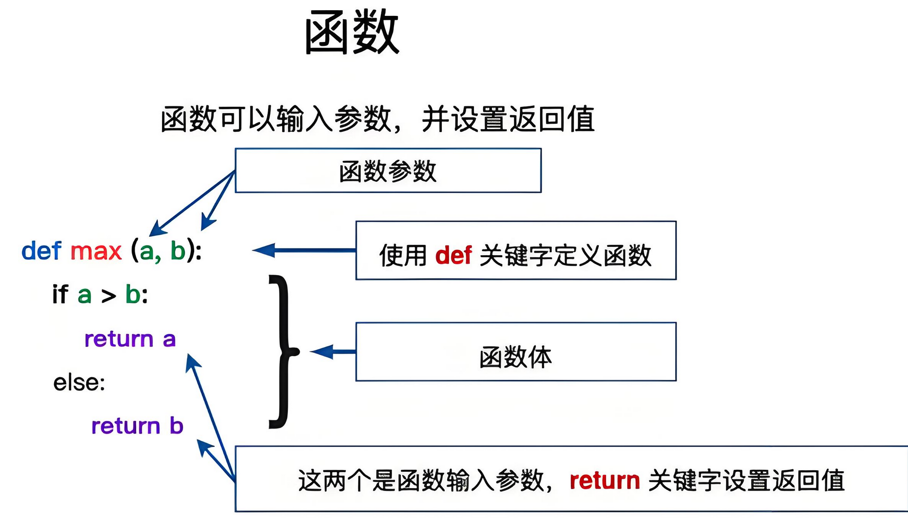
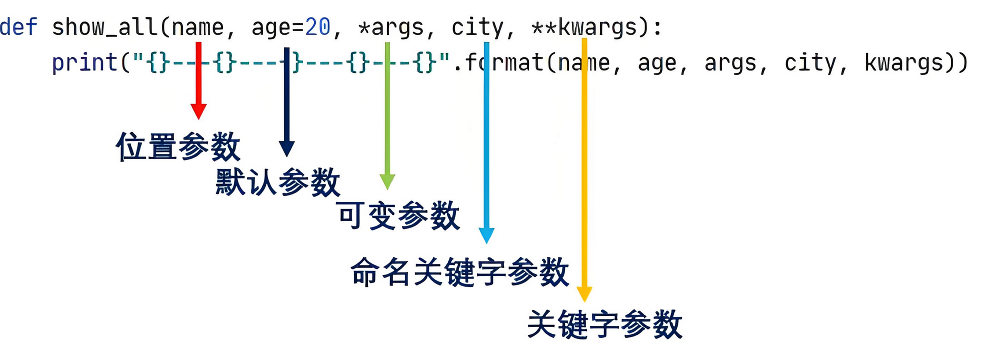
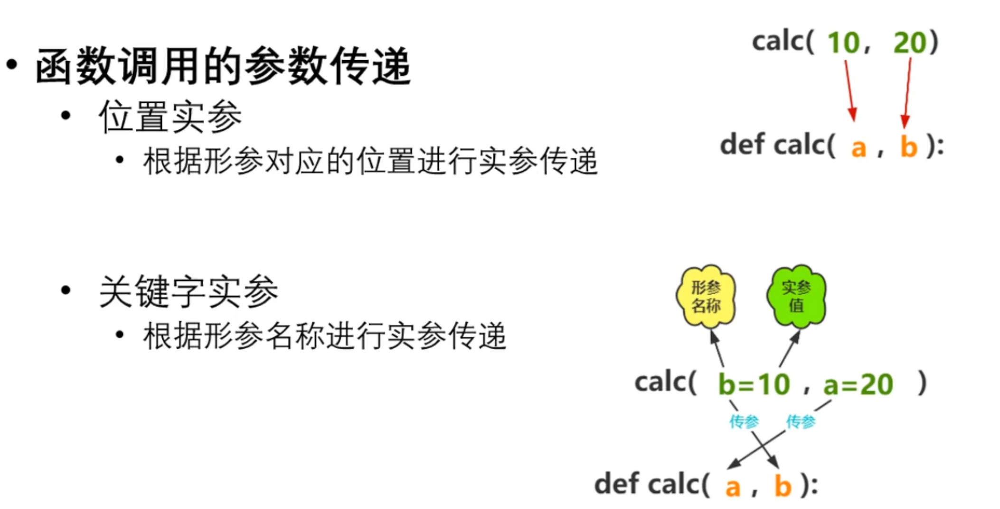
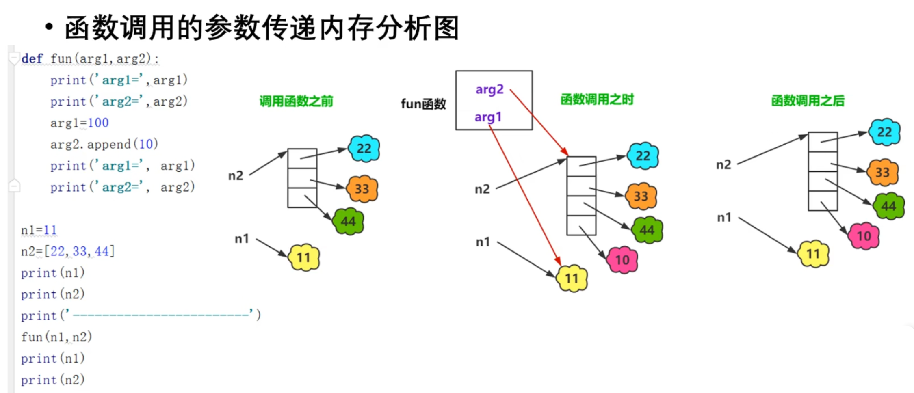

### 什么是函数

在Python中，函数是一段组织好的、可重复使用的、用来实现单一或相关联功能的代码块。它提高了代码的重用性、可读性和可维护性。你可以将函数想象成一个小型的程序，它接收输入（称为参数），执行一系列的操作，然后返回输出（如果有的话）。

### 为什么需要函数

-   代码重用：一旦你定义了函数，就可以在程序中的不同地方多次调用它，而无需重复编写相同的代码。
-   模块化：将程序分解成若干个函数，每个函数负责一个特定的任务，这样可以使代码更加模块化，易于理解和维护。
-   抽象：函数隐藏了实现细节，只关心函数的输入和输出，提高了代码的可读性和可维护性。
-   减少错误：由于函数被设计为执行单一任务，因此更容易测试和调试。

### 函数的创建语法



```python
def 函数名(参数列表):  
    """函数文档字符串（可选）"""  
    # 函数体  
    # 使用return语句返回结果（可选）
```

-   def 是定义函数的关键字。
-   函数名 是你自定义的，用于调用这个函数的名字。根据PEP 8，函数名应该使用小写字母和下划线（snake\_case）的形式。
-   参数列表 是函数接收输入的地方，它是一个由逗号分隔的变量名列表。这些变量在函数内部作为局部变量使用。如果函数不需要任何参数，那么参数列表应该是空的，但仍然需要保留括号。
-   函数体是包含实际代码块的部分，这些代码块定义了函数执行的操作。
-   return 语句（可选）用于结束函数的执行并返回一个值给调用者。如果函数没有return语句，那么它会自动返回None。

### 函数的传参

> 在Python中，函数的参数传递是一个核心概念，它涉及到如何将数据从函数的调用者（或称为“外部”）传递到函数内部。这个过程涉及到两个关键概念：形参（形式参数）和实参（实际参数）。 Python中的函数参数传递主要是通过赋值传递（也称为共享传递）来实现的，这意味着实参的值会被复制到形参的位置（对于不可变类型如整数、浮点数、字符串和元组等）或者是将实参的内存地址赋值给形参（对于可变类型如列表、字典和集合等）。但是，需要注意的是，由于Python中的赋值操作本质上是对象的引用传递，因此可变类型在函数内部修改后会影响到原始数据（如果函数内部直接修改了对象，而不是创建了一个新的对象）。


#### 形参（Formal Parameters）

形参是函数定义时括号内的变量名，用于在函数体内部接收外部传入的数据。在函数被调用之前，形参不会占用实际的内存空间，它们只是函数的占位符。

#### 实参（Actual Parameters）

实参是调用函数时传递给函数的实际值，这些值可以是常量、变量、表达式或另一个函数的返回值。实参的值会被传递给相应的形参，以便在函数内部使用。




-   形参：函数定义时括号内的变量名，用于接收外部传入的数据。
-   实参：调用函数时传递给函数的实际值。
-   Python中的参数传递机制主要是赋值传递，对于可变类型，如果函数内部修改了对象，那么原始数据也会受到影响。
-   可以通过组合使用不同类型的参数（位置参数、关键字参数、默认参数、可变位置参数和可变关键字参数）来创建灵活且强大的函数。

#### 位置传参（Positional Arguments）

> 位置传参是最基本也是最常见的传参方式，它是根据参数在函数定义中的位置顺序来传递参数的。

##### 语法

```python
def function_name(param1, param2, ..., paramN):  
    # 函数体  
    pass
```

在这里，param1, param2, …, paramN 是形参，它们定义了函数需要接收多少个参数以及这些参数在函数体内部将如何被引用。

##### 调用

调用函数时，你需要按照形参定义的顺序提供实参：

```python
function_name(arg1, arg2, ..., argN)
```

其中，arg1, arg2, …, argN 是传递给函数的实参，它们会被按照顺序分配给相应的形参。

##### 示例

```python
# 定义函数，该函数接收两个位置参数  
def add_numbers(a, b):  
    """  
    返回两个数的和  
    """  
    return a + b  
  
# 调用函数，使用位置传参  
result = add_numbers(5, 3)  
  
# 打印结果  
print(result)  # 输出: 8  
  
# 注释: 在这个例子中，5 被传递给形参 a，3 被传递给形参 b，然后函数计算它们的和并返回结果。
```

##### 注意事项

1.  顺序必须匹配：实参的顺序必须与形参的顺序相匹配，否则Python会抛出一个TypeError，因为它无法将实参正确地映射到形参上。
2.  参数数量：在调用函数时，提供的实参数量必须与函数定义中声明的形参数量一致（除非使用了默认参数、可变位置参数或可变关键字参数等特殊情况）。
3.  灵活性：虽然位置传参是最直观的方式，但在某些情况下，它可能不够灵活。例如，当函数有许多参数且你只想修改其中一个参数的值时，使用关键字传参会更方便。

#### 关键字传参（Keyword Arguments）

> 关键字传参允许你在调用函数时通过指定参数名来传递参数，这使得函数调用更加清晰且不易出错。 在函数定义时，你仍然会声明一些形参，但在调用函数时，你可以通过参数名来明确指定每个实参应该赋给哪个形参。

##### 语法

函数定义的语法与位置传参时相同，但在调用函数时，你可以使用参数名来指定实参：

```python
def function_name(param1, param2, ..., paramN):  
    # 函数体  
    pass  
  
# 调用函数，使用关键字传参  
function_name(param1=value1, param2=value2, ..., paramN=valueN)
```

在这里，param1=value1, param2=value2, …, paramN=valueN 是关键字传参的示例，其中 paramX 是形参名，valueX 是对应的实参值。

##### 案例

```python
# 定义函数  
def greet(name, greeting="Hello"):  
    """  
    使用提供的问候语和名字打招呼  
    """  
    print(f"{greeting}, {name}!")  
  
# 调用函数，使用关键字传参  
greet(name="Alice", greeting="Hi")  
  
# 输出: Hi, Alice!  
  
# 也可以改变参数的顺序  
greet(greeting="Good morning", name="Bob")  
  
# 输出: Good morning, Bob!  
  
# 注释: 在这两个例子中，我们都使用了关键字传参来明确指定每个参数的值。  
# 这使得我们可以以任意顺序传递参数，同时提高了代码的可读性。
```

##### 注意事项

1.  顺序无关：与位置传参不同，关键字传参允许你以任意顺序传递参数，因为每个参数都是通过其名称来识别的。
2.  清晰性：关键字传参增加了代码的可读性，因为参数名提供了关于每个参数用途的明确说明。
3.  混合使用：在调用函数时，你可以混合使用位置传参和关键字传参，但所有位置传参必须位于关键字传参之前。
4.  默认参数：如果函数定义中包含了默认参数，那么在调用函数时，你可以省略这些参数的实参（如果它们使用了默认值）。然而，如果你想要覆盖默认值，你可以通过关键字传参来指定新的值。
5.  函数签名：了解函数的签名（即函数定义中形参的列表）对于正确使用关键字传参至关重要。如果你尝试传递一个函数签名中不存在的参数名，Python将抛出一个TypeError。

#### 默认参数（Default Arguments）

> 在函数定义时，你可以通过为参数分配一个默认值来创建默认参数。这个默认值可以是任何静态值，包括数字、字符串、列表、元组、字典、集合、None等，但不能是变量（因为变量在函数定义时可能尚未定义或已被赋予不同的值）。

##### 语法

```python
def function_name(param1, param2=default_value2, ..., paramN=default_valueN):  
    # 函数体  
    pass
```

在这里，param1 是必需的（非默认）参数，而 param2, …, paramN 是具有默认值 default\_value2, …, default\_valueN 的默认参数。

##### 案例

```python
# 定义函数，其中一个参数有默认值  
def greet(name, greeting="Hello"):  
    print(f"{greeting}, {name}!")  
  
# 调用函数，只提供必需的参数  
greet("Alice")  
# 输出: Hello, Alice!  
  
# 调用函数，提供所有参数  
greet("Bob", "Hi")  
# 输出: Hi, Bob!  
  
# 注释: 在这个例子中，"greeting" 参数有一个默认值 "Hello"。因此，在调用 greet("Alice") 时，  
# Python 会自动将 "greeting" 的值设置为 "Hello"。
```

##### 注意事项

1.  默认值只在函数定义时计算一次：如果默认值是一个可变对象（如列表、字典、集合等），那么这个对象只会在函数定义时创建一次。这意味着如果函数修改了该对象，并且后续再次调用该函数而没有为对应参数提供新的值，那么修改将保留。这可能会导致意外的行为，特别是当你不希望函数之间共享状态时。

```python
def add_item(item, my_list=[]):  
    my_list.append(item)  
    return my_list  

print(add_item(1))  # 输出: [1]  
print(add_item(2))  # 输出: [1, 2]，而不是 [2]！
```

为了避免这个问题，你可以使用 None 作为可变类型参数的默认值，并在函数体内部进行检查，根据需要创建一个新的对象。

```python
def add_item(item, my_list=None):  
    if my_list is None:  
        my_list = []  
    my_list.append(item)  
    return my_list  

print(add_item(1))  # 输出: [1]  
print(add_item(2))  # 输出: [2]
```

1.  位置参数不能跟在默认参数之后：在函数定义中，所有默认参数都必须位于非默认参数（即必需参数）之后。这是因为Python在调用函数时，首先会匹配位置参数，然后再处理关键字参数。如果默认参数位于非默认参数之前，那么Python将无法确定哪些参数是必需的，哪些参数有默认值。
2.  调用时可以使用关键字参数覆盖默认值：在调用函数时，你可以通过关键字参数来覆盖默认参数的值。这是非常有用的，因为它允许你只为需要修改的参数提供值，而保留其他参数的默认值。
3.  默认值必须是静态的：如前所述，默认参数的值必须在函数定义时就已经确定，不能是变量。这是因为Python在函数定义时就会计算默认参数的值，并将其存储在函数的 \_\_ defaults \_\_ 属性中。如果默认参数是一个变量，那么该变量在函数定义时的值可能会被后续的代码更改，从而导致不可预测的行为。

#### 可变位置参数（\*args）

在Python中，可变位置参数（通常表示为\*args）是一种允许你将不定数量的参数传递给函数的机制。这里的“可变”指的是传递给函数的参数数量不是固定的，而是由调用者决定的。\*args在函数定义中作为参数列表的最后一个元素出现，它接收一个元组，该元组包含了所有传递给函数但未被前面定义的参数名捕获的额外位置参数。

##### 语法

在函数定义中，_args用于表示函数可以接受任意数量的位置参数。这些参数在函数内部被打包成一个元组，名为args（但你也可以使用其他名称，比如_values、\*numbers等，不过args是最常见的约定）。

```python
def function_name(*args):  
    # 函数体，args是一个元组，包含了所有额外的位置参数  
    pass
```

##### 案例

```python
# 定义函数，使用*args接收可变数量的位置参数  
def greet(*names):  
    for name in names:  
        print(f"Hello, {name}!")  
  
# 调用函数，传递多个参数  
greet("Eve", "Frank", "Grace")  
# 输出:  
# Hello, Eve!  
# Hello, Frank!  
# Hello, Grace!  
  
# 注释: *names会将多个参数接收为元组names，然后在函数体内遍历
```

##### 注意事项

-   ·\* args必须是最后一个位置参数：在函数定义中，·\* args必须紧跟在所有其他位置参数之后。如果它在其他位置参数之前出现，Python将抛出语法错误。
-   与关键字参数的组合：_args可以与关键字参数一起使用，但关键字参数必须位于·_ args之后（如果函数还定义了其他非默认参数，则这些参数也必须位于·\* args之前）。此外，还可以有一个特殊的\*\*kwargs参数（可变关键字参数），它位于\* args之后，用于接收任意数量的关键字参数。
-   参数解包：在调用函数时，可以使用\*操作符将列表、元组或其他可迭代对象解包为位置参数。这允许你将存储在容器中的数据作为单独的参数传递给函数。

```python
def sum_numbers(*args):  
    return sum(args)  

numbers = [1, 2, 3, 4]  
print(sum_numbers(*numbers))  # 输出: 10
```

-   args的名称：虽然习惯上我们将可变位置参数命名为args，但你也可以使用其他名称。重要的是\*前缀，它告诉Python这个参数将接收所有额外的位置参数，并将它们打包成一个元组。

#### 可变关键字参数（\*\*kwargs）

> 当你想要以字典形式接收未知数量的关键字参数时，可以使用可变关键字参数。\*\*kwargs会将接收到的多个关键字参数值作为字典（dict）传递。 在Python中，\*\*kwargs（关键字参数）是一种在函数定义时使用的特殊语法，它允许你将不定长度的关键字参数传递给一个函数。这些关键字参数在函数内部被收集到一个名为kwargs（虽然你可以使用任何变量名，但kwargs是约定俗成的）的字典中。这使得函数能够处理比预先定义更多的参数，增加了函数的灵活性和通用性。

##### 语法

当你定义一个函数并希望它能够接受任意数量的关键字参数时，你可以在函数定义中使用\*\*kwargs。

```python
def greet(**kwargs):  
    for key, value in kwargs.items():  
        print(f"{key}: {value}")  
  
greet(name="Alice", age=30, country="Wonderland")
```

在这个例子中，greet函数可以接受任意数量的关键字参数。当调用greet(name=“Alice”, age=30, country=“Wonderland”)时，这些参数被收集到一个名为kwargs的字典中，其中kwargs = {‘name’: ‘Alice’, ‘age’: 30, ‘country’: ‘Wonderland’}。然后，函数遍历这个字典并打印出每个键值对。

##### 案例

```python
# 定义函数，使用**kwargs接收可变数量的关键字参数  
def greet(**kwargs):  
    for key, value in kwargs.items():  
        if key == "name":  
            print(f"Hello, {value}!")  
  
# 调用函数，传递多个关键字参数  
greet(name="Hannah", age=30)  
# 输出: Hello, Hannah!  
  
# 注释: **kwargs会将多个关键字参数接收为字典kwargs，然后可以通过items()遍历
```

##### 使用\*\*kwargs的注意事项

1.  命名冲突：虽然你可以使用任何变量名来代替kwargs，但最好遵循约定使用kwargs，以避免与其他变量名冲突或造成混淆。
2.  参数顺序：在函数定义中，_args（如果有的话）必须位于\*\*kwargs之前。这是因为位置参数（非关键字参数）在关键字参数之前被处理，而_args用于收集位置参数，\*\*kwargs用于收集关键字参数。
3.  默认值：你不能为\*\*kwargs中的参数设置默认值，因为\*\*kwargs本身是一个字典，它会在运行时动态地收集所有未匹配的关键字参数。
4.  修改kwargs：虽然你可以在函数内部修改kwargs字典，但这通常不是一个好主意，因为它可能会影响到函数外部的状态，导致代码难以理解和维护。
5.  用途：\*\*kwargs非常适合于那些需要高度灵活性的函数，特别是当你不知道函数将接收哪些关键字参数时。然而，过度使用\*\*kwargs可能会使函数签名变得模糊，降低代码的可读性和可维护性。因此，在可能的情况下，最好明确指定函数所需的参数。

#### 组合使用

在实际开发中，经常需要将位置参数、关键字参数、默认参数、可变位置参数和可变关键字参数组合使用。

```python
# 定义函数，组合使用多种参数  
def greet(greeting="Hello", *names, **kwargs):  
    for name in names:  
        print(f"{greeting}, {name}!")  
    for key, value in kwargs.items():  
        if key == "lang":  
            print(f"({value})")  
  
# 调用函数  
greet("Bonjour", "Irene", "Jacob", lang="French")  
# 输出:  
# Bonjour, Irene!  
# Bonjour, Jacob!  
# (French)  
  
# 注释: 函数中greeting使用默认参数，names接收可变位置参数，kwargs接收可变关键字参数
```

### 常用内置函数

#### len()

功能：返回对象（字符、列表、元组等）长度或项目个数。 代码案例：

```python
# 计算字符串长度  
str_len = len("Hello, World!")  
print(f"String length: {str_len}")  # String length: 13  

# 计算列表长度  
list_len = len([1, 2, 3, 4, 5])  
print(f"List length: {list_len}")  # List length: 5
```

#### type()

功能：返回对象的类型。 代码案例：

```python
# 检查字符串类型  
str_type = type("Hello")  
print(f"String type: {str_type}")  # String type: <class 'str'>  

# 检查列表类型  
list_type = type([1, 2, 3])  
print(f"List type: {list_type}")  # List type: <class 'list'>
```

#### print()

功能：输出信息到控制台。 代码案例：

```python
# 打印字符串  
print("Hello, Python!")  # Hello, Python!  

# 打印多个值，默认以空格分隔  
print("Hello", "Python", "!")  # Hello Python !  

# 自定义分隔符  
print("Hello", "Python", "!", sep="-")  # Hello-Python-!
```

#### max() 和 min()

功能：max() 返回给定参数中的最大值，min() 返回最小值。 代码案例：

```python
# 找到最大值  
max_value = max(1, 3, 5, 7, 9)  
print(f"Max value: {max_value}")  # Max value: 9  

# 找到列表中的最小值  
min_value = min([10, 2, 5, 1, 3])  
print(f"Min value: {min_value}")  # Min value: 1
```

#### sum()

功能：返回序列（列表、元组、集合、字符串）中元素的总和。 代码案例：

```python
# 计算列表中数字的总和  
total = sum([1, 2, 3, 4, 5])  
print(f"Total: {total}")  # Total: 15
```

#### sorted()

功能：对可迭代对象进行排序，返回排序后的列表。 代码案例：

```python
# 对列表进行排序  
sorted_list = sorted([3, 1, 4, 1, 5, 9, 2])  
print(f"Sorted list: {sorted_list}")  # Sorted list: [1, 1, 2, 3, 4, 5, 9]  

# 使用key参数进行排序  
students = [('john', 'A', 15), ('jane', 'B', 12), ('dave', 'B', 10)]  
sorted_students = sorted(students, key=lambda student: student[2])  # 按年龄排序  
print(f"Sorted students by age: {sorted_students}")  
# Sorted students by age: [('dave', 'B', 10), ('jane', 'B', 12), ('john', 'A', 15)]
```

#### range()

功能：生成一个可迭代的数字序列，常用于循环中。 代码案例：

```python
# 使用range生成一个0到4（不包括4）的序列  
for i in range(5):  
    print(i)  
# 输出:  
# 0  
# 1  
# 2  
# 3  
# 4  
  
# 也可以指定起始值和步长  
for i in range(1, 10, 2):  
    print(i)  
# 输出:  
# 1  
# 3  
# 5  
# 7  
# 9
```

#### enumerate()

功能：将一个可遍历的数据对象（如列表、元组或字符串）组合为一个索引序列，同时列出数据和数据下标，一般用在for循环当中。 代码案例：

```python
# 遍历列表的同时获取索引和值  
fruits = ['apple', 'banana', 'cherry']  
for index, fruit in enumerate(fruits):  
    print(f"Index {index}: {fruit}")  
# 输出:  
# Index 0: apple  
# Index 1: banana  
# Index 2: cherry
```

#### zip()

功能：将多个可迭代对象作为参数，将对象中对应的元素打包成一个个元组，然后返回由这些元组组成的zip对象。 代码案例：

```python
# 打包两个列表的元素  
names = ['Alice', 'Bob', 'Charlie']  
ages = [24, 27, 22]  
for name, age in zip(names, ages):  
    print(f"{name} is {age} years old.")  
# 输出:  
# Alice is 24 years old.  
# Bob is 27 years old.  
# Charlie is 22 years old.
```

#### map()

功能：对可迭代对象的每个元素应用指定的函数。 代码案例：

```python
# 对列表中的每个数字加1  
def add_one(x):  
    return x + 1  

numbers = [1, 2, 3, 4, 5]  
result = map(add_one, numbers)  
# map对象是一个迭代器，我们可以将其转换为列表来查看结果  
print(list(result))  
# 输出:  
# [2, 3, 4, 5, 6]
```

#### filter()

功能：过滤序列，过滤掉不符合条件的元素，返回由符合条件元素组成的新迭代器。 代码案例：

```python
# 过滤出列表中的偶数  
def is_even(n):  
    return n % 2 == 0  

numbers = [1, 2, 3, 4, 5, 6, 7, 8, 9, 10]  
filtered_numbers = filter(is_even, numbers)  
# 同样地，我们需要将迭代器转换为列表来查看结果  
print(list(filtered_numbers))  
# 输出:  
# [2, 4, 6, 8, 10]
```

#### round()

功能：对浮点数进行四舍五入。 代码案例：

```python
# 四舍五入到最接近的整数  
print(round(3.14159))  # 输出: 3  
  
# 指定小数位数  
print(round(3.14159, 2))  # 输出: 3.14  
  
# 注意：当数字恰好在中间时，Python 3 的 round() 函数采用“银行家舍入”法  
print(round(2.5))  # 输出: 2  
print(round(3.5))  # 输出: 4
```
