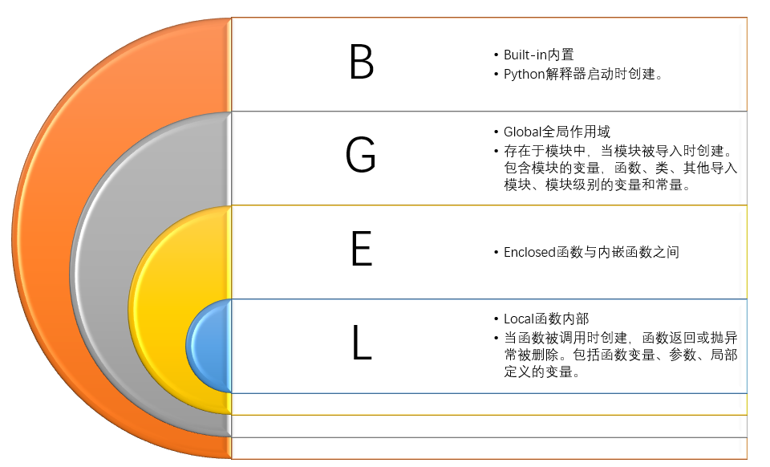

### 作用域的分类

Python中的作用域主要分为四种类型，这些类型按照从内到外的顺序排列：

-   局部作用域（Local Scope）：这是最直接的作用域，它包含了函数内部定义的变量。这些变量只能在函数体内被访问和修改。当函数执行完毕后，这些局部变量通常会被销毁（除非它们被作为返回值或以某种方式传递到外部作用域）。
-   嵌套作用域（Enclosing Scope 或 Nonlocal Scope）：当一个函数内部定义了另一个函数时，内层函数可以访问外层函数定义的变量，这些变量对于内层函数来说就是非局部（nonlocal）的。然而，外层函数不能直接访问内层函数定义的变量，除非这些变量被显式地作为返回值或全局变量。
-   全局作用域（Global Scope）：全局作用域包含了在模块级别定义的变量。这些变量在整个模块内部都是可见的，包括在模块内部定义的所有函数中。在函数内部，可以通过global关键字来声明一个变量是全局的，从而允许在函数内部修改全局变量的值。
-   内置作用域（Built-in Scope）：这是Python解释器提供的特殊作用域，包含了Python的内置函数和异常。这个作用域在全局作用域之前被搜索，但它对程序员来说是只读的，不能修改内置作用域中的变量或函数。


### LEGB规则

Python解释器在查找变量时遵循LEGB规则，即按照以下顺序搜索变量：

-   Local（局部作用域）：首先在当前函数或代码块中查找变量。
-   Enclosing（嵌套作用域）：如果局部变量中没有找到，Python会向外层函数（如果有的话）查找变量。
-   Global（全局作用域）：如果嵌套作用域中也没有找到，Python会在全局作用域中查找变量。
-   Built-in（内置作用域）：最后，Python会在内置作用域中查找变量。

### 变量的生命周期

变量的生命周期与其作用域紧密相关。局部变量在函数被调用时创建，在函数执行完毕后销毁（除非它们被返回或以其他方式传递到外部）。全局变量在模块被加载时创建，在模块被卸载时销毁。内置变量则与Python解释器的生命周期相同。

### 注意事项

-   变量遮蔽（Shadowing）：在内部作用域中定义一个与外部作用域同名的变量时，内部作用域的变量会遮蔽外部作用域的变量。这意味着在内部作用域中，只能访问到内部定义的变量，而无法访问到被遮蔽的外部变量。
-   global和nonlocal关键字：global关键字用于在函数内部声明一个变量是全局的，从而允许修改全局变量的值。nonlocal关键字用于在嵌套函数中声明一个变量是非局部的，即它是外层函数定义的局部变量，从而允许在嵌套函数中修改这个非局部变量的值。

### 局部作用域（Local）

> 局部作用域是最内层的作用域，它包含在函数或lambda函数内定义的变量。这些变量只能在函数或lambda函数内部访问。当函数执行完毕时，这些局部变量将被销毁（除非它们被返回或被以某种方式保存到全局作用域中）。

#### 定义与创建

局部作用域是在函数或代码块（如if语句、for循环或while循环）执行时创建的。在这个作用域内定义的变量就是局部变量。当函数或代码块执行完毕后，局部作用域会被销毁，同时其中的局部变量也会被销毁（除非它们被作为返回值或以其他方式传递到外部作用域）。

#### 访问与修改

局部变量只能在定义它们的函数或代码块内部被访问和修改。在函数或代码块外部尝试访问这些变量会导致NameError异常，因为外部作用域中不存在这些变量。

#### 变量遮蔽

如果在一个作用域内部定义了与外部作用域同名的变量，内部作用域的变量会遮蔽外部作用域的变量。这意味着在内部作用域中，只能访问到内部定义的变量，而无法访问到被遮蔽的外部变量。这种遮蔽机制是作用域解析的一个重要方面。

#### 案例

```python
def my_function():  
    local_var = "I am local"  # 定义一个局部变量  
    print(local_var)  # 在函数内部访问局部变量  
  
my_function()  # 输出: I am local  
  
# 尝试在函数外部访问局部变量会导致NameError  
# print(local_var)  # 这会抛出NameError  
  
# 变量遮蔽示例  
x = "I am global"  
  
def another_function():  
    x = "I am local and shadowing the global x"  
    print(x)  # 访问局部作用域中的x  
  
print(x)  # 访问全局作用域中的x  
another_function()  # 访问并打印被遮蔽的局部变量x  
print(x)  # 再次访问全局作用域中的x
```

#### 注意事项

-   在函数内部，如果需要修改全局变量，必须使用global关键字声明该变量是全局的。否则，Python会将其视为一个新的局部变量。
-   在嵌套函数中，如果需要修改外层函数定义的局部变量（即非局部变量），应使用nonlocal关键字声明该变量。
-   局部作用域是Python中变量作用域机制的基础，理解局部作用域对于编写清晰、可维护的代码至关重要。

### 嵌套作用域（Enclosing/Enclosing locals）

> Python中的嵌套作用域（Nested Scope）是变量作用域的一个关键特性，它允许在内部作用域中访问外部作用域（但不是全局作用域）中定义的变量。这种机制使得函数可以访问其封闭作用域（Enclosing Scope）中的变量，而不仅仅是直接定义在它们内部的作用域或全局作用域中的变量。

#### 嵌套作用域的基本概念

在Python中，当你定义一个函数内部再定义另一个函数时，就创建了嵌套作用域。内部函数可以访问其外部函数（但不是全局作用域）中定义的变量。这种访问是单向的：外部函数不能直接访问内部函数中的变量，除非这些变量作为返回值或通过其他方式（如闭包）传递到外部。

#### 示例

在这个例子中，inner\_function 能够访问 outer\_function 中定义的 text 变量，尽管 text 是在 inner\_function 的外部作用域中定义的。

```python
def outer_function(text):  
    def inner_function():  
        # 这里可以访问 outer_function 中的 text 变量  
        print(text)  
      
    # 调用内部函数  
    inner_function()  
  
# 调用外部函数  
outer_function("Hello, nested scope!")
```

#### 闭包（Closure）

嵌套作用域的一个特别重要的应用是闭包。闭包是一个函数值，它引用了其外部作用域中的变量。即使外部函数已经执行完毕，闭包中的这些变量仍然会被保留。

```python
def outer_function(text):  
    def inner_function():  
        # 这里可以访问 outer_function 中的 text 变量  
        print(text)  
      
    # 返回内部函数，形成闭包  
    return inner_function  
  
# 调用外部函数并获取闭包  
my_closure = outer_function("Hello, closure!")  
  
# 稍后调用闭包  
my_closure()  # 输出: Hello, closure!
```

在这个例子中，outer\_function 返回了 inner\_function，而 inner\_function 仍然能够访问 outer\_function 中的 text 变量，即使 outer\_function 已经执行完毕。这就是闭包的力量所在。

#### 注意事项

-   嵌套作用域中的变量访问是单向的：内部作用域可以访问外部作用域中的变量，但外部作用域不能直接访问内部作用域中的变量（除非通过返回值或其他机制）。
-   闭包允许将外部作用域中的变量与内部函数一起封装起来，即使外部函数已经执行完毕，这些变量仍然可以通过闭包进行访问和修改（如果它们是可变对象）。
-   嵌套作用域和闭包是Python中高级编程概念的一部分，它们使得函数式编程和高级抽象成为可能。

### 全局作用域（Global）

> Python中的全局作用域（Global Scope）是变量和函数定义的一个最外层作用域，它跨越了整个程序的运行，是所有局部作用域（如函数内部的作用域）的父作用域。全局作用域中的变量和函数在整个程序中都是可访问的，只要它们没有被局部作用域中的同名变量或函数所遮蔽（shadowing）。

#### 定义全局变量

在Python中，全局变量是在所有函数外部定义的变量。这些变量可以在程序的任何位置被访问，只要它们没有被局部作用域中的同名变量所遮蔽。

```python
# 这是一个全局变量  
global_var = "I am a global variable"  
  
def func():  
    # 这里可以访问全局变量  
    print(global_var)  
  
func()  # 输出: I am a global variable
```

#### 修改全局变量

在函数内部，你不能直接修改全局作用域中的变量（除非使用global关键字）。如果你在函数内部给一个变量赋值，而该变量名在全局作用域中也存在，那么这会在局部作用域中创建一个新的同名变量，从而遮蔽了全局作用域中的变量。

```python
global_var = "I am a global variable"  
  
def func():  
    # 尝试修改全局变量（但实际上是创建了一个局部变量）  
    global_var = "I am trying to change the global variable, but I failed"  
    print(global_var)  # 输出: I am trying to change the global variable, but I failed  
  
func()  
print(global_var)  # 输出: I am a global variable，说明全局变量未被修改
```

要在函数内部修改全局变量，需要使用global关键字明确声明：

```python
global_var = "I am a global variable"  
  
def func():  
    global global_var  # 声明要修改的是全局变量  
    global_var = "I am now a changed global variable"  
  
func()  
print(global_var)  # 输出: I am now a changed global variable
```

#### 注意事项

-   全局变量应谨慎使用，因为它们可能导致代码难以理解和维护，尤其是在大型程序中。全局变量可能会导致意外的副作用和难以追踪的错误。
-   在函数内部修改全局变量时，应明确使用global关键字，以避免意外的遮蔽。
-   使用全局变量是函数式编程范式中所不推荐的，因为它破坏了函数的独立性和可重用性。在可能的情况下，应考虑使用其他机制（如类属性、模块级变量、闭包等）来替代全局变量。

### 内置作用域（Built-in）

-   在Python中，“内置作用域”（Built-in Scope）是变量查找链中的最内层，但它并不是传统意义上的一个作用域层级，而是指Python解释器内置的一系列特殊对象（如内置函数、异常和内置数据类型等）的集合。这些内置对象在Python程序的任何地方都是可以直接访问的，无需任何形式的导入或声明。
-   然而，值得注意的是，虽然这些内置对象在逻辑上可以被视为处于一个特殊的“内置作用域”中，但从Python的作用域规则和实现的角度来看，它们并不遵循典型的LEGB（Local, Enclosing, Global, Built-in）作用域查找顺序中的“Built-in”部分。实际上，在Python中，当解释器在LEGB作用域链中查找一个变量时，如果在前面的作用域中都没有找到，它最终会检查内置作用域，但这更像是一个后备机制，而不是一个独立的作用域层级。

#### 案例

在这个例子中，len是一个内置函数，用于获取对象的长度。当我们在代码中直接调用len()时，Python解释器会在内置作用域中找到这个函数并执行它。然而，如果我们不小心（或故意）将len重新赋值为一个不同的对象（如字符串），那么我们就“覆盖”了内置作用域中的len函数，直到我们删除这个新赋的值为止。

```python
# 尝试访问内置变量  
print(len([1, 2, 3]))  # 输出: 3，len是内置函数  
  
# 尝试覆盖内置变量（不推荐）  
len = "I am not a function anymore"  
print(len([1, 2, 3]))  # 这将引发TypeError，因为len现在是一个字符串  
  
# 还原内置变量（不推荐这样做，但展示了如何恢复）  
del len  
print(len([1, 2, 3]))  # 再次输出: 3，因为len内置函数被“恢复”了
```

#### 注意事项

-   避免覆盖内置对象：由于内置对象是Python语言的核心部分，覆盖它们（如示例中的len）可能会导致难以调试的错误和意外的行为。因此，强烈建议不要这样做。
-   内置作用域不是传统的作用域：虽然我们可以将内置对象视为处于一个特殊的“内置作用域”中，但从技术角度来看，它们并不遵循Python中典型的作用域规则。
-   使用builtins模块：如果你需要访问或修改内置对象（尽管这通常是不推荐的），你可以使用builtins模块。这个模块包含了所有内置对象的引用，允许你以编程方式访问它们。然而，请注意，直接修改builtins模块中的对象可能会导致不可预测的行为和错误。

### builtins

> Python的builtins模块是一个特殊的模块，它包含了Python解释器提供的所有内置函数、异常、以及其他一些内置标识符。这些内置对象是Python语言的核心部分，它们在Python程序的任何地方都是可以直接访问的，无需显式地导入builtins模块。然而，了解builtins模块的存在和它的内容对于深入理解Python的内部工作机制以及在某些特殊情况下（如需要修改内置对象的行为）是非常有用的。

#### 内置对象

builtins模块中的对象包括但不限于：

内置函数：如len(), type(), print(), open(), range()等。这些函数提供了执行常见任务（如长度计算、类型检查、打印输出、文件操作等）的快捷方式。 内置异常：如Exception, ValueError, TypeError, IOError等。这些异常类用于在程序遇到错误时提供反馈，并允许开发者以结构化的方式处理这些错误。 内置类型：如int, float, str, list, dict等。这些类型用于定义Python中的基本数据结构。 内置常量：如True, False, None, NotImplemented, Ellipsis等。这些常量在Python程序中有着特殊的用途。

#### 访问builtins模块

虽然builtins模块中的对象在Python程序的任何地方都是可直接访问的，但如果你需要显式地引用builtins模块（例如，为了查看它包含哪些对象，或者在某些特殊情况下需要修改内置对象的行为），你可以通过以下方式导入它：

```python
import builtins  
  
# 现在可以访问builtins模块中的对象了  
print(builtins.len([1, 2, 3]))  # 输出: 3
```

需要注意的是，直接修改builtins模块中的对象（除了那些设计为可修改的，如builtins.open可以通过builtins.open = my\_custom\_open被覆盖）通常是不推荐的，因为这可能会导致难以预测的行为和错误。

#### 修改内置对象的行为

虽然不推荐这样做，但在某些特殊情况下（如单元测试或临时修补库中的bug），你可能需要修改内置对象的行为。在这种情况下，你可以通过覆盖builtins模块中的相应对象来实现。但是，请务必小心行事，并在完成后及时恢复原始行为，以避免对程序的其他部分产生负面影响。

#### 注意事项

-   避免不必要的修改：直接修改builtins模块中的对象应该被视为一种最后的手段，仅在你完全了解可能的后果时才进行。
-   兼容性：随着Python版本的更新，builtins模块中的对象可能会发生变化。因此，在修改内置对象时，请务必注意你正在使用的Python版本。
-   文档：builtins模块的内容在Python的官方文档中有详细记录。如果你需要了解某个内置对象的详细信息，查阅官方文档是一个很好的起点。

### 案例

```python
# 定义一个全局变量  
global_var = "I am a global variable"


def outer_function():
    # 定义一个嵌套作用域变量，仅在outer_function内部可见  
    nested_var = "I am a nested variable"

    def inner_function():
        # 定义一个局部变量，仅在inner_function内部可见  
        local_var = "I am a local variable"

        # 访问嵌套作用域变量  
        print(nested_var)  # 输出: I am a nested variable  

        # 尝试访问全局变量（未使用global关键字直接访问）  
        print(global_var)  # 输出: I am a global variable  

        # 尝试访问内置作用域中的内置函数  
        print(len("hello"))  # 输出: 5，展示了内置作用域的使用，尽管不是直接修改  

        # 访问局部变量  
        print(local_var)  # 输出: I am a local variable  

    # 调用内部函数，以展示嵌套作用域  
    inner_function()


# 尝试直接访问嵌套作用域变量（会失败）
# print(nested_var)  # NameError: name 'nested_var' is not defined  

# 访问全局变量  
print(global_var)  # 输出: I am a global variable  

# 修改全局变量  
global_var = "I am a modified global variable"
print(global_var)  # 输出: I am a modified global variable  

# 调用外部函数，以展示全局和嵌套作用域  
outer_function()

# 再次尝试访问局部变量（会失败）  
# print(local_var)  # NameError: name 'local_var' is not defined  

# 尝试覆盖内置函数（不推荐，仅作演示）  
original_len = len  # 保存原始len函数  
len = "I overwrote len!"  # 尝试覆盖len（不推荐这样做）  

# 尝试使用被覆盖的len（会失败，因为现在是字符串）  
try:
    print(len([1, 2, 3]))  # TypeError: 'str' object is not callable  
except TypeError as e:
    print(f"Caught an error: {e}")  # 捕获并打印错误  

# 恢复原始len函数  
len = original_len
print(len([1, 2, 3]))  # 输出: 3
```

运行结果

```text
I am a global variable
I am a modified global variable
I am a nested variable
I am a modified global variable
5
I am a local variable
Caught an error: 'str' object is not callable
3
```

