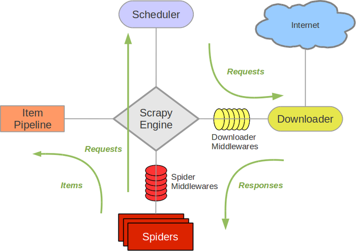
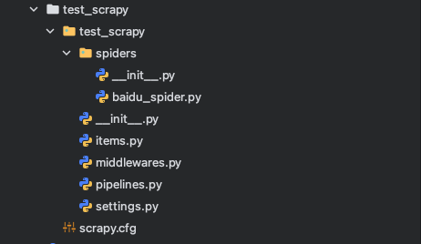
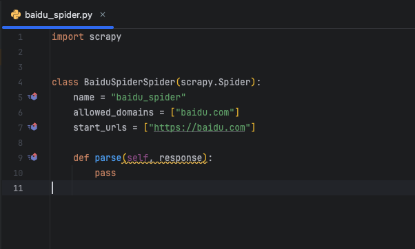
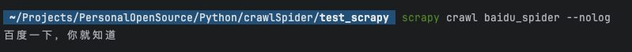
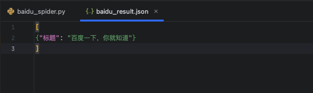
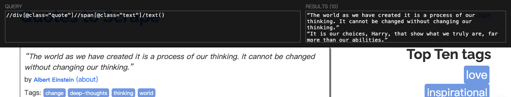
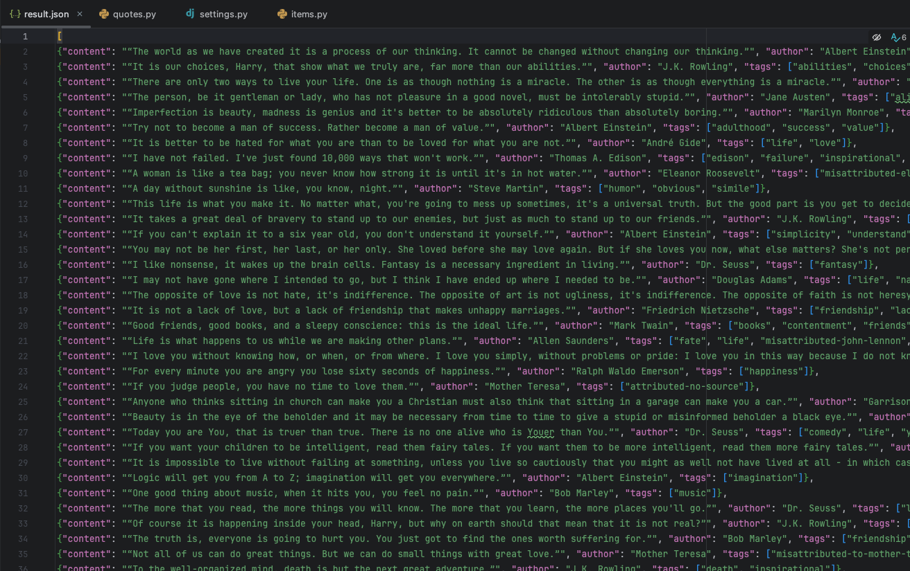

### 概述

官方文档：[Scrapy官方文档](https://osgeo.cn/scrapy/index.html)

Scrapy，Python开发的一个快速、高层次的屏幕抓取和web抓取框架，用于抓取web站点并从页面中提取结构化的数据。Scrapy用途广泛，可以用于数据挖掘、监测和自动化测试.

其最初是为了页面抓取 (更确切来说, 网络抓取 )所设计的， 后台也应用在获取API所返回的数据(例如 Amazon Associates Web Services ) 或者通用的网络爬虫.

Scrapy吸引人的地方在于它是一个框架，任何人都可以根据需求方便的修改。它也提供了多种类型爬虫的基类，如BaseSpider、sitemap爬虫等，最新版本又提供了web2.0爬虫的支持.


### Scrapy五大基本构成:

Scrapy框架主要由五大组件组成，它们分别是调度器(Scheduler)、下载器(Downloader)、爬虫（Spiders）、实体管道(Item Pipeline)和Scrapy引擎(Scrapy Engine)。

#### **调度器(Scheduler):**

调度器，说白了把它假设成为一个URL（抓取网页的网址或者说是链接）的优先队列，由它来决定下一个要抓取的网址是什么，同时去除重复的网址（不做无用功）。用户可以自己的需求定制调度器。

#### **下载器(Downloader):**

下载器，是所有组件中负担最大的，它用于高速地下载网络上的资源。Scrapy的下载器代码不会太复杂，但效率高，主要的原因是Scrapy下载器是建立在twisted这个高效的异步模型上的(其实整个框架都在建立在这个模型上的)。

#### **爬虫(Spiders):**

爬虫，是用户最关心的部份。用户定制自己的爬虫(通过定制正则表达式等语法)，用于从特定的网页中提取自己需要的信息，即所谓的实体(Item)。 用户也可以从中提取出链接,让Scrapy继续抓取下一个页面。

#### **实体管道(Item Pipeline):**

实体管道，用于处理爬虫(spiders)提取的实体。主要的功能是持久化实体、验证实体的有效性、清除不需要的信息。

#### **Scrapy引擎(Scrapy Engine):**

Scrapy引擎是整个框架的核心.它用来控制调试器、下载器、爬虫。实际上，引擎相当于计算机的CPU,它控制着整个流程。

### 整体架构图

官网架构图



### Scrapy安装以及生成项目

#### **安装方式**

```python
pip3 install scrapy
```

#### **生成项目**

```python
scrapy startproject test_scrapy
```

执行命令，就会在当前文件夹下生成一个新的项目

然后进入项目文件夹，使用要爬取的地址链接，生成文件

```python
cd test_scrapy
scrapy genspider baidu_spider baidu.com
```

项目目录框架如下：



spiders下的 baidu_spider.py 是 scrapy 自动为我们生成的




### 修改项目配置

在生成的项目文件夹下有一个配置文件 settings.py ，需要修改一下

```python
# 基础配置部分

# 项目名称配置
BOT_NAME = "test_scrapy"
# 定义爬虫项目名称，会在日志、统计中显示
# 也用于默认的 User-Agent 字符串

# 爬虫模块路径配置
SPIDER_MODULES = ["test_scrapy.spiders"]
# 指定包含爬虫类的 Python 模块路径
# Scrapy 会从这里查找和加载爬虫类
# 支持多个模块路径，如 ["spiders1", "spiders2"]

# 新爬虫生成路径
NEWSPIDER_MODULE = "test_scrapy.spiders"
# 使用 scrapy genspider 命令创建新爬虫时的默认模块路径
# 新创建的爬虫文件会自动放在此目录下

# 机器人协议配置
ROBOTSTXT_OBEY = True  # 生产环境建议遵守
# 是否遵守目标网站的 robots.txt 协议
# True：遵守，只爬取允许的页面，符合道德和法律要求
# False：不遵守，可能被网站封禁或违反服务条款

# 用户代理配置
USER_AGENT = "your_custom_user_agent (+http://www.yourdomain.com)"
# HTTP 请求头中的 User-Agent 字段
# 应该设置为真实的标识信息，包含联系方式
# 建议格式：项目名/版本 (+http://你的域名或联系方式)
# 示例：NewsCrawler/1.0 (+https://github.com/yourusername/project)

# 并发控制配置
CONCURRENT_REQUESTS = 16
# 全局最大并发请求数
# 控制 Scrapy 同时处理的总请求数量
# 包括正在下载、等待下载的请求
# 建议值：8-32，根据服务器性能和网络条件调整

CONCURRENT_REQUESTS_PER_DOMAIN = 8
# 每个域名的最大并发请求数
# 限制对单个网站的并发访问，避免造成过大压力
# 建议值：2-16，根据目标网站的承受能力调整
# 过高的值可能导致 IP 被封禁

# 下载延迟配置
DOWNLOAD_DELAY = 0.5
# 连续请求之间的最小延迟时间（单位：秒）
# 用于控制爬取速度，避免高频请求
# 建议值：0.25-2.0，根据网站响应时间和反爬策略调整
# 值越小，爬取越快，但被封风险越高

RANDOMIZE_DOWNLOAD_DELAY = True  # 在 0.5 * 0.5 ~ 1.5 * 0.5 秒间随机延迟
# 是否随机化下载延迟
# True：实际延迟会在 (DOWNLOAD_DELAY * 0.5) 到 (DOWNLOAD_DELAY * 1.5) 之间随机
# 例如：DOWNLOAD_DELAY=0.5 时，实际延迟为 0.25-0.75 秒
# 避免固定的请求间隔被识别为爬虫行为

# 自动限速配置
AUTOTHROTTLE_ENABLED = True
# 是否启用自动限速功能
# True：根据服务器响应时间动态调整请求延迟
# 当服务器响应快时，增加并发；响应慢时，减少并发
# 智能调节，既提高效率又避免过载

AUTOTHROTTLE_START_DELAY = 1.0
# 自动限速的初始延迟时间（单位：秒）
# 爬虫启动时的初始延迟，比普通 DOWNLOAD_DELAY 更保守
# 用于初始探测服务器的响应能力
# 建议值：1.0-5.0

AUTOTHROTTLE_MAX_DELAY = 60.0
# 自动限速的最大延迟时间（单位：秒）
# 当服务器响应极慢或遇到问题时，请求之间的最大间隔
# 避免无限等待导致爬虫效率过低
# 建议值：30.0-180.0

AUTOTHROTTLE_TARGET_CONCURRENCY = 1.0
# 自动限速的目标并发数
# 控制向同一服务器发送请求的平均速率
# 1.0 表示每秒大约 1 个请求
# 值越高，爬取越快，但服务器压力越大
# 建议值：0.5-2.0

# 重试机制配置
RETRY_ENABLED = True
# 是否启用请求重试机制
# True：当请求失败时自动重试
# 提高爬虫的健壮性，应对网络波动和临时错误

RETRY_TIMES = 2
# 最大重试次数（不包括第一次请求）
# 例如：设置为 2 表示最多尝试 3 次（1 次原始请求 + 2 次重试）
# 建议值：2-5，过高的重试次数可能造成死循环

RETRY_HTTP_CODES = [500, 502, 503, 504, 408, 429]
# 需要重试的 HTTP 状态码列表
# 500：服务器内部错误
# 502：网关错误
# 503：服务不可用（常见于反爬虫限流）
# 504：网关超时
# 408：请求超时
# 429：请求过多（触发了反爬虫机制）
# 注意：404 通常不重试，因为资源不存在

# 超时设置
DOWNLOAD_TIMEOUT = 30
# 下载请求的超时时间（单位：秒）
# 超过此时间未收到响应，请求将被视为失败
# 避免因慢响应或无响应而长时间阻塞
# 建议值：15-60，根据目标网站响应速度调整

# 日志设置
LOG_LEVEL = 'INFO'  # DEBUG, INFO, WARNING, ERROR, CRITICAL
# 日志级别设置
# DEBUG：最详细，包含所有调试信息
# INFO：一般信息，显示爬虫运行状态
# WARNING：警告信息，潜在问题
# ERROR：错误信息，需要关注
# CRITICAL：严重错误，可能导致爬虫停止
# 生产环境建议使用 INFO 或 WARNING

LOG_FILE = 'scrapy.log'  # 可选：将日志输出到文件
# 日志输出文件路径
# 不设置时，日志输出到控制台
# 设置后，日志同时输出到文件和屏幕
# 便于长期记录和分析爬虫运行情况

# 编码配置
FEED_EXPORT_ENCODING = "utf-8"
# 数据导出时的字符编码
# UTF-8：支持所有语言字符，推荐使用
# 避免中文等非 ASCII 字符出现乱码
# 特别是在导出 JSON、CSV、XML 等格式时

# Item Pipeline 配置示例（可根据需要启用）
ITEM_PIPELINES = {
    'test_scrapy.pipelines.DuplicatesPipeline': 300,
    'test_scrapy.pipelines.ValidationPipeline': 400,
    'test_scrapy.pipelines.MongoDBPipeline': 500,
}
# Item Pipeline 处理管道配置
# 数字表示处理顺序，从小到大依次执行
# 300：去重管道（删除重复数据）
# 400：验证管道（检查数据完整性）
# 500：MongoDB存储管道（将数据存入MongoDB数据库）
# 每个数字代表一个执行优先级，可以自定义更多管道

# 其他重要配置（可根据需要添加）

# 数据导出配置
FEED_FORMAT = 'json'  # 输出格式：json, csv, xml, jsonlines 等
FEED_URI = 'output.json'  # 输出文件路径
FEED_EXPORT_FIELDS = ['title', 'url', 'content', 'date']  # 字段顺序

# 深度限制
DEPTH_LIMIT = 3  # 最大爬取深度，0表示无限制
DEPTH_PRIORITY = 0  # 深度优先级，正数表示广度优先，负数表示深度优先

# 下载器中间件优先级设置
DOWNLOADER_MIDDLEWARES = {
    # 禁用默认的 UserAgent 中间件
    'scrapy.downloadermiddlewares.useragent.UserAgentMiddleware': None,
    # 添加随机 UserAgent 中间件（需要安装 scrapy-user-agents）
    'scrapy_user_agents.middlewares.RandomUserAgentMiddleware': 400,
    # 添加代理中间件（需要安装 scrapy-proxy-pool）
    'scrapy_proxy_pool.middlewares.ProxyPoolMiddleware': 610,
    'scrapy_proxy_pool.middlewares.BanDetectionMiddleware': 620,
}

# 内存使用限制
MEMUSAGE_ENABLED = True  # 启用内存监控
MEMUSAGE_LIMIT_MB = 1024  # 内存使用上限（MB），超过会关闭爬虫
MEMUSAGE_NOTIFY_MAIL = ['admin@example.com']  # 内存超标通知邮箱

# Cookie 配置
COOKIES_ENABLED = True  # 启用 Cookie，保持会话状态
COOKIES_DEBUG = False  # 是否记录 Cookie 调试信息

# 图片下载配置（需要 scrapy.pipelines.images.ImagesPipeline）
IMAGES_STORE = 'images'  # 图片存储目录
IMAGES_MIN_HEIGHT = 100  # 最小图片高度
IMAGES_MIN_WIDTH = 100   # 最小图片宽度

# 数据库连接配置（示例）
MONGODB_URI = "mongodb://localhost:27017"
MONGODB_DATABASE = "scrapy_data"
MONGODB_COLLECTION = "items"

# 邮件通知配置
MAIL_FROM = 'scrapy@example.com'
MAIL_HOST = 'smtp.example.com'
MAIL_PORT = 587
MAIL_USER = 'username'
MAIL_PASS = 'password'
MAIL_TLS = True
MAIL_SSL = False

# 爬虫关闭条件
CLOSESPIDER_TIMEOUT = 3600  # 运行1小时后自动关闭（单位：秒）
CLOSESPIDER_ITEMCOUNT = 10000  # 抓取10000个item后自动关闭
CLOSESPIDER_PAGECOUNT = 1000  # 抓取1000个页面后自动关闭
CLOSESPIDER_ERRORCOUNT = 10  # 发生10个错误后自动关闭
```

为了测试，可以先简化配置，后续根据项目需求在增加配置

```python
# 最小化配置，避免依赖问题
BOT_NAME = "test_scrapy"
SPIDER_MODULES = ["test_scrapy.spiders"]
NEWSPIDER_MODULE = "test_scrapy.spiders"

# 基本配置
ROBOTSTXT_OBEY = False
USER_AGENT = "Mozilla/5.0 (Windows NT 10.0; Win64; x64) AppleWebKit/537.36"

# 并发控制
CONCURRENT_REQUESTS = 16
CONCURRENT_REQUESTS_PER_DOMAIN = 8
DOWNLOAD_DELAY = 1

# 编码
FEED_EXPORT_ENCODING = "utf-8"

# 日志
LOG_LEVEL = 'INFO'

# 如果有日志文件路径问题，可以注释掉
# LOG_FILE = 'scrapy.log'
```

### 代码测试

```python
import scrapy  
  
  
class BaiduSpiderSpider(scrapy.Spider):  
    name = "baidu_spider"  
    allowed_domains = ["baidu.com"]  
    start_urls = ["https://www.baidu.com"]  
  
    def parse(self, response):  
        title = response.xpath("//title//text()").get()  
        print(title)
```

在终端运行命令

```python
scrapy crawl baidu_spider --nolog    
```

`--nolog` 代表不在终端打印日志，如果不加会显示一堆日志，为了看得清晰就不打印日志了



或者也可以保存到文件中查看，但如果想保存到文件中就必须使用 yield

```python
import scrapy  
  
  
class BaiduSpiderSpider(scrapy.Spider):  
    name = "baidu_spider"  
    allowed_domains = ["baidu.com"]  
    start_urls = ["http://www.baidu.com"]  
  
    def parse(self, response):  
        title = response.xpath("//title//text()").get()  
  
        item = {"标题": title}  
  
        yield item
```

在终端运行命令

```python
scrapy crawl baidu_spider -o baidu_result.json
```

`-o baidu_result.json` 表示将结果写到 baidu_result.json 文件中，会在项目目录中生成




### 实操案例

使用scrapy的官方文档中提供的地址测试：[测试地址](https://quotes.toscrape.com/)

#### 创建项目

```python
scrapy startproject crawl_quotes
```

#### 生成spider

```python
cd crawl_quotes
scrapy genspider quotes https://quotes.toscrape.com/ 
```

#### 修改配置文件(settings.py)

```python
BOT_NAME = "crawl_quotes"  
  
SPIDER_MODULES = ["crawl_quotes.spiders"]  
NEWSPIDER_MODULE = "crawl_quotes.spiders"  
  
ADDONS = {}  
  
# 基本配置  
ROBOTSTXT_OBEY = False  
USER_AGENT = "Mozilla/5.0 (Macintosh; Intel Mac OS X 10_15_7) AppleWebKit/537.36 (KHTML, like Gecko) Chrome/146.0.0.0 Safari/537.36"  
  
# 并发控制  
CONCURRENT_REQUESTS = 16  
CONCURRENT_REQUESTS_PER_DOMAIN = 8  
DOWNLOAD_DELAY = 1  
  
# 编码  
FEED_EXPORT_ENCODING = "utf-8"  
  
# 日志  
LOG_LEVEL = 'INFO'
```

#### 确认要提取的数据(items.py)

查看网站可知，页面中的主要数据为 内容、作者、标签，将这三项添加到item中


```python
import scrapy  
  
  
class CrawlQuotesItem(scrapy.Item):
    content = scrapy.Field()  
    author = scrapy.Field()  
    tags = scrapy.Field()
```

#### 编写爬虫(quotes.py)

```python
import scrapy  
  
from crawl_quotes.items import CrawlQuotesItem  
  
  
class QuotesSpider(scrapy.Spider):  
    name = "quotes"  
    allowed_domains = ["quotes.toscrape.com"]  
    start_urls = ["https://quotes.toscrape.com/"]  
  
    def parse(self, response):  
  
        divs = response.xpath('//div[@class="quote"]')  
  
        for div in divs:  
  
            item = CrawlQuotesItem()    # 每次循环都创建一个新的item，要不然内容会重复  
            content = div.xpath('.//span[@class="text"]/text()').get()  
  
            author = div.xpath('.//small[@class="author"]/text()').get()  
  
            tags = div.xpath('.//a[@class="tag"]/text()').getall()  
  
            item["content"] = content  
            item["author"] = author  
            item["tags"] = tags  
  
            yield item  
  
        # 获取下一页，有下一页就继续抓取  
        next_page = response.xpath('//li[@class="next"]/a/@href').get()  
  
        if next_page:  
            yield response.follow(next_page, callback=self.parse)
```

在代码中使用了xpath来解析页面元素，浏览器中推荐使用扩展 XPath Helper ，在页面中定位很方便




#### 启动爬虫，并将内容保存

```python
scrapy crawl quotes -o result.json --nolog
```

#### 查看结果


