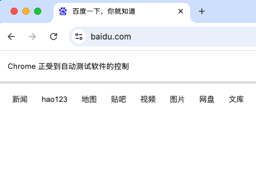
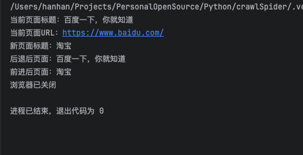
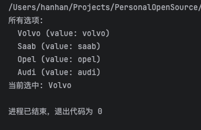
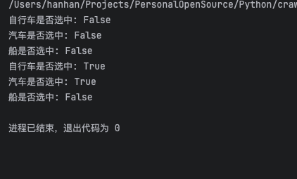
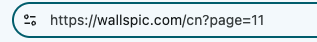
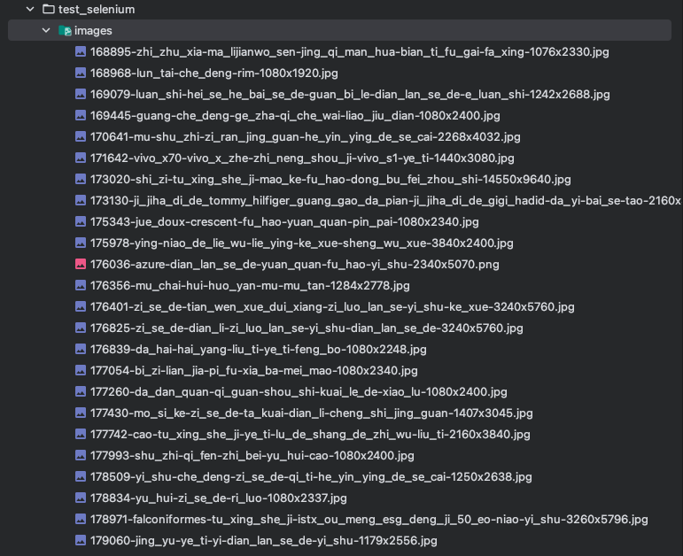

### 了解Selenium

[Selenium官方文档](https://www.selenium.dev/zh-cn/documentation/)

Selenium是一款用于测试Web应用程序的经典工具，它直接运行在浏览器中，仿佛真正的用户在操作浏览器一样，主要用于网站自动化测试、网站模拟登陆、自动操作键盘和鼠标、测试浏览器兼容性、测试网站功能等，同时也可以用来制作简易的网络爬虫。

### 安装Selenium

在命令行中输入：

```python
pip3 install selenium
```

### 安装浏览器驱动管理工具

```python
pip3 install webdriver-manager
```

### 测试:访问百度

```python
from selenium import webdriver  
from selenium.webdriver.chrome.service import Service  
from webdriver_manager.chrome import ChromeDriverManager  
  
import time  
  
# 设置Chrome驱动  
service = Service(ChromeDriverManager().install())  
  
# 创建浏览器对象  
driver = webdriver.Chrome(service=service)  
  
# 设置访问地址  
driver.get("https://www.baidu.com")  
  
# 等待5秒  
time.sleep(5)  
  
# 关闭浏览器  
driver.quit()
```

运行这个程序，会自动打开Chrome浏览器，访问百度首页，5秒后浏览器自动关闭


### Selenium基础操作详解

#### 常用操作汇总表

| 操作      | 方法                                      | 示例                                    |
| ------- | --------------------------------------- | ------------------------------------- |
| 打开网页    | `driver.get(url)`                       | `driver.get("https://www.baidu.com")` |
| 获取页面标题  | `driver.title`                          | `title = driver.title`                |
| 获取当前URL | `driver.current_url`                    | `url = driver.current_url`            |
| 前进      | `driver.forward()`                      | `driver.forward()`                    |
| 后退      | `driver.back()`                         | `driver.back()`                       |
| 刷新      | `driver.refresh()`                      | `driver.refresh()`                    |
| 关闭当前窗口  | `driver.close()`                        | `driver.close()`                      |
| 关闭所有窗口  | `driver.quit()`                         | `driver.quit()`                       |
| 最大化窗口   | `driver.maximize_window()`              | `driver.maximize_window()`            |
| 设置窗口大小  | `driver.set_window_size(width, height)` | `driver.set_window_size(800, 600)`    |

#### 详细操作示例

```python
import time  
  
from selenium import webdriver  
from selenium.webdriver.chrome.service import Service  
from webdriver_manager.chrome import ChromeDriverManager  
  
# 初始化浏览器  
service = Service(ChromeDriverManager().install())  
driver = webdriver.Chrome(service=service)  
try:  
    # 访问第一个网站  
    driver.get("https://www.baidu.com")  
    print(f"当前页面标题：{driver.title}")  
    print(f"当前页面URL：{driver.current_url}")  
    # 等待2秒  
    time.sleep(2)  
  
    # 访问第二个网站  
    driver.get("https://www.taobao.com")  
    print(f"新页面标题：{driver.title}")  
    # 等待2秒  
    time.sleep(2)  
  
    # 后退到百度  
    driver.back()  
    print(f"后退后页面：{driver.title}")  
    # 等待2秒  
    time.sleep(2)  
    # 前进到淘宝  
    driver.forward()  
    print(f"前进后页面：{driver.title}")  
    # 刷新页面      
	driver.refresh()  
    # 最大化窗口  
    driver.maximize_window()  
    # 设置窗口大小  
    driver.set_window_size(800, 600)  
finally:  
    # 关闭浏览器  
    time.sleep(3)  
    driver.quit()  
    print("浏览器已关闭")
```



### 元素定位

假设html如下:

```html
<div>
<a href="https://www.baidu.com">百度</a>
<a href="https://news.baidu.com">百度新闻</a>
</div>
<input id="test_id" name="test_name" class="test_class_name" type="text">
```

#### 通过ID定位

```python
# 元素有id属性时使用（id通常是唯一的）
search_input = driver.find_element("id", "test_id")
search_input = driver.find_element_by_id("test_id")
```

#### 通过NAME定位

```python
# 元素的name属性可能不唯一
search_input = driver.find_element("name", "test_name")
search_input = driver.find_element_by_name("test_name")
```

#### 通过CLASS\_NAME定位

```python
# 元素的class属性可能不唯一
search_input = driver.find_element("class name", "test_class_name")
search_input = driver.find_element_by_class_name("test_class_name")
```

#### 通过TAG\_NAME定位(无法精确定位，不推荐)

```python
# 通过标签名查找
divs = driver.find_elements("tag name", "div")  # 所有div元素
inputs = driver.find_elements("tag name", "input")  # 所有input元素
links = driver.find_elements("tag name", "a")  # 所有链接
```

#### 通过LINK\_TEXT定位

```php-template
<a href="https://news.baidu.com">新闻</a><a href="https://www.hao123.com">hao123</a>
```

```python
# 精确匹配链接文本
link = driver.find_element("link text", "百度")
```

##### 通过PARTIAL\_LINK\_TEXT定位

```python
# 部分匹配链接文本（包含即可）
baidu_link = driver.find_element("partial link text", "新闻")  # 匹配"百度新闻"
```

#### 通过CSS\_SELECTOR定位（推荐）

CSS选择器功能强大，类似于CSS样式选择元素：

```python
# 通过id
element = driver.find_element("css selector", "#test_id")
```

选择器中的 `#` 表示id，所以是寻找 id=“test_id” 的元素

```python
# 通过class
element = driver.find_element("css selector", ".test_class_name")
```

选择器中的 `.` 代表class，所以是寻找class=“test_class_name” 的元素

```python
# 通过标签名+class
element = driver.find_element("css selector", "input.test_class_name")
```

选择器中是通过标签名+class精确定位，代表class=“test_class_name” 的 `input` 元素

```python
# 通过属性
element = driver.find_element("css selector", "[name='test_name']")
```

选择器中 `[]` 内是属性，所以是寻找name=“test_name” 的元素

```python
# 组合选择
element = driver.find_element("css selector", "input#test_id.test_class_name[name='test_name']")
```

选择器各种选项组合，所以是寻找id="test_id"， class="test_class_name"， name="test_name" 的 input 标签元素
#### 通过XPATH定位(最常用)

XPath就像文件路径，可以定位到任何元素：

```python

# 绝对路径（不推荐）
element = driver.find_element("xpath", "/html/body/div/div[2]/div/div/div/form/span/input") 

# 相对路径（推荐）
element = driver.find_element("xpath", "//input")

# 带属性的相对路径
element = driver.find_element("xpath", "//input[@id='test_id']")
element = driver.find_element("xpath", "//input[@name='test_name']")

# 使用and/or
element = driver.find_element("xpath", "//input[@id='test_id' and @name='test_name']") 

# 使用文本内容
# contains为模糊匹配，不加为精准匹配
element = driver.find_element("xpath", "//a[text()='新闻']") 
element = driver.find_element("xpath", "//a[contains(text(),'新闻')]") 
```

#### 元素定位选择建议

|    场景    |        推荐方式        |      原因       |
|----------|--------------------|---------------|
|  元素有id   |       By.ID        |   最简单、最快、唯一   |
| 元素有name  |      By.NAME       |     简单常用      |
| 元素有class |   By.CLASS_NAME    | 简单，但class可能重复 |
| 查找多个同类元素 |    By.TAG_NAME     |   查找所有同类元素    |
|  精确文本链接  |    By.LINK_TEXT    |   链接文本不变时使用   |
|  模糊文本链接  | By.PARTIAL_LINK_TEXT |   链接文本部分匹配    |
|   复杂选择   |  By.CSS_SELECTOR   |   功能强大，语法简洁   |
|  最复杂情况   |      By.XPATH      |   功能最强大，但稍慢   |

### 元素操作

定位元素后，可以与网页交互

#### 输入文本

```python
import time  
  
from selenium import webdriver  
from selenium.webdriver.chrome.service import Service  
from selenium.webdriver.common.by import By  
from selenium.webdriver.common.keys import Keys  
from webdriver_manager.chrome import ChromeDriverManager  
  
service = Service(ChromeDriverManager().install())  
driver = webdriver.Chrome(service=service)  
try:  
    driver.get("https://www.baidu.com")  
  
    # 找到搜索框  
    search_box = driver.find_element(By.ID, "kw")  
  
    # 方法1：直接输入  
    search_box.send_keys("Python")  
    time.sleep(2)  
  
    # 方法2：先清空再输入  
    search_box.clear()  # 清空内容  
    search_box.send_keys("Selenium")  
    time.sleep(2)  
  
    # 方法3：输入特殊键（如回车）  
    search_box.clear()  
    search_box.send_keys("Selenium学习")  
    search_box.send_keys(Keys.ENTER)  # 按回车键  
    time.sleep(2)  
finally:  
    driver.quit()
```

#### 点击操作

```python
import time  
  
from selenium import webdriver  
from selenium.webdriver.chrome.service import Service  
from selenium.webdriver.common.by import By  
from webdriver_manager.chrome import ChromeDriverManager  
  
service = Service(ChromeDriverManager().install())  
driver = webdriver.Chrome(service=service)  
  
try:  
    driver.get("https://www.baidu.com")  
  
    # 找到搜索框并输入内容  
    search_box = driver.find_element(By.ID, "kw")  
    search_box.send_keys("Python")  
  
    # 方法1：直接点击百度一下按钮  
    search_button = driver.find_element(By.ID, "su")  
    search_button.click()  
    time.sleep(2)  
  
    # 方法2：模拟键盘回车（不需要点击按钮）  
    driver.back()  # 返回百度首页  
    time.sleep(1)  
  
    search_box = driver.find_element(By.ID, "kw")  
    search_box.clear()  
    search_box.send_keys("Selenium")  
    search_box.submit()  # 提交表单（相当于在输入框按回车）  
    time.sleep(2)  
finally:  
    driver.quit()
```

#### 获取元素信息

```python
from selenium import webdriver  
from selenium.webdriver.chrome.service import Service  
from selenium.webdriver.common.by import By  
from webdriver_manager.chrome import ChromeDriverManager  
  
service = Service(ChromeDriverManager().install())  
driver = webdriver.Chrome(service=service)  
  
try:  
    driver.get("https://www.baidu.com")  
  
    # 获取搜索框元素  
    search_box = driver.find_element(By.ID, "kw")  
  
    # 获取元素的各种属性  
    print(f"元素标签名: {search_box.tag_name}")  
    print(f"元素ID: {search_box.get_attribute('id')}")  
    print(f"元素name: {search_box.get_attribute('name')}")  
    print(f"元素class: {search_box.get_attribute('class')}")  
    print(f"元素类型: {search_box.get_attribute('type')}")  
    print(f"元素值: {search_box.get_attribute('value')}")  
    print(f"元素是否可见: {search_box.is_displayed()}")  
    print(f"元素是否可用: {search_box.is_enabled()}")  
    print(f"元素是否被选中: {search_box.is_selected()}")  
  
    # 获取元素位置和大小  
    location = search_box.location  
    size = search_box.size  
    print(f"元素位置: x={location['x']}, y={location['y']}")  
    print(f"元素大小: 宽={size['width']}, 高={size['height']}")  
  
    # 获取元素文本（对于有文本的元素）  
    baidu_link = driver.find_element(By.LINK_TEXT, "百度首页")  
    print(f"链接文本: {baidu_link.text}")  
finally:  
    driver.quit()
```

#### 处理下拉框

```python
import time  
  
from selenium import webdriver  
from selenium.webdriver.chrome.service import Service  
from selenium.webdriver.common.by import By  
from selenium.webdriver.support.select import Select  
from webdriver_manager.chrome import ChromeDriverManager  
  
service = Service(ChromeDriverManager().install())  
driver = webdriver.Chrome(service=service)  
  
try:  
    # 访问一个测试页面（包含下拉框）  
    driver.get("https://www.w3schools.com/tags/tryit.asp?filename=tryhtml_select")  
  
    # 切换到iframe（因为这个页面有iframe框架）  
    driver.switch_to.frame("iframeResult")  
  
    # 找到下拉框  
    cars_select = driver.find_element(By.ID, "cars")  
  
    # 创建Select对象  
    select = Select(cars_select)  
  
    # 方法1：通过可见文本选择  
    select.select_by_visible_text("Audi")  
    time.sleep(1)  
  
    # 方法2：通过value值选择  
    select.select_by_value("opel")  
    time.sleep(1)  
  
    # 方法3：通过索引选择（从0开始）  
    select.select_by_index(0)  # 选择第一个选项  
    time.sleep(1)  
  
    # 获取所有选项  
    all_options = select.options  
    print("所有选项:")  
  
    for option in all_options:  
        print(f"  {option.text} (value: {option.get_attribute('value')})")  
  
        # 获取已选中的选项  
    selected_option = select.first_selected_option  
    print(f"当前选中: {selected_option.text}")  
finally:  
    driver.quit()
```



#### 处理复选框和单选框

```python
import time  
  
from selenium import webdriver  
from selenium.webdriver.chrome.service import Service  
from selenium.webdriver.common.by import By  
from webdriver_manager.chrome import ChromeDriverManager  
  
service = Service(ChromeDriverManager().install())  
driver = webdriver.Chrome(service=service)  
  
try:  
    # 访问测试页面    
	driver.get("https://www.w3schools.com/tags/tryit.asp?filename=tryhtml5_input_type_checkbox")  
	  
	    # 切换到iframe    
	driver.switch_to.frame("iframeResult")  
	  
	    # 找到复选框    
	vehicle1 = driver.find_element(By.ID, "vehicle1")  # 自行车    
	vehicle2 = driver.find_element(By.ID, "vehicle2")  # 汽车    
	vehicle3 = driver.find_element(By.ID, "vehicle3")  # 船    
	    # 检查复选框状态    
	print(f"自行车是否选中: {vehicle1.is_selected()}")  
	    print(f"汽车是否选中: {vehicle2.is_selected()}")  
	    print(f"船是否选中: {vehicle3.is_selected()}")  
	  
	    # 选中复选框（如果未选中）    
	if not vehicle1.is_selected():  
        vehicle1.click()  
        time.sleep(1)  
  
    if not vehicle2.is_selected():  
        vehicle2.click()  
        time.sleep(1)  
  
        # 取消选中（如果已选中）  
    if vehicle3.is_selected():  
        vehicle3.click()  
        time.sleep(1)  
  
        # 重新检查状态  
    print(f"自行车是否选中: {vehicle1.is_selected()}")  
    print(f"汽车是否选中: {vehicle2.is_selected()}")  
    print(f"船是否选中: {vehicle3.is_selected()}")  
finally:  
    driver.quit()
```


### 等待机制

网页加载需要时间，所以需要等待元素出现后再操作

#### 强制等待（不推荐）

```python
import timetime.sleep(5)  # 强制等待5秒，不管元素是否加载完成
```

**缺点**：如果元素提前加载完成，也要等；如果超时未加载，会报错。

#### 隐式等待（全局等待）

```python
from selenium import webdriver
from selenium.webdriver.chrome.service import Service
from webdriver_manager.chrome import ChromeDriverManager 

service = Service(ChromeDriverManager().install())
driver = webdriver.Chrome(service=service) 

# 设置隐式等待10秒
driver.implicitly_wait(10) 

# 之后的所有find_element操作都会最多等待10秒
driver.get("https://www.baidu.com")
element = driver.find_element("id", "kw") 
```

**优点**：设置一次，全局生效。

#### 显式等待（推荐）

```python
from selenium import webdriver
from selenium.webdriver.chrome.service import Service
from webdriver_manager.chrome import ChromeDriverManager
from selenium.webdriver.common.by import By
from selenium.webdriver.support.ui import WebDriverWait
from selenium.webdriver.support import expected_conditions as EC 

service = Service(ChromeDriverManager().install())
driver = webdriver.Chrome(service=service) 

try:    
	driver.get("https://www.baidu.com")        
	# 创建等待对象（最多等10秒，每0.5秒检查一次）    
	wait = WebDriverWait(driver, 10, 0.5)        
	
	# 等待元素出现    
	search_box = wait.until(EC.presence_of_element_located((By.ID, "kw")))    print("搜索框已出现")        
	
	# 等待元素可点击    
	search_button = wait.until(EC.element_to_be_clickable((By.ID, "su")))    print("搜索按钮可点击")        
	
	# 等待元素可见    
	logo = wait.until(EC.visibility_of_element_located((By.ID, "lg")))    
	print("百度logo可见")        
	
	# 等待文本出现在元素中    
	news_link = wait.until(EC.text_to_be_present_in_element((By.LINK_TEXT, "新闻"), "新闻"))    
	print("新闻链接文本正确")    
finally:    
	driver.quit()
```

#### 常用等待条件

|             条件              |        说明        |
|-----------------------------|------------------|
|  `presence_of_element_located`  | 元素出现在DOM中（不一定可见） |
| `visibility_of_element_located` |  元素可见（有宽高，非隐藏）   |
|    `element_to_be_clickable`    |      元素可点击       |
|  `text_to_be_present_in_element`  |     元素包含特定文本     |
|       `title_contains`        |    页面标题包含特定文本    |
|       `alert_is_present`        |      出现警告框       |

### 常见问题

#### 找不到元素（NoSuchElementException）

**错误信息**：

```text
selenium.common.exceptions.NoSuchElementException: Message: no such element
```

**可能原因**：
- 元素还没加载出来
- 元素ID/名称已改变
- 页面有iframe框架

**解决方法**：
- 增加等待时间
- 使用其他定位方式，比如id找不到，试试name、class、xpath等
- 检查是否有iframe

```python
driver.switch_to.frame("iframe_name_or_id")  # 切换到iframe

# 操作...

driver.switch_to.default_content()  # 切换回主页面
```

#### 元素不可点击（ElementNotInteractableException）

**错误信息**：

```text
ElementNotInteractableException: element not interactable
```

**可能原因**：
- 元素被其他元素遮挡
- 元素不可见（display: none）
- 元素还没加载完成

**解决方法**：
- 等待元素可点击
- 使用JavaScript点击

```python
driver.execute_script("arguments[0].click();", element)
```

- 滚动到元素位置并点击

```python
driver.execute_script("arguments[0].scrollIntoView();", element)element.click()
```

#### 超时错误（TimeoutException）

**错误信息**：

```text
TimeoutException: Message: timeout waiting for element
```

**解决方法**：
- 增加等待时间

```python
wait = WebDriverWait(driver, 20)  # 从10秒增加到20秒 
```

- 设置更频繁的检查

```python
wait = WebDriverWait(driver, 10, 0.1)  # 每0.1秒检查一次
```

- 检查网络或网站状态
#### 浏览器驱动问题

**错误信息**：

```text
WebDriverException: Message: 'chromedriver' executable needs to be in PATH
```

**解决方法**：  
- 确保安装了 `webdriver-manager` 并正确使用：

```python
# 正确的方式
from webdriver_manager.chrome import ChromeDriverManager

service = Service(ChromeDriverManager().install())
driver = webdriver.Chrome(service=service)
```


### 实操:爬取图片

以 [图片网站](https://wallspic.com/cn) 为目标， 这个网站不是静态网站，使用requests+bs4或者scrapy都搞不定，所以用selenium试试

#### 寻找网页特点

打开网站，会直接发现图片列表，一直下拉，会发现下一页按钮，旁边有总页数，所以如果下拉到底，会加载出来10页图片


点击下一页，发现浏览器中的链接变成了 `https://wallspic.com/cn?page=11` 



改变几次 `page` 的值，我发现一页一页请求也可以，这样就省去了下拉的问题

#### 完整代码

```python
import os  
import random  
import time  
  
import requests  
from selenium import webdriver  
from selenium.webdriver.chrome.service import Service  
from selenium.webdriver.common.by import By  
from webdriver_manager.chrome import ChromeDriverManager  
  
# 初始化浏览器  
service = Service(ChromeDriverManager().install())  
driver = webdriver.Chrome(service=service)  
  
"""  
爬取图片  
  
参数:  
    page_num: 页数  
"""  
  
  
def crawl_images(page_num):  
  
    # 具体页数的链接  
    url = f"https://wallspic.com/cn?page={page_num}"  
  
    # 获取当前页数的页面下的所有图片详情页链接列表  
    links = get_img_detail_link(url)  
  
    print(links)  
  
    # 遍历图片详情页链接，爬取图片  
    for link in links:  
  
        try:  
            open_img_detail_link(link)  
  
            # 随机等待  
            random_wait()  
        except Exception as e:  
            print(e)  
            continue  
  
  
  
"""  
获取图片详情页  
  
参数:  
    url: 网页链接  
    返回:  
    links: 当前网页所有图片的详情页链接列表  
"""  
  
  
def get_img_detail_link(url):  
    # 打开网站链接  
    driver.get(url)  
  
    # 获取所有符合条件的a元素  
    hrefs = driver.find_elements(By.XPATH, '//div[@class="gallery_fluid"]//a')  
  
    # 使用推导式，获取当前页面所有图片的详细页面链接  
    links = [_.get_attribute('href') for _ in hrefs]  
  
    return links  
  
  
"""  
打开图片详情页  
  
参数:  
    link: 图片详情页链接  
"""  
  
  
def open_img_detail_link(link):  
    # 访问图片的详细链接  
    driver.get(link)  
  
    # 获取下载按钮  
    download_button = driver.find_elements(By.XPATH, '//div[@class="wallpaper__buttons"]//a')  
  
    # 获取按钮中的图片链接  
    img_url = download_button[0].get_attribute('href')  
  
    # 下载图片  
    download_image(img_url)  
  
    # 随机等待  
    random_wait()  
  
    # 返回上一页  
    driver.back()  
  
  
"""  
下载图片  
  
参数:  
    img_url: 图片链接  
"""  
  
  
def download_image(img_url):  
    try:  
  
        # 判断目录是否存在  
        save_dir = f"./images/"  
        if not os.path.exists(save_dir):  
            os.makedirs(save_dir)  
  
        # 下载图片  
        img_resp = requests.get(img_url)  
  
        # 获取图片名称  
        img_name = img_url.split("/")[-1]  
  
        # 拼接保存路径  
        save_path = os.path.join(save_dir, img_name)  
  
        # 保存图片  
        with open(save_path, 'wb') as f:  
            f.write(img_resp.content)  
  
    except Exception as e:  
        print(f"下载失败: {e}")  
  
  
"""  
随机等待  
  
参数:  
    base_min: 基础最小等待时间  
    base_max: 基础最大等待时间  
    variance: 随机波动范围（0-1）  
"""  
  
  
def random_wait(base_min=1, base_max=3, variance=0.3):  
    # 基础等待时间  
    base_wait = random.uniform(base_min, base_max)  
  
    # 添加随机波动  
    variance_factor = random.uniform(1 - variance, 1 + variance)  
  
    # 最终等待时间  
    final_wait = base_wait * variance_factor  
  
    # 确保不低于最小值  
    final_wait = max(base_min * 0.5, final_wait)  
  
    time.sleep(final_wait)  
  
  
if __name__ == '__main__':  
  
    for i in range(1, 2711):  
  
        print(f"现在到了第{i}页")  
  
        crawl_images(i)  
  
        random_wait()
```

#### 运行结果

在当前文件夹下，会有一个images文件夹，下面存放了图片

