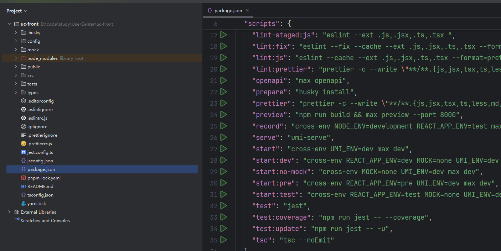
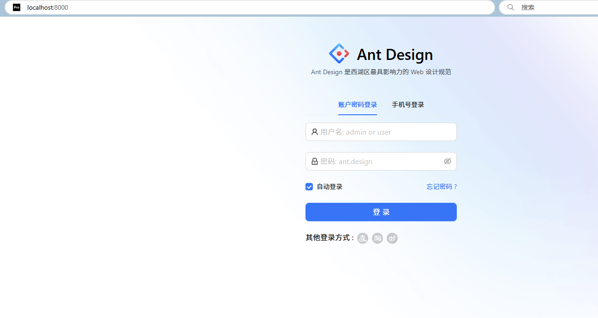

这篇记录一次 Ant Design Pro 的最小初始化流程：从脚手架创建到本地启动。

## 安装

- 参考文档：[Ant Design Pro 入门](https://pro.ant.design/zh-CN/docs/getting-started)

## 使用

### 1) 初始化项目

```bash
npm i @ant-design/pro-cli -g
pro create myapp
```

### 2) 选择 umi 版本与模板

- umi@4：暂不支持全量区块
- umi@3：可选 pro / complete 模板（complete 包含所有区块，不适合当基础模板二次开发）

```text
? 🐂 使用 umi@4 还是 umi@3 ? (Use arrow keys)
❯ umi@4
  umi@3
```

```text
? 🚀 要全量的还是一个简单的脚手架? (Use arrow keys)
❯ simple
  complete
```

### 3) 安装依赖

```bash
cd myapp
tyarn
# 或
npm install
```

### 4) 启动与验证

- 启动：打开项目，在 package.json 里找到 start 脚本并运行
- 

- 验证：访问 http://localhost:8000/
- 
