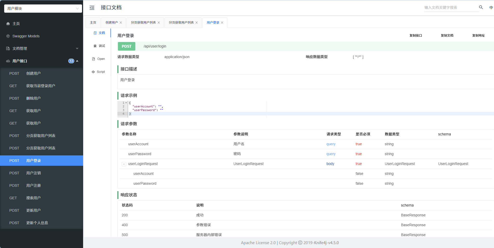
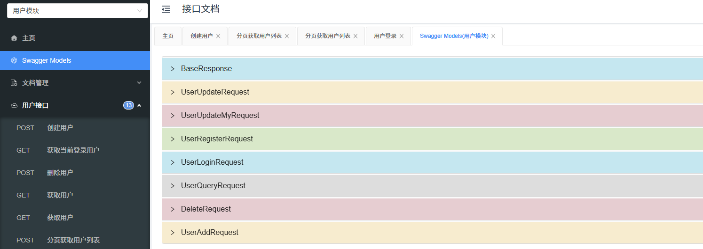

这篇记录在 Java 后端项目里接入 Swagger / Knife4j，生成可在线调试的接口文档。

## 接口文档是什么

接口文档用来描述 API 的关键要素：

- 请求参数
- 响应结构（错误码）
- 接口地址 / 名称
- 请求方法 / 格式
- 备注

## 接口文档的作用

- 便于归档与查阅，减少“口口相传”
- 作为前后端对接介质（后端 → 文档 ← 前端）
- 支持在线调试，提升联调效率

## 常见做法

- 手写：腾讯文档、Markdown
- 自动生成：根据代码生成文档 / 调试页
- 工具：Swagger、Postman；Apifox / Apipost / Eolink

## Swagger 与 Knife4j

- Swagger：开源 API 文档生成工具
- Knife4j：基于 Swagger 的增强版，UI 更好、功能更全，支持导出 HTML/Markdown/Word/PDF

## Knife4j 接入步骤

### 1) 引入依赖

```xml
<dependency>
    <groupId>com.github.xiaoymin</groupId>
    <artifactId>knife4j-openapi3-jakarta-spring-boot-starter</artifactId>
    <version>4.5.0</version>
</dependency>
```

### 2) 配置静态资源映射（WebMvcConfig）

```java
package com.hjx.ucback.config;

import org.springframework.context.annotation.Configuration;
import org.springframework.web.servlet.config.annotation.ResourceHandlerRegistry;
import org.springframework.web.servlet.config.annotation.WebMvcConfigurer;

@Configuration
public class WebMvcConfig implements WebMvcConfigurer {

    @Override
    public void addResourceHandlers(ResourceHandlerRegistry registry) {
        registry.addResourceHandler("/static/**")
                .addResourceLocations("classpath:/static/");
        registry.addResourceHandler("/doc.html")
                .addResourceLocations("classpath:/META-INF/resources/");
        registry.addResourceHandler("/webjars/**")
                .addResourceLocations("classpath:/META-INF/resources/webjars/");
    }
}
```

### 3) Knife4j 配置（Knife4jConfig）

```java
package com.hjx.ucback.config;

import io.swagger.v3.oas.models.OpenAPI;
import io.swagger.v3.oas.models.info.Contact;
import io.swagger.v3.oas.models.info.Info;
import org.springdoc.core.models.GroupedOpenApi;
import org.springframework.context.annotation.Bean;
import org.springframework.context.annotation.Configuration;

@Configuration
public class Knife4jConfig {

    private static final String API_INFO_TITLE = "接口文档";
    private static final String API_INFO_VERSION = "V1.0";
    private static final String API_INFO_DESCRIPTION = "用户中心接口文档";

    @Bean
    public GroupedOpenApi UserOpenApi() {
        return GroupedOpenApi.builder()
                .group("UserApi")
                .displayName("用户模块")
                .pathsToMatch("/**")
                .packagesToScan("com.hjx.ucback.controller")
                .build();
    }

    @Bean
    public OpenAPI openAPI() {
        return new OpenAPI()
                .info(new Info()
                        .title(API_INFO_TITLE)
                        .description(API_INFO_DESCRIPTION)
                        .version(API_INFO_VERSION)
                        .contact(new Contact().name("HanGR"))
                );
    }
}
```

### 4) 实体类注解（Schema）

```java
@Schema(description = "用户视图（脱敏）")
public class UserVO implements Serializable {

    /**
     * id
     */
    private Long id;

    /**
     * 用户昵称
     */
    private Long id;
}
```

## 截图



