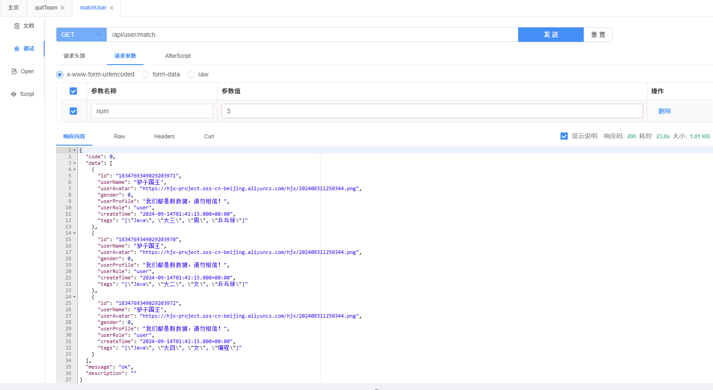
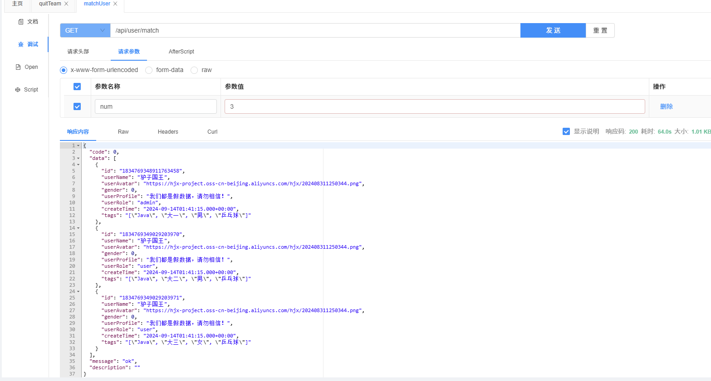

这篇记录一次“按用户标签做相似度匹配”的性能问题：从原始实现到一次可落地的优化。

## 背景

核心算法是编辑距离，相关笔记：<https://han-gr.github.io/p/2024-09-21-%E5%8C%B9%E9%85%8D%E7%AE%97%E6%B3%95/>

## 使用场景

- 匹配用户 / 推荐用户
- 输入：登录用户标签
- 输出：相似度最高的 N 个用户

## 原始实现

```java
@Override
public List<UserVO> matchUser(long num, User loginUser) {
    // 所有用户
    List<User> userList = this.list();
    // 登录用户的标签
    String loginUserTags = loginUser.getTags();

    // 将用户标签序列化
    Gson gson = new Gson();
    List<String> tagList = gson.fromJson(loginUserTags, new TypeToken<List<String>>() {
    }.getType());

    // 用户列表的下表 => 相似度
    SortedMap<Integer, Long> indexDistanceMap = new TreeMap<>();
    // 遍历所有用户, 获取标签, 计算相似度
    for (int i = 0; i < userList.size(); i++) {
        User user = userList.get(i);
        String userTags = user.getTags();
        //无标签的
        if (StringUtils.isBlank(userTags)) {
            continue;
        }
        List<String> userTagList = gson.fromJson(userTags, new TypeToken<List<String>>() {
        }.getType());
        //计算分数
        long distance = AlgorithmUtils.minDistance(tagList, userTagList);
        indexDistanceMap.put(i, distance);
    }
    //下面这个是打印前num个的id和分数
    List<UserVO> userListVo = new ArrayList<>();
    int i = 0;
    for (Map.Entry<Integer, Long> entry : indexDistanceMap.entrySet()) {
        if (i >= num) {
            break;
        }
        UserVO userVO = getUserVO(userList.get(entry.getKey()));
        userListVo.add(userVO);
        i++;
    }
    return userListVo;
}
```

## 问题

- 时间复杂度：O(n^2)
- 实测：283 万用户，响应时间约 64s
- 

## 优化思路

- 避免大数据量循环打印日志
- 控制内存占用：不要把所有分数都存起来
  - 维护一个固定长度的有序集合（sortedSet），只保留 Top N（时间换空间）
- 尽量只查需要的数据
  - 过滤掉标签为空的用户
  - 只查必要字段（比如 id、tags）
- 能提前算的就提前算（定时任务 / 缓存）

## 优化后实现

```java
@Override
public List<UserVO> matchUser(long num, User loginUser) {
    QueryWrapper<User> queryWrapper = new QueryWrapper<>();

    // 只查询有标签的用户
    queryWrapper.isNotNull("tags");
    queryWrapper.select("id", "tags");
    List<User> userList = this.list(queryWrapper);

    // 序列化登录用户的标签
    String loginUserTags = loginUser.getTags();
    Gson gson = new Gson();
    List<String> tagList = gson.fromJson(loginUserTags, new TypeToken<List<String>>() {
    }.getType());

    // 用户列表的下标 => 相似度
    List<Pair<User, Long>> list = new ArrayList<>();
    // 依次计算当前用户和所有用户的相似度
    for (int i = 0; i < userList.size(); i++) {
        User user = userList.get(i);
        String userTags = user.getTags();
        //无标签的 或当前用户为自己
        if (StringUtils.isBlank(userTags) || Objects.equals(user.getId(), loginUser.getId())) {
            continue;
        }
        List<String> userTagList = gson.fromJson(userTags, new TypeToken<List<String>>() {
        }.getType());
        //计算分数
        long distance = AlgorithmUtils.minDistance(tagList, userTagList);
        list.add(new ImmutablePair<>(user, distance));
    }
    // 按编辑距离由小到大排序
    List<Pair<User, Long>> topUserPairList = list.stream()
            .sorted((a, b) -> (int) (a.getValue() - b.getValue()))
            .limit(num)
            .toList();

    // 有顺序的userID列表
    List<Long> userIdList = topUserPairList.stream().map(pari -> pari.getKey().getId()).toList();

    //根据id查询user完整信息
    QueryWrapper<User> userQueryWrapper = new QueryWrapper<>();
    userQueryWrapper.in("id", userIdList);
    Map<Long, List<UserVO>> userIdUserListMap = this.list(userQueryWrapper).stream()
            .map(this::getUserVO)
            .collect(Collectors.groupingBy(UserVO::getId));

    // 因为上面查询打乱了顺序，这里根据上面有序的userID列表赋值
    List<UserVO> finalUserListVO = new ArrayList<>();
    for (Long userId : userIdList) {
        finalUserListVO.add(userIdUserListMap.get(userId).getFirst());
    }
    return finalUserListVO;
}
```

## 结果

- 耗时降低到约 23s
- 
- 仍有优化空间：可以继续考虑缓存/离线计算等方案
