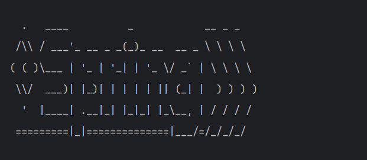
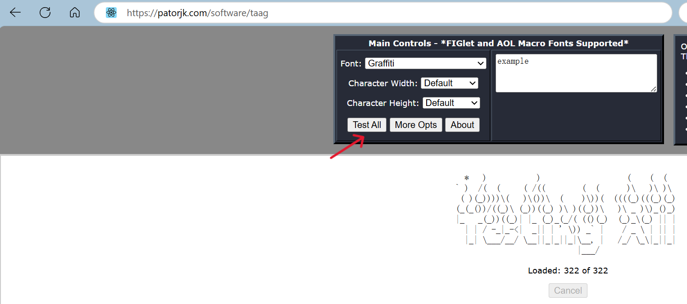

### 背景

在 SpringBoot 项目中, 启动项目时, 通常会看到默认的启动 Banner
如图所示:



### 自定义 Banner
如果需要自定义启动 Banner, 可以在 `resources` 目录下新建 `banner.txt` 文件, 并在文件中写入自定义的 Banner 内容, SpringBoot 会自动读取该文件内容作为启动 Banner.

例如:
```

 ▄▄▄▄▄▄▄▄▄▄▄  ▄       ▄  ▄▄▄▄▄▄▄▄▄▄▄  ▄▄       ▄▄  ▄▄▄▄▄▄▄▄▄▄▄  ▄            ▄▄▄▄▄▄▄▄▄▄▄ 
▐░░░░░░░░░░░▌▐░▌     ▐░▌▐░░░░░░░░░░░▌▐░░▌     ▐░░▌▐░░░░░░░░░░░▌▐░▌          ▐░░░░░░░░░░░▌
▐░█▀▀▀▀▀▀▀▀▀  ▐░▌   ▐░▌ ▐░█▀▀▀▀▀▀▀█░▌▐░▌░▌   ▐░▐░▌▐░█▀▀▀▀▀▀▀█░▌▐░▌          ▐░█▀▀▀▀▀▀▀▀▀ 
▐░▌            ▐░▌ ▐░▌  ▐░▌       ▐░▌▐░▌▐░▌ ▐░▌▐░▌▐░▌       ▐░▌▐░▌          ▐░▌          
▐░█▄▄▄▄▄▄▄▄▄    ▐░▐░▌   ▐░█▄▄▄▄▄▄▄█░▌▐░▌ ▐░▐░▌ ▐░▌▐░█▄▄▄▄▄▄▄█░▌▐░▌          ▐░█▄▄▄▄▄▄▄▄▄ 
▐░░░░░░░░░░░▌    ▐░▌    ▐░░░░░░░░░░░▌▐░▌  ▐░▌  ▐░▌▐░░░░░░░░░░░▌▐░▌          ▐░░░░░░░░░░░▌
▐░█▀▀▀▀▀▀▀▀▀    ▐░▌░▌   ▐░█▀▀▀▀▀▀▀█░▌▐░▌   ▀   ▐░▌▐░█▀▀▀▀▀▀▀▀▀ ▐░▌          ▐░█▀▀▀▀▀▀▀▀▀ 
▐░▌            ▐░▌ ▐░▌  ▐░▌       ▐░▌▐░▌       ▐░▌▐░▌          ▐░▌          ▐░▌          
▐░█▄▄▄▄▄▄▄▄▄  ▐░▌   ▐░▌ ▐░▌       ▐░▌▐░▌       ▐░▌▐░▌          ▐░█▄▄▄▄▄▄▄▄▄ ▐░█▄▄▄▄▄▄▄▄▄ 
▐░░░░░░░░░░░▌▐░▌     ▐░▌▐░▌       ▐░▌▐░▌       ▐░▌▐░▌          ▐░░░░░░░░░░░▌▐░░░░░░░░░░░▌
 ▀▀▀▀▀▀▀▀▀▀▀  ▀       ▀  ▀         ▀  ▀         ▀  ▀            ▀▀▀▀▀▀▀▀▀▀▀  ▀▀▀▀▀▀▀▀▀▀▀ 
                                                                                        
```


### 在线生成 Banner
我们还可以使用在线生成器生成自定义的 Banner
- [https://patorjk.com/software/taag](https://patorjk.com/software/taag)
- 输入你想生成的文字, 选择你喜欢的字体风格, 即可生成自定义的 Banner 内容
- 点击 `Test All` 即可生成多个不同风格的 Banner 供选择
  - 如图所示:
  - 


### 注意事项
- Banner 内容必须为纯 ASCII 字符, 否则可能导致启动失败        
- Banner 内容长度不能超过 80 个字符, 超过部分会被截断