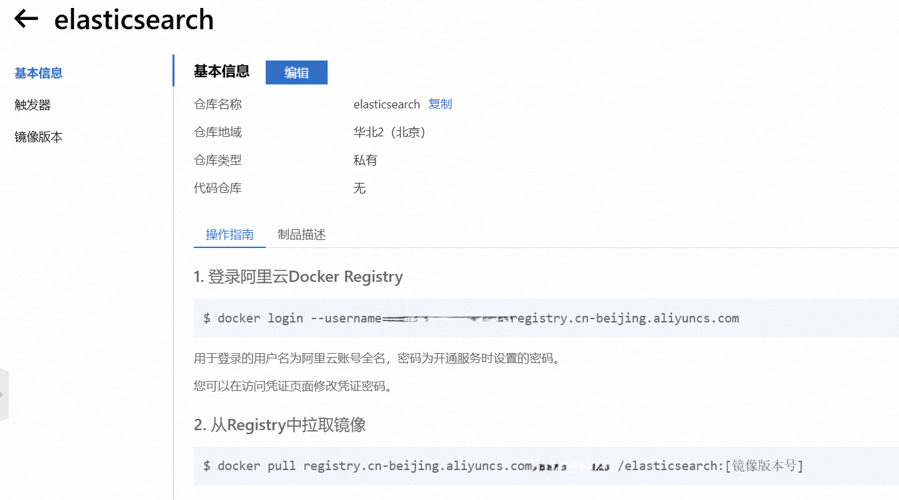
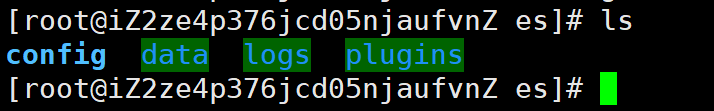
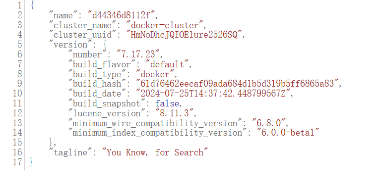
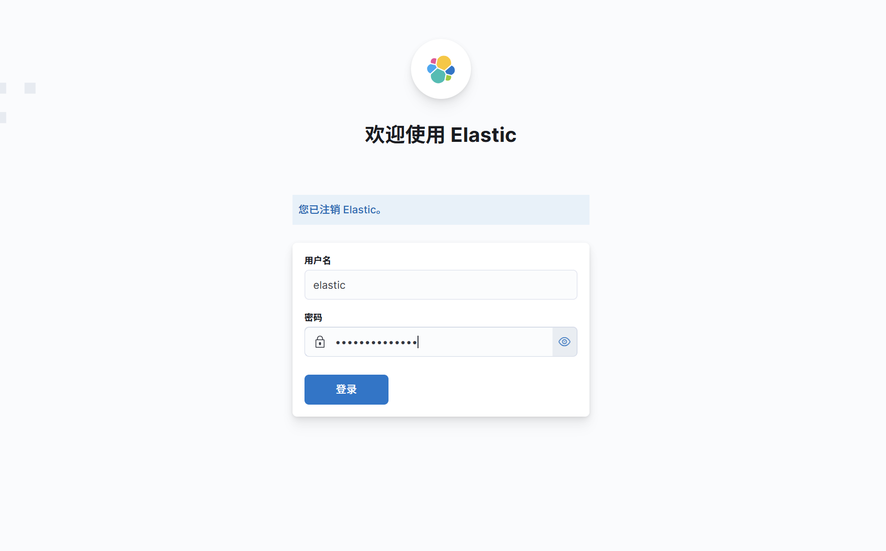
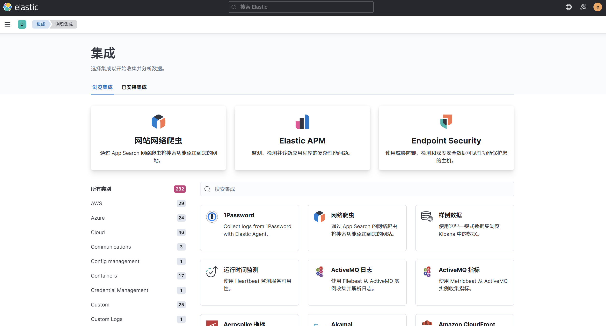

这篇记录用 Docker 在服务器上安装 Elasticsearch + Kibana（版本 7.17.23）的一套可复用步骤。

## 背景

- 项目里用到了 Elasticsearch，需要同时装 Kibana 方便可视化
- 本机也能装，但我把环境统一放到 Docker，便于迁移/重装

## 准备镜像

- Elasticsearch / Kibana：7.17.23
- 国内无法稳定拉取时，我用这个开源项目把镜像推到阿里云镜像仓库：<https://github.com/tech-shrimp/docker_image_pusher>
- 

## 准备网络

Elasticsearch 和 Kibana 放在同一 Docker 网络里：

```bash
docker network create es-net
```

## 安装 Elasticsearch

### 1) 拉取镜像

- 按阿里云镜像仓库的操作指南拉取
- 

### 2) 准备数据目录与配置

```bash
mkdir -p es/{config,data,logs,plugins}
```

- 
- 注意：data / logs / plugins 目录需要权限，否则容器可能启动失败

在 `es/config/elasticsearch.yml` 写入：

```yaml
cluster.name: "docker-cluster"
network.host: 0.0.0.0
http.cors.enabled: true
http.cors.allow-origin: "*"
http.cors.allow-headers: Authorization
xpack.security.enabled: true
xpack.security.transport.ssl.enabled: true
```

### 3) 启动容器

下面写成一条命令更清晰：

```bash
docker run -dit \
  --name es \
  --net es-net \
  -m 1GB -e "ES_JAVA_OPTS=-Xms512m -Xmx1024m" \
  -e "discovery.type=single-node" \
  -v ./softTools/es/data:/usr/share/elasticsearch/data \
  -v ./softTools/es/plugins:/usr/share/elasticsearch/plugins \
  -v ./softTools/es/logs:/usr/share/elasticsearch/logs \
  -v ./softTools/es/config/elasticsearch.yml:/usr/share/elasticsearch/config/elasticsearch.yml \
  --privileged \
  -p 9200:9200 \
  elasticsearch
```

### 4) 验证

- 浏览器访问：`http://ip:9200`
- 

## 安装 Kibana

### 1) 准备配置文件

```bash
mkdir -p kibana/config
```

在 `kibana/config/kibana.yml` 写入：

```yaml
server.host: "0.0.0.0"
server.shutdownTimeout: "5s"
elasticsearch.hosts: ["http://elasticsearch:9200"]
monitoring.ui.container.elasticsearch.enabled: true
i18n.locale: "zh-CN"
elasticsearch.username: "xxxxxx"
elasticsearch.password: "xxxxxxx"
```

### 2) 启动容器

```bash
docker run -dit \
  --name kibana \
  --net es-net \
  -v ./softTools/kibana/config/kibana.yml:/usr/share/kibana/config/kibana.yml \
  -e ELASTICSEARCH_HOSTS=http://es:9200 \
  -p 5601:5601 \
  kibana
```

### 3) 验证

- 浏览器访问：`http://ip:5601`
- 
- 

## 安装分词插件

### 1) 下载插件

- IK：<https://release.infinilabs.com/analysis-ik/stable/>
- Pinyin：<https://release.infinilabs.com/analysis-pinyin/stable/>

### 2) 解压到 plugins

```bash
mkdir -p es/plugins/{ik,pinyin}
cd es/plugins/ik
wget https://release.infinilabs.com/analysis-ik/stable/elasticsearch-analysis-ik-7.17.23.zip
unzip elasticsearch-analysis-ik-7.17.23.zip

cd ../pinyin
wget https://release.infinilabs.com/analysis-pinyin/stable/elasticsearch-analysis-pinyin-7.17.23.zip
unzip elasticsearch-analysis-pinyin-7.17.23.zip
```

- 注意：解压完成后要删掉 zip，否则 Elasticsearch 可能启动失败

### 3) 重启 Elasticsearch

```bash
docker restart es
```
