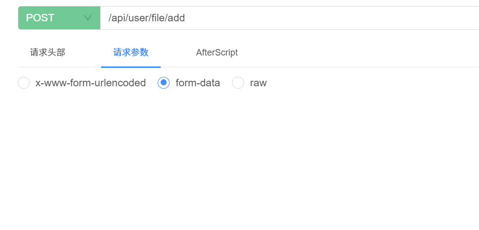

### 问题描述

- 使用knife4j工具，在线调试接口时，上传文件功能无法使用
- 

### 解决方案

- 在 controller 方法中，将上传文件参数加上, @RequestPart(“file”)MultipartFile file注解即可

```java
public R<String> addFile(@RequestPart("file") MultipartFile file){
    // 处理上传文件逻辑
    return file;
} 
```

- 

