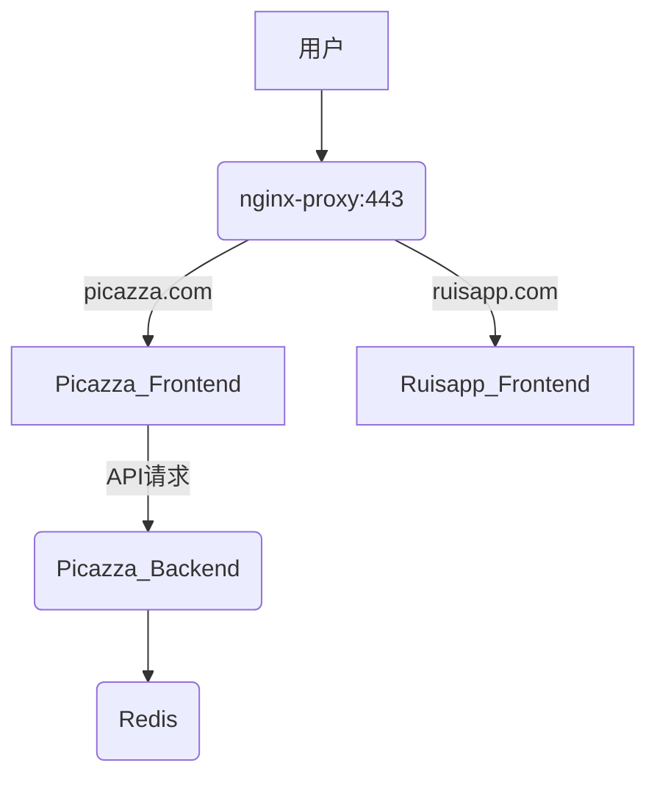

## 问题介绍

> [!question] 背景
> - 有一台服务器,已经使用docker容器部署了一个网站,使用域名访问: https://www.picazza.com
> - 现在想使用docker容器部署另外一个网站,同样使用域名访问: https://www.ruisapp.com
> - 但是当时部署第一个网站时已经把80、443端口占用了

## 解决方法

> [!success] 核心思路
> 1. **新增Nginx反向代理容器**：作为流量入口，统一处理80/443端口
> 2. **调整原网站容器**：停止直接暴露80/443，改为仅内部暴露端口
> 3. **部署新静态网站容器**：内部暴露80端口
> 4. **通过Nginx按域名转发**：根据访问域名转发到对应容器

### 架构


### 流程

##### 1.更改前端项目内的dockerfile

- 删除ssl配置和443端口配置

```dockerfile
FROM registry.cn-beijing.aliyuncs.com/hengjixiang/nginx:latest  
  
## 设置时区  
ENV TZ=Asia/Shanghai  
RUN ln -snf /usr/share/zoneinfo/$TZ /etc/localtime && echo $TZ > /etc/timezone  
 
WORKDIR /usr/share/nginx/html/   
 
COPY ./docker/nginx.conf /etc/nginx/conf.d/default.conf  
  
# COPY ./ssl /etc/nginx/cert/
 
COPY ./dist  /usr/share/nginx/html/  
 
EXPOSE 80
  
# EXPOSE 443  
  
CMD ["nginx", "-g", "daemon off;"]
```
	
##### 2.更改前端项目内的nginx.conf

- 同样删除ssl配置和443端口配置

```nginx
server {  
	listen 80;  
	server_name  localhost;  
  
	root /usr/share/nginx/html;  
	index index.html;  
  
	# SPA路由支持  
	location / {  
		try_files $uri $uri/ /index.html;  
	}  
  
	# 静态资源缓存  
	location ~* \.(js|css|png|jpg|jpeg|gif|ico|svg|woff2)$ {  
		expires 1y;  
		add_header Cache-Control "public, immutable";  
		access_log off;  
	}  
  
	# 禁止访问敏感文件  
	location ~ /\. {  
		deny all;  
	}  
}
```

##### 3.在服务器上构建两个前端项目的镜像

```bash
docker build -t ruisapp:v1.0 .
docker build -t picazza-frontend:v1.0 .
```

##### 4.编写picazza前端docker-compose.yml

```yml
version: "3.8"
networks:
  picazza-net:
    name: picazza-net
    driver: bridge
    ipam:
      config:
        - subnet: 172.20.0.0/16
          gateway: 172.20.0.1

services:
  redis:
    image: redis:latest
    container_name: redis
    pull_policy: never
    networks:
      picazza-net:
        ipv4_address: 172.20.0.100
    ports:
      - 6379:6379

  picazza-backend:
    image: picazza-backend:v1.0
    container_name: picazza-backend
    pull_policy: never
    networks:
      picazza-net:
        ipv4_address: 172.20.0.101
    ports:
      - 8080:8080
    depends_on:
      - redis

  picazza-frontend:
    image: picazza-frontend:v1.0
    container_name: picazza-frontend
    pull_policy: never
    networks:
      picazza-net:
        ipv4_address: 172.20.0.102
    depends_on:
      - picazza-backend
```

##### 5.编写ruisapp前端docker-compose.yml

```yml
version: "3.8"
networks:
  ruisapp-net:
    name: ruisapp-net 
    driver: bridge
    ipam:
      config:
        - subnet: 172.21.0.0/16
          gateway: 172.21.0.1

services:
  ruisapp:
    image: ruisapp:v1.0
    container_name: ruisapp
    pull_policy: never
    networks:
      ruisapp-net:
        ipv4_address: 172.21.0.100
```

- 注意,每个项目创建一个网络,将网络隔离开,并且每个网络的子网的网关地址都要不同

##### 6.创建Nginx的相关目录
- 目录结构
```bash
/root/softTools/nginx-proxy/ # 反向代理根目录
 ├── docker-compose.yml # 代理容器配置 
 ├── nginx.conf # Nginx全局配置 
 ├── conf.d/ # 域名路由规则 
 │ ├── picazza.conf # picazza.com配置 
 │ └── ruisapp.conf # ruisapp.com配置 
 └── certs/ # SSL证书 
   ├── picazza/ 
   │ ├── picazza.com.pem 
   │ └── picazza.com.key
   ├── ruisapp/ 
   │ ├── ruisapp.com.pem 
   │ └── ruisapp.com.key
```

##### 7.把项目的证书上传到对应的项目目录下

##### 8.编写nginx的docker-compose.yml

```yml
version: '3.8'

services:
  nginx-proxy:
    image: registry.cn-beijing.aliyuncs.com/hengjixiang/nginx:latest
    container_name: nginx-proxy
    restart: always
    ports:
      - "80:80"
      - "443:443"
    volumes:
      - ./nginx.conf:/etc/nginx/nginx.conf
      - ./conf.d:/etc/nginx/conf.d
      - ./certs:/etc/nginx/certs
    networks:
      - picazza-net
      - ruisapp-net

networks:
  picazza-net:
    external: true
  ruisapp-net:
    external: true
```

##### 9.启动各个容器

### 结果

- 两个项目根据不同的域名可访问
- 以后如果想再新增项目的时候,只需要在nginx里面添加配置就行了

## 参考资源