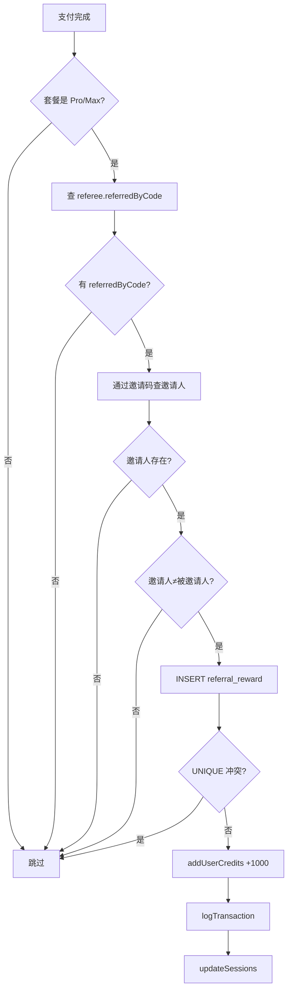

我最近在 [RuiToolAi](https://ruitoolai.com) 中实现了一套完整的用户邀请（Referral）功能，涵盖注册、奖励发放、统计展示等全链路。技术栈是 Next.js App Router + Cloudflare Workers (Vinext) + D1 + Drizzle ORM。

这篇文章记录整个设计思路和实现细节，包括在 D1 不支持事务的约束下如何保证数据一致性。

---

## 功能概述

核心流程很简单：

1. 每个用户注册时自动生成一个 8 位邀请码
2. 用户分享邀请码或邀请链接给朋友
3. 朋友通过邀请链接注册后，系统记录邀请关系
4. 当被邀请人**首次**购买 Pro 或 Max 套餐时，邀请人自动获得 **1000 积分**

---

## 一、数据库设计

### user 表新增字段

```sql
ALTER TABLE user ADD COLUMN invite_code TEXT(20) UNIQUE;
ALTER TABLE user ADD COLUMN referred_by_code TEXT(20);
CREATE INDEX invite_code_idx ON user(invite_code);
```

- `inviteCode`：用户自己的邀请码，全局唯一，注册时自动生成
- `referredByCode`：注册时传入的邀请码（表示"我是被谁邀请的"）

两个字段都是可空的——老用户没有邀请码，会在首次访问邀请页面时自动补生成。

### referral_reward 表

```sql
CREATE TABLE referral_reward (
  id              TEXT PRIMARY KEY,
  referrer_id     TEXT NOT NULL REFERENCES user(id),   -- 邀请人（获奖者）
  referee_id      TEXT NOT NULL UNIQUE REFERENCES user(id), -- 被邀请人（唯一约束）
  payment_intent_id TEXT(255) NOT NULL UNIQUE,          -- Stripe PaymentIntent（幂等）
  credits_awarded INTEGER NOT NULL,                     -- 奖励积分
  created_at      INTEGER NOT NULL
);

CREATE INDEX referral_reward_referrer_idx ON referral_reward(referrer_id);
```

三个关键约束保证业务正确性：

| 约束 | 作用 |
|------|------|
| `referee_id UNIQUE` | 每个被邀请人最多触发一次奖励 |
| `payment_intent_id UNIQUE` | 同一笔支付不会重复发奖（幂等） |
| `referrer_id INDEX` | 快速查询邀请人的奖励记录 |

---

## 二、邀请码生成算法

邀请码使用 8 位字符，字母表为 32 个字符：

```
ABCDEFGHJKMNPQRSTUVWXYZ23456789
```

刻意排除了易混淆字符：`0`、`O`、`I`、`1`、`L`。

```typescript
const INVITE_CODE_ALPHABET = "ABCDEFGHJKMNPQRSTUVWXYZ23456789";
const INVITE_CODE_LENGTH = 8;

export function generateInviteCode(): string {
  let code = "";
  const array = new Uint8Array(INVITE_CODE_LENGTH);
  crypto.getRandomValues(array); // Cloudflare Workers 全局可用
  for (const byte of array) {
    code += INVITE_CODE_ALPHABET[byte % INVITE_CODE_ALPHABET.length];
  }
  return code;
}
```

32^8 ≈ 1.1×10^12 种组合，碰撞概率极低。`ensureInviteCode` 函数做了 3 次重试处理极端情况：

```typescript
export async function ensureInviteCode(userId: string): Promise<string> {
  // 已有邀请码则直接返回
  const user = await db.query.userTable.findFirst({ ... });
  if (user?.inviteCode) return user.inviteCode;

  // 重试 3 次处理 UNIQUE 冲突
  for (let i = 0; i < 3; i++) {
    const code = generateInviteCode();
    try {
      await db.update(userTable).set({ inviteCode: code })...;
      return code;
    } catch { continue; }
  }

  throw new Error("Failed to generate invite code after 3 attempts");
}
```

---

## 三、注册流程集成

系统有三条注册路径，都需要在创建用户时设置 `inviteCode` 和 `referredByCode`。

### 3.1 密码注册

`sign-up.actions.ts`：

```typescript
const [user] = await db.insert(userTable).values({
  email: input.email,
  firstName: input.firstName,
  lastName: input.lastName,
  passwordHash: hashedPassword,
  currentCredits: siteConfig.billing.signUpBonusCredits,
  inviteCode: generateInviteCode(),
  referredByCode: input.referralCode || null,  // 空字符串→null
}).returning();
```

### 3.2 Google OAuth 注册

Google SSO 的特殊之处在于 OAuth 流程是分两步的：先跳转 Google，回调时创建用户。邀请码通过 Cookie 在两步之间传递：

`google/route.ts`（发起 OAuth 时）：

```typescript
const referralCode = new URL(request.url).searchParams.get("ref");
if (referralCode) {
  cookieStore.set("google-oauth-referral-code", referralCode, cookieOptions);
}
```

`google/callback/google-callback.action.ts`（回调时）：

```typescript
const referralCode = cookieStore.get("google-oauth-referral-code")?.value ?? null;
cookieStore.delete("google-oauth-referral-code"); // 用完即删

await db.insert(userTable).values({
  ...
  inviteCode: generateInviteCode(),
  referredByCode: referralCode,
});
```

### 3.3 Passkey 注册

Passkey 注册分两步（start + complete），在 start 步骤创建用户时写入邀请信息，逻辑与密码注册一致。

### 3.4 URL 参数传递

注册页面通过 `?ref=XXXX` 参数接收邀请码：

```typescript
// page.tsx - Server Component
const { ref } = await searchParams;
return <SignUpClientComponent referralCode={ref} />;

// sign-up.client.tsx - Client Component
const form = useForm({
  defaultValues: {
    referralCode: referralCode ?? "",
  },
});
```

邀请码作为隐藏表单字段随注册请求一起提交。

---

## 四、奖励发放机制

奖励发放的触发点在支付完成回调中：

```typescript
// credits.action.ts - finalizeCreditsCheckoutSession
await tryGrantReferralReward({
  refereeId: session.user.id,
  packageId: creditPackage.id,
  paymentIntentId: paymentIntent.id,
}).catch((err) => {
  // 奖励发放失败不影响主流程
  console.error("Failed to grant referral reward:", err);
});
```

`tryGrantReferralReward` 的执行逻辑：



### 幂等性设计

三层幂等保护：

1. **`referee_id UNIQUE`** — 同一被邀请人多次购买，只有首次触发奖励
2. **`payment_intent_id UNIQUE`** — 同一笔支付重复回调不会重复发奖
3. **先 INSERT 奖励记录，再发积分** — 奖励记录插入失败（UNIQUE 冲突）则整个流程跳过

---

## 五、D1 无事务约束下的数据一致性

Cloudflare D1 不支持事务，这是项目的一个已知约束。我们在奖励发放流程中面临以下风险：

| 步骤 | 风险 | 影响 | 处理方式 |
|------|------|------|----------|
| INSERT referral_reward 成功 | — | 记录已持久化 | — |
| addUserCredits 失败 | 积分未发放但记录已存在 | UNIQUE 约束阻止重试，积分永久丢失 | `.catch()` 记录告警日志，需人工介入 |
| logTransaction 失败 | 积分已发放但无审计记录 | 账务对不上 | `.catch()` 记录告警，不影响主流程 |

```typescript
// 步骤 1：插入奖励记录（UNIQUE 约束保证幂等）
await db.insert(referralRewardTable).values({ ... });

// 步骤 2：发积分（失败时记录告警，不向上抛出）
await addUserCredits(referrer.id, REFERRAL_REWARD_CREDITS).catch((err) => {
  console.error("Failed to add credits (manual recovery needed):", err);
});

// 步骤 3：记交易日志（失败不影响积分）
await logTransaction({ ... }).catch((err) => {
  console.error("Failed to log transaction:", err);
});
```

这种设计牺牲了极端情况下的自动恢复能力，但保证了：
- 主支付流程不受奖励模块故障影响
- 不会出现重复发奖
- 所有异常都有告警日志

---

## 六、前端页面

邀请页面 `/dashboard/referral` 展示：

- 邀请统计卡片（成功邀请人数、累计获得积分）
- 邀请码（带一键复制）
- 邀请链接（`https://ruitoolai.com/sign-up?ref=XXXX`）
- 规则说明
- 奖励历史记录

页面是 React Server Component，数据在服务端获取后传递给客户端交互组件。

---

## 七、需要关注的设计决策

### 7.1 为什么选择 8 位字母数字码而不是更短的纯数字码？

- **易读性**：排除了 `0/O/I/1/L` 等易混淆字符，用户手动输入时不容易出错
- **安全性**：32^8 ≈ 1 万亿组合，暴力枚举不可行
- **碰撞概率**：即使 100 万用户，碰撞概率也低于 0.05%

### 7.2 为什么奖励只在首次购买时触发？

防止刷分行为。如果每次购买都触发，A 可以反复用小号充值然后退款来刷积分。`referee_id UNIQUE` 约束从数据库层面保证每个被邀请人只能触发一次。

### 7.3 为什么只对 Pro/Max 套餐发奖？

免费套餐或低价套餐触发奖励可能导致：
- ROI 不合理（1000 积分价值可能高于套餐价格）
- 容易被滥用

可以通过修改 `REFERRAL_ELIGIBLE_PLAN_SLUGS` 常量灵活调整。

### 7.4 老用户兼容

老用户在新增此功能前注册，`inviteCode` 为 NULL。`ensureInviteCode` 函数在用户首次访问邀请页面时自动补生成邀请码，无需任何迁移脚本。

---

## 八、总结

这套邀请系统包含以下文件：

| 文件 | 职责 |
|------|------|
| `src/db/schema.ts` | 数据表定义 + 关系映射 |
| `src/utils/referral.ts` | 核心逻辑：生成邀请码、发放奖励、统计查询 |
| `src/constants/referral.ts` | 可配置常量（奖励积分数、触发套餐） |
| `src/schemas/signup.schema.ts` | 注册表单校验（含 referralCode） |
| `src/app/(auth)/sign-up/*` | 三条注册路径集成 |
| `src/actions/credits.action.ts` | 支付完成回调中触发奖励 |
| `src/app/(dashboard)/dashboard/referral/*` | 邀请页面 |

在 D1 不支持事务的约束下，通过 UNIQUE 约束 + 先写记录后发积分 + 分级 catch 的策略，在简洁性和数据正确性之间取得了合理的平衡。
