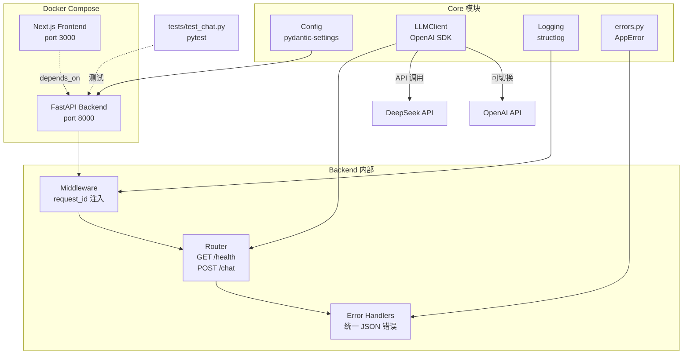

最近开了一个新坑 —— **DevAssist**，一个 AI 驱动的开发者助手，计划从零撸一个全栈项目。

## 项目是干嘛的

简单说就是：**一个能读文档、能回答问题、能写代码并跑起来验证的 AI 助手**。后面还会做 Agent、微调模型这些高级玩法，不过那是后话了。

现在的目标非常朴素：**把地基打好**。

---

## 整体架构



现在看起来还比较简单，一个 FastAPI 后端 + 一个 Next.js 前端壳，中间用 Docker Compose 拉起来。复杂的东西（RAG、Agent、数据库）都在后面才会加进来。

---

## 初始化项目

**目标：跑起来。**

搭骨架。`docker-compose up` 之后能看到两个服务启动，一个 `/health` 能返回 `{"status": "ok"}`，就算成了。

```
devassist/
├── backend/
│   ├── app/
│   │   └── main.py          # FastAPI 入口，只有一个 /health
│   ├── Dockerfile
│   └── requirements.txt
├── frontend/                 # Next.js 脚手架（create-next-app）
│   └── ...
├── docker-compose.yml
└── .env.example
```

用 `create-next-app` 生成前端项目，选了 TypeScript + Tailwind + App Router，后面写聊天界面直接用。

**踩坑记录：** `npx create-next-app` 第一次跑的时候没输出就被静默吃掉了，第二遍才正常。遇到这类问题可以先 `node -v && npm -v` 确认 Node 环境正常。

---

## 配置管理 + 结构化日志

**目标：配置读得出来，日志看得明白。**

### 配置管理

用 `pydantic-settings` 统一管配置，从 `.env` 文件和环境变量加载。好处是本地开发扔个 `.env` 就行，线上直接走环境变量，不用改代码。

```python
class Settings(BaseSettings):
    env: Literal["dev", "test", "prod"] = "dev"
    log_level: str = "INFO"
    service_name: str = "devassist-backend"

    model_config = SettingsConfigDict(
        env_file=".env",
        env_file_encoding="utf-8",
        extra="ignore",
    )
```

用 `@lru_cache` 包一下，全局只实例化一次，后面哪儿都能用。

### 结构化日志

接入 `structlog`，输出 JSON 格式的日志。最关键的一步是**在中间件里给每个请求绑 `request_id`**：

```python
@app.middleware("http")
async def bind_request_id(request, call_next):
    request_id = request.headers.get("x-request-id") or str(uuid4())
    structlog.contextvars.bind_contextvars(request_id=request_id)
    response = await call_next(request)
    response.headers["x-request-id"] = request_id
    # ...
```

这样后面不管是 LLM 调用、数据库查询还是业务逻辑，所有日志都会自动带上 `request_id`，排查问题的时候直接 `grep` 一个 ID 就能串起整条链路。

---

## LLM 客户端 + 聊天接口

**目标：能跟 DeepSeek 对话。**

### LLMClient 封装

DeepSeek 和 OpenAI 的 API 都是 OpenAI 格式的，所以直接用 `openai` 这个 SDK 就够了，只需要切 `base_url`：

```python
class LLMClient:
    def __init__(self, *, provider, api_key, model, base_url=None):
        resolved_base_url = base_url or self._default_base_url(provider)
        self._client = AsyncOpenAI(api_key=api_key, base_url=resolved_base_url)

    async def chat(self, *, messages, temperature, stream=False):
        start = time.perf_counter()
        response = await self._client.chat.completions.create(...)
        # 记录耗时 + token 用量到日志
        self._logger.info("llm_call", ...)
```

每次调用都会记一条结构化日志：`provider / model / latency_ms / prompt_tokens / completion_tokens / success`。这些数据后面做成本分析和性能优化的时候会非常有用。

### 第一个聊天接口

`POST /chat`，请求体 `{"message": "你好"}`，返回 `{"reply": "你好！..."}`。当前阶段先做非流式（`temperature=0.0`），后面再补 SSE 流式。

**踩坑记录：** `openai==1.37.0` 和 `httpx==0.28.1` 不兼容，`AsyncClient.__init__()` 报 `unexpected keyword argument 'proxies'`，解法是在 `requirements.txt` 里显式锁 `httpx==0.27.2`。

---

## 统一错误处理

**目标：不管什么错误，前端拿到的都是统一的 JSON 格式。**

之前 `/chat` 缺 API key 的时候直接抛 `HTTPException`，返回的是 FastAPI 默认格式，跟业务错误长得不一样，所以把这块统一了。

定义了一个 `AppError` 基类：

```python
class AppError(Exception):
    def __init__(self, *, code, message, status_code=400, details=None):
        self.code = code        # 给前端/调用方做分支处理
        self.message = message  # 给人看的
        self.details = details  # 给调试的
```

然后注册了四种异常处理器，按优先级从高到低：

| 处理器 | 捕获 | 说明 |
|--------|------|------|
| `handle_app_error` | `AppError` | 业务异常，分 4xx/5xx 打 info/exception |
| `handle_validation_error` | `RequestValidationError` | Pydantic 参数校验失败，422 |
| `handle_http_exception` | `HTTPException` | FastAPI 自带的，404/401 之类 |
| `handle_unexpected_error` | `Exception` | 兜底，500，不暴露内部细节 |

所有错误响应都长这样：

```json
{
  "error": {
    "code": "validation_error",
    "message": "Invalid request",
    "details": [{"type": "missing", "loc": ["body", "message"], ...}]
  },
  "request_id": "fe8a3b2c-..."
}
```

---

## 测试

**目标：pytest 跑起来，核心路径有覆盖。**

写了 5 条测试，覆盖了前四天最重要的几个点：

| 测试 | 覆盖内容 |
|------|----------|
| `test_health_has_request_id` | `/health` 返回值 + 响应头 `x-request-id` |
| `test_chat_returns_reply` | `/chat` 正常返回，用 Fake LLMClient 不联网 |
| `test_chat_validation_error_is_unified_json` | 缺参数 → 422 + 统一 JSON |
| `test_chat_configuration_error_is_unified_json` | 缺 API key → 500 + 统一 JSON |
| `test_config_loading_from_env` | Settings 从环境变量正确加载 |

Fake LLMClient 的设计很简单，就是几个 dataclass 模拟 OpenAI SDK 的返回结构，然后直接 echo 用户输入。这样测试完全不用联网，跑得飞快：

```python
class _FakeLLMClient:
    async def chat(self, *, messages, temperature, stream=False):
        user_text = messages[0]["content"] if messages else ""
        return _FakeResponse(choices=[
            _FakeChoice(message=_FakeMessage(content=f"echo: {user_text}"))
        ])
```

Dockerfile 里也加了 `COPY tests ./tests`，这样 `docker compose run --rm backend pytest -q` 就能在容器里跑测试：

```
5 passed in 0.20s
```

---

## 当前项目结构

```
devassist/
├── backend/
│   ├── app/
│   │   ├── core/
│   │   │   ├── config.py       # 配置管理（pydantic-settings）
│   │   │   ├── errors.py       # 统一错误处理
│   │   │   └── llm.py          # LLM 客户端（DeepSeek/OpenAI）
│   │   └── main.py             # FastAPI 入口 + /health + /chat
│   ├── tests/
│   │   └── test_chat.py        # 5 条测试
│   ├── Dockerfile
│   └── requirements.txt
├── frontend/                    # Next.js 脚手架（还没写业务代码）
├── docker-compose.yml
├── .env.example
```

---

## 一些感受

1. **Docker Compose 开发体验很好。** 改代码 → `docker compose up -d --build` → 验证，循环很快。不需要本地装 Python 虚拟环境，容器里环境完全一致。

2. **structlog 值得花时间配好。** JSON 日志 + `request_id` 这个组合，排查问题的时候是真的香。后面接 Grafana/Loki 也方便。

3. **测试一开始就写，后面省心。** 现在测试虽然只有 5 条，但已经覆盖了核心路径。后面每加一个新功能就补一条测试，改代码的时候跑一次就知道有没有改坏。

4. **DeepSeek 的 API 兼容 OpenAI 格式，切换成本极低。** 一个 `base_url` 搞定，不需要额外的 SDK。

---

接下来准备开始做 **多轮对话 + SSE 流式**，然后接入 PostgreSQL 持久化聊天记录。后面还有 RAG、Agent、微调……路还很长，慢慢来。
