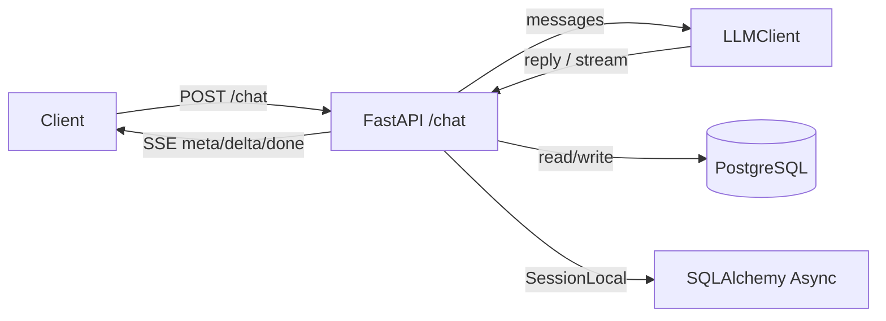
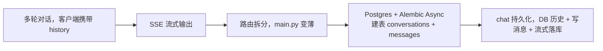

这一阶段做的事情很集中：把 `/chat` 从“能用”推到“更像真实产品”。

可以理解为三条主线：

- **体验**：支持 SSE 流式输出（先看到字再说）
- **工程结构**：路由拆分，入口文件不再堆逻辑
- **数据沉淀**：接入 PostgreSQL，把会话和消息存下来

## 1. 两张图（先看全貌）

### 1.1 架构流（请求怎么走）



### 1.2 演进路线（能力逐步补齐）




## 2. 多轮对话（conversation_id + history）

目标：先把“多轮”跑通。最省事的方式就是 **客户端随请求带 history**，服务端拼 messages 直接喂给 LLM。

请求体示例：

```json
{
  "conversation_id": null,
  "history": [
    {"role": "user", "content": "hi"},
    {"role": "assistant", "content": "hello"}
  ],
  "message": "how are you"
}
```

关键点：

- `conversation_id` 不传：服务端生成一个 UUID 并返回，前端下一轮继续带上
- `history` 由客户端维护：服务端只负责 `history + message` 组装成 messages

这个阶段的设计很务实：先把功能闭环，DB 后面再上。

具体实现：`backend/app/api/chat.py`

```python
class ChatRequest(BaseModel):
    conversation_id: UUID | None = None
    message: str
    history: list[ChatMessage] = []


@router.post("/chat", response_model=ChatResponse)
async def chat(payload: ChatRequest, stream: bool = False) -> ChatResponse | StreamingResponse:
    conversation_id = payload.conversation_id or uuid4()

    if payload.conversation_id is not None:
        messages = await load_history_from_db(conversation_id)
    else:
        messages = [{"role": m.role, "content": m.content} for m in payload.history]
    messages.append({"role": "user", "content": payload.message})
```

## 3. SSE 流式输出（meta/delta/done）

目标：让回复“边生成边看到”。用 SSE（text/event-stream），因为它对浏览器天然友好，不用引入 WebSocket 的复杂度。

事件结构约定：

- `meta`：先把 `conversation_id` 发给前端（前端可以立刻保存）
- `delta`：每个 chunk 的增量内容
- `done`：明确收尾

注意：**一定要发 done**。这能让前端明确停下来，不用“靠猜”。

具体实现：`backend/app/core/streaming.py`

```python
def sse_event(*, data: Any, event: str | None = None) -> str:
    payload = json.dumps(data, ensure_ascii=False)
    if event:
        return f"event: {event}\ndata: {payload}\n\n"
    return f"data: {payload}\n\n"


async def openai_chat_stream_to_sse(
    stream: AsyncIterable[Any],
    *,
    conversation_id: str | None = None,
) -> AsyncGenerator[str, None]:
    if conversation_id:
        yield sse_event(data={"type": "meta", "conversation_id": conversation_id})

    async for chunk in stream:
        delta = getattr(chunk.choices[0], "delta", None)
        content = getattr(delta, "content", None) if delta is not None else None
        if content:
            yield sse_event(data={"type": "delta", "content": content})

    yield sse_event(data={"type": "done"}, event="done")
```

## 4. 路由拆分（main.py 变薄）

目标：把入口文件从“堆逻辑”变成“只做注册”。

拆分后 `main.py` 主要只干三件事：

1. 初始化 Settings + structlog
2. 注册全局错误处理器
3. `include_router(chat_router)`

## 5. PostgreSQL + Alembic Async（建表 + 迁移）

目标：先把“能存”这套基础设施搭起来。

新增两张表：

- `conversations`：会话壳（后续做会话列表/标题/用户绑定）
- `messages`：消息（role/content/citations）


迁移这一块有个小坑：我用的是 `postgresql+asyncpg`，Alembic 需要用 async 的 env 才不会踩 `MissingGreenlet`。

具体实现：`backend/app/db/models.py`

```python
class Conversation(TimestampMixin, Base):
    __tablename__ = "conversations"
    id: Mapped[UUID] = mapped_column(PG_UUID(as_uuid=True), primary_key=True, default=uuid4)


class Message(TimestampMixin, Base):
    __tablename__ = "messages"
    conversation_id: Mapped[UUID] = mapped_column(
        PG_UUID(as_uuid=True),
        ForeignKey("conversations.id", ondelete="CASCADE"),
        nullable=False,
        index=True,
    )
    role: Mapped[str] = mapped_column(String(50), nullable=False)
    content: Mapped[str] = mapped_column(Text, nullable=False)
    citations: Mapped[dict | list | None] = mapped_column(JSONB, nullable=True)
```

具体实现：`backend/alembic/env.py`

```python
from sqlalchemy.ext.asyncio import async_engine_from_config


async def run_migrations_online() -> None:
    configuration = config.get_section(config.config_ini_section) or {}
    configuration["sqlalchemy.url"] = _get_database_url()

    connectable = async_engine_from_config(
        configuration,
        prefix="sqlalchemy.",
        poolclass=pool.NullPool,
    )

    async with connectable.connect() as connection:
        await connection.run_sync(do_run_migrations)
    await connectable.dispose()
```

## 6. /chat 持久化（DB 历史 + 写消息 + 流式落库）

目标：让 `conversation_id` 真正变成“服务端可读写的会话主键”，而不是仅仅给前端串联用。

### 6.1 历史加载策略：传了 conversation_id 就以 DB 为准

规则很直接：

- 请求带 `conversation_id`：优先从 DB 读取历史（避免客户端 history 和服务端不一致）
- 请求不带 `conversation_id`：沿用 `history`（兼容“客户端携带历史”的模式）

具体实现：`backend/app/api/chat.py`（历史优先级）

```python
conversation_id = payload.conversation_id or uuid4()

if payload.conversation_id is not None:
    messages = await load_history_from_db(conversation_id)
else:
    messages = [{"role": m.role, "content": m.content} for m in payload.history]
messages.append({"role": "user", "content": payload.message})
```

### 6.2 非流式：拿到完整回复后“一次性写入一轮对话”

具体实现：`backend/app/api/chat.py`（非流式写入一轮）

```python
async def persist_turn_to_db(conversation_id: UUID, user: str, assistant: str) -> None:
    async with SessionLocal() as session:
        await _ensure_conversation(session=session, conversation_id=conversation_id)
        session.add(Message(conversation_id=conversation_id, role="user", content=user))
        session.add(Message(conversation_id=conversation_id, role="assistant", content=assistant))
        await session.commit()
```

### 6.3 流式：先写 user，再在 finally 里写完整 assistant

流式最大的坑就是：回复是碎片（delta）。

我做的折中是：

1. 一进入 stream 分支，先把 user message 写入 DB（用户输入不丢）
2. delta 只在内存里累计
3. generator `finally` 拼出完整 assistant_text，再写入 DB（避免碎片化存储）

具体实现：`backend/app/api/chat.py`（流式落库：先 user，后 assistant）

```python
if stream:
    await persist_user_message_to_db(conversation_id, payload.message)
    openai_stream = await llm_client.chat(messages=messages, temperature=0.0, stream=True)
    assistant_parts: list[str] = []

    async def _generator() -> AsyncGenerator[str, None]:
        yield sse_event(data={"type": "meta", "conversation_id": str(conversation_id)})
        async for chunk in openai_stream:
            content = getattr(getattr(chunk.choices[0], "delta", None), "content", None)
            if content:
                assistant_parts.append(content)
                yield sse_event(data={"type": "delta", "content": content})
        yield sse_event(data={"type": "done"}, event="done")

    async def _persist_after_stream() -> AsyncGenerator[str, None]:
        try:
            async for item in _generator():
                yield item
        finally:
            assistant_text = "".join(assistant_parts)
            if assistant_text:
                await persist_assistant_message_to_db(conversation_id, assistant_text)
```

## 7. 本地验证（按顺序跑）

只列最关键的几条命令，按顺序执行即可：

1. 启动数据库

```bash
docker compose up -d db
```

2. 跑迁移

```bash
docker compose run --rm backend alembic upgrade head
```

3. 非流式请求

```bash
curl -s http://localhost:8000/chat \
  -H 'content-type: application/json' \
  -d '{"message":"hello"}'
```

4. 流式请求（观察 text/event-stream）

```bash
curl -N http://localhost:8000/chat?stream=true \
  -H 'content-type: application/json' \
  -d '{"message":"hello"}'
```

