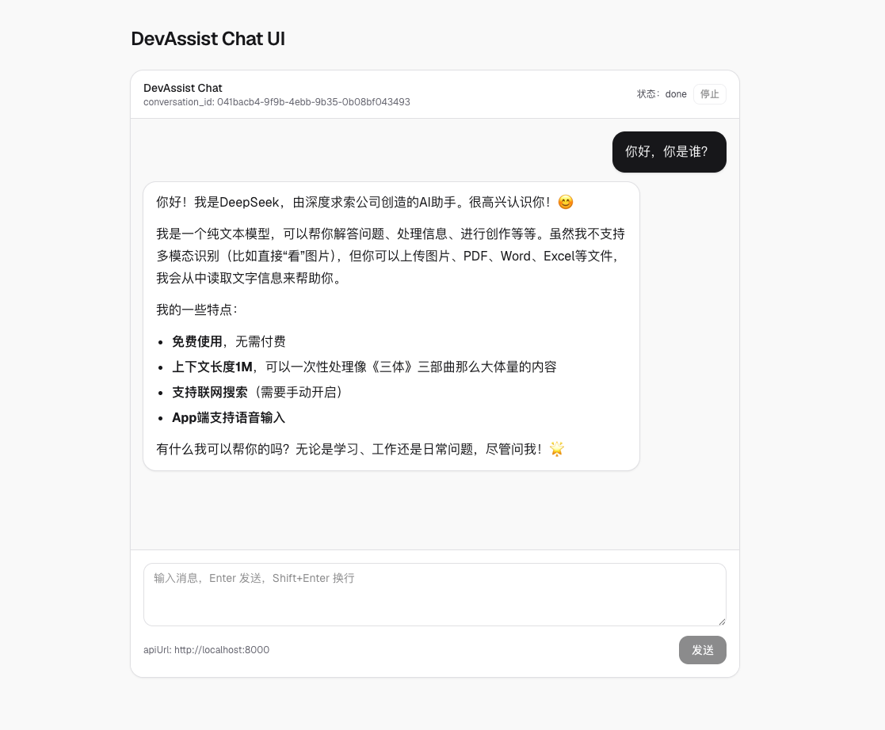

实现了一个可用的聊天页面，支持安全的 Markdown 渲染、SSE 流式增量输出，并补齐空状态、加载态、错误提示等基础体验。

## 1. 功能概览

- 支持 3 种消息角色：system/user/assistant，并做了左右布局区分
- 支持 Markdown（含 GFM）渲染，并通过 sanitize 做基础安全过滤
- 支持 SSE 流式协议：meta / delta / done / error
- 支持会话串联：前端保存后端返回的 `conversation_id`，后续请求携带
- 支持停止生成：AbortController 取消流式请求
- 支持空状态引导、发送中反馈、错误提示（toast + 气泡兜底）

## 2. 目录结构与关键文件

- 页面入口：`frontend/src/app/page.tsx`
- 聊天应用组件：`frontend/src/components/chat/ChatApp.tsx`
- 消息气泡组件：`frontend/src/components/chat/MessageBubble.tsx`
- SSE 流式工具：`frontend/src/lib/streaming.ts`
- 非流式 API client（typed）：`frontend/src/lib/api.ts`

## 3. 消息渲染：MessageBubble（Markdown + XSS 防护）

核心点：

- 用 `react-markdown` + `remark-gfm` 渲染 Markdown（列表、表格、代码块等）
- 用 `rehype-sanitize` 对输出做基础过滤，避免直接把不可信内容插入 DOM
- 通过 `components` 精细控制标签样式（`p/a/ul/ol/pre/code` 等），统一排版与间距

核心实现：

```tsx
import ReactMarkdown from "react-markdown";
import type { Components } from "react-markdown";
import rehypeSanitize from "rehype-sanitize";
import remarkGfm from "remark-gfm";

const components: Components = {
  p: ({ children }) => (
    <p className="leading-7 [&:not(:first-child)]:mt-3">{children}</p>
  ),
  a: ({ children, href }) => (
    <a
      href={href}
      className="underline underline-offset-2"
      target="_blank"
      rel="noreferrer"
    >
      {children}
    </a>
  ),
  pre: ({ children }) => (
    <pre className="mt-3 overflow-x-auto rounded-lg bg-zinc-950 p-3 text-sm text-zinc-50">
      {children}
    </pre>
  ),
};

export function MessageBubble(props: { role: "system" | "user" | "assistant"; content: string }) {
  return (
    <ReactMarkdown
      remarkPlugins={[remarkGfm]}
      rehypePlugins={[rehypeSanitize]}
      components={components}
    >
      {props.content}
    </ReactMarkdown>
  );
}
```

关键说明：

- 这里的 sanitize 是“最低限度”的安全护栏，能够防止最常见的 XSS 形态；但如果未来要支持更丰富的 HTML/组件渲染，需要明确白名单策略

## 4. 流式通信：SSE 解析与 streamChat

### 4.1 解析层：parseSseStream（ReadableStream -> SSE message）

- 输入：`ReadableStream<Uint8Array>`
- 输出：`AsyncGenerator<SseMessage>`
- 处理点：
  - 按行解析 `event:` / `data:`，遇到空行表示一个事件结束
  - 保留 `buffer`，处理 chunk 边界被截断的情况
  - 支持通过 `AbortSignal` 停止读取并 `reader.cancel()`

核心实现：

```ts
export async function* parseSseStream(
  stream: ReadableStream<Uint8Array>,
  options?: { signal?: AbortSignal },
): AsyncGenerator<{ event: string | null; data: string }> {
  const reader = stream.getReader();
  const decoder = new TextDecoder("utf-8");

  let buffer = "";
  let currentEvent: string | null = null;
  let dataLines: string[] = [];

  while (true) {
    if (options?.signal?.aborted) {
      try {
        await reader.cancel();
      } catch {}
      return;
    }

    const { done, value } = await reader.read();
    if (done) {
      return;
    }

    buffer += decoder.decode(value, { stream: true });
    const lines = buffer.replaceAll("\r\n", "\n").replaceAll("\r", "\n").split("\n");
    buffer = lines.pop() ?? "";

    for (const line of lines) {
      if (line === "") {
        if (dataLines.length > 0) {
          yield { event: currentEvent, data: dataLines.join("\n") };
        }
        currentEvent = null;
        dataLines = [];
        continue;
      }
      if (line.startsWith("event:")) currentEvent = line.slice(6).trim() || null;
      if (line.startsWith("data:")) dataLines.push(line.slice(5).trimStart());
    }
  }
}
```

### 4.2 业务层：streamChat（SSE message -> ChatStreamEvent）

- 请求：`POST /chat?stream=true`
- 事件：meta / delta / done / error
- 错误信息更友好：非 2xx 时尝试解析 JSON 错误体，并拼上 `x-request-id`（如果存在）

核心实现：

```ts
export async function* streamChat(options: {
  apiUrl: string;
  message: string;
  conversationId?: string;
  history?: Array<{ role: "system" | "user" | "assistant"; content: string }>;
  signal?: AbortSignal;
}): AsyncGenerator<
  | { type: "meta"; conversation_id: string }
  | { type: "delta"; content: string }
  | { type: "done" }
  | { type: "error"; message: string }
> {
  const url = new URL("/chat", options.apiUrl);
  url.searchParams.set("stream", "true");

  const resp = await fetch(url.toString(), {
    method: "POST",
    headers: { "content-type": "application/json" },
    body: JSON.stringify({
      conversation_id: options.conversationId ?? null,
      message: options.message,
      history: options.history ?? [],
    }),
    signal: options.signal,
  });

  if (!resp.ok || !resp.body) {
    yield { type: "error", message: `HTTP ${resp.status}` };
    return;
  }

  for await (const sse of parseSseStream(resp.body, { signal: options.signal })) {
    const parsed = JSON.parse(sse.data) as { type?: string; [k: string]: unknown };
    if (parsed.type === "meta" && typeof parsed.conversation_id === "string") {
      yield { type: "meta", conversation_id: parsed.conversation_id };
    }
    if (parsed.type === "delta" && typeof parsed.content === "string") {
      yield { type: "delta", content: parsed.content };
    }
    if (parsed.type === "done") {
      yield { type: "done" };
      return;
    }
    if (parsed.type === "error") {
      yield { type: "error", message: String(parsed.message ?? "Unknown error") };
      return;
    }
  }
}
```

## 5. 聊天交互：ChatApp（会话、发送、停止、自动滚动）

### 5.1 状态设计

- `messages`: 渲染消息列表（user/assistant），assistant 的增量输出通过“更新最后一条消息”实现
- `conversationId`: 保存后端 meta 事件带回的 `conversation_id`
- `status`: idle / streaming / error / done
- `abortRef`: 保存当前请求的 `AbortController`，用于停止生成

### 5.2 发送流程

- 先插入两条消息：
  - user：当前输入内容
  - assistant：空字符串（后续 delta 逐步 append）
- 启动 `streamChat(...)`，逐事件处理：
  - meta：写入 `conversationId`
  - delta：把 assistant 对应消息的内容拼接上增量文本
  - done：结束并设置状态
  - error：结束并展示错误

核心实现：

```tsx
const userMessageId = crypto.randomUUID();
const assistantMessageId = crypto.randomUUID();

setMessages((prev) => [
  ...prev,
  { id: userMessageId, role: "user", content: userText },
  { id: assistantMessageId, role: "assistant", content: "" },
]);

for await (const ev of streamChat({ apiUrl, message: userText, history, signal })) {
  if (ev.type === "meta") {
    setConversationId(ev.conversation_id);
    continue;
  }
  if (ev.type === "delta") {
    setMessages((prev) =>
      prev.map((m) =>
        m.id === assistantMessageId ? { ...m, content: m.content + ev.content } : m,
      ),
    );
    continue;
  }
  if (ev.type === "done") {
    setStatus("done");
    return;
  }
  if (ev.type === "error") {
    setStatus("error");
    setError(ev.message);
    return;
  }
}
```

### 5.3 停止生成

- `AbortController.abort()` 取消 fetch
- 取消是“用户主动行为”，不应当被当作错误展示，所以在 catch 分支里对 `AbortError` 做了区分处理

核心实现：

```tsx
function stop() {
  abortRef.current?.abort();
  abortRef.current = null;
  setStatus("idle");
}

try {
  // streaming loop...
} catch (err) {
  if ((err as { name?: unknown })?.name === "AbortError") {
    setStatus("idle");
    return;
  }
  setStatus("error");
  setError(String(err));
}
```

### 5.4 自动滚动

- `useEffect` 监听 `messages/status` 变化，滚动到 `bottomRef`，保证新增内容可见

## 6. 体验打磨：空状态、加载态、Toast、错误信息

- 空状态（messages 为空时）：
  - 展示引导卡片与示例问题，避免用户进来看到一屏空白
- 加载态：
  - 顶部状态旁显示 spinner
  - 发送按钮显示“发送中”并带 spinner
  - streaming 时禁用输入框，避免状态混乱
- Toast（轻量提示条）：
  - 错误时弹错误 toast
  - 点击“停止”弹成功 toast
  - 自动消失 + 可手动关闭
- 错误信息：
  - toast 用于即时反馈
  - 消息区仍保留一条 system 气泡兜底，避免用户错过信息

Toast 核心实现：

```tsx
export function Toast(props: {
  toast: { message: string; variant: "success" | "error" };
  onClose: () => void;
  autoCloseMs?: number;
}) {
  useEffect(() => {
    const timeout = window.setTimeout(() => props.onClose(), props.autoCloseMs ?? 4000);
    return () => window.clearTimeout(timeout);
  }, [props]);

  const classes =
    props.toast.variant === "error"
      ? "border-red-200 bg-red-50 text-red-900"
      : "border-emerald-200 bg-emerald-50 text-emerald-900";

  return (
    <div className={["rounded-2xl border px-4 py-3 shadow-sm", classes].join(" ")}>
      <div className="text-sm leading-6">{props.toast.message}</div>
      <button className="ml-auto rounded-lg px-2 py-1 text-xs" onClick={props.onClose}>
        关闭
      </button>
    </div>
  );
}
```

## 7. 环境变量：前后端拆分与 apiUrl 注入

### 7.1 前端：NEXT_PUBLIC_API_URL

- `frontend/src/app/page.tsx` 读取 `process.env.NEXT_PUBLIC_API_URL`，并把 `apiUrl` 传给 `ChatApp`
- 新增示例文件：`frontend/.env.example`

建议做法：

- 本地创建 `frontend/.env.local`（不提交），参考 `.env.example` 填写

### 7.2 后端：backend/.env（与 compose 对齐）

- compose 已约定后端 env 位置为 `./backend/.env`
- 示例文件：`backend/.env.example`

## 8. 本地验证命令

前端静态检查：

```bash
cd frontend
npm run lint
```

前端启动：

```bash
cd frontend
npm run dev
```

Docker 一键拉起（含 DB + migrate + 后端 + 前端）：

```bash
docker compose up -d --build
docker compose ps
```

如果要看迁移是否执行：

```bash
docker compose logs -f migrate
```

## 9. 设计取舍与可改进点

- Toast 目前是“页面内简单实现”，足够支撑开发阶段的错误/状态提示；如果后续要做全站统一通知，可以抽到 `components/ui/` 并做全局队列
- `streamChat` 当前只处理最小协议字段，后续如果需要 citations/tool-calls 等结构化数据，可在事件模型里扩展并保持向后兼容
- `api.ts` 已提供非流式 typed client；后续可以把 ChatApp 的非流式模式也接到 api client 上，统一错误策略与 request_id 展示

## 10.最终效果



