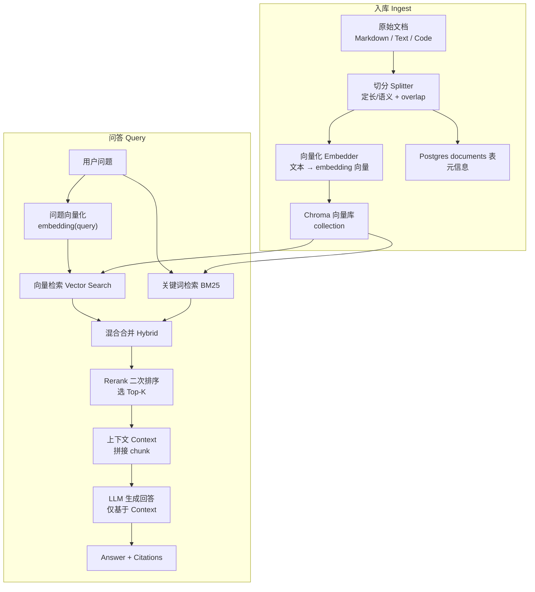

一句话总结：RAG = 先从你的“资料库”里把相关资料找出来（Retrieval），再要求大模型只基于这些资料回答（Generation），并把引用来源一起返回，从而减少胡编乱造。


## 1. RAG 在解决什么问题

大模型（LLM）很强，但有一个致命问题：它擅长“生成看起来合理的文本”，却不保证内容真的来自真实资料。

你问它一个它不确定的问题，它也可能：
- 讲得很像真的（语言非常顺）
- 但实际上是在“编”（俗称幻觉）

RAG 的核心思路是给大模型“加一个外部记忆”：
- 你把资料存进一个可检索的知识库（例如 FastAPI 文档）
- 用户提问时，系统先去知识库找相关资料
- 再把这些资料作为上下文交给 LLM，让它只基于资料回答
- 同时把资料来源（引用）返回，便于核对


## 2. RAG 的四个阶段

把 RAG 想象成“开卷考试”：

1) **入库（Ingest）**：把书分章节、做索引、放到书架上
- 文档读取/抓取
- 切分为小块（chunk）
- 生成每个 chunk 的 embedding 向量
- 写入向量库（Chroma）与元信息表（Postgres）

2) **检索（Retrieve）**：根据题目去翻书，找最相关的几页
- 对用户问题也做 embedding
- 在向量库做相似度检索（vector search）
- 同时做关键词检索（BM25）
- 合并为混合检索（Hybrid Search）

3) **重排（Rerank）**：把找来的候选资料再精挑细选，筛出最有用的几段
- 先拿一批候选（candidate）
- 用更精细的规则/模型重新排序
- 选出最终 top_k 段上下文

4) **生成（Generate）**：把“开卷资料”交给 LLM，让它写答案
- 拼上下文 context
- 让 LLM 基于 context 作答
- 返回 answer + citations（引用片段/来源）


## 2.1 架构图：从文档到答案

下面这张图就是 DevAssist 跑通的 RAG 版本（偏工程化的“最小闭环”）。



你可以把它理解成两条“输入输出”：
- 文档输入：文档 → chunk → embedding → Chroma（可检索）
- 问题输入：问题 → 检索出 chunk → 拼上下文 → LLM 输出答案（附引用）


## 3. 专业词汇解释，要不然根本不懂

下面这些词看懂了，RAG 就不神秘了：

- **RAG（Retrieval-Augmented Generation）**：检索增强生成；先检索资料，再生成答案。
- **知识库/文档库**：你自己存的资料集合，比如 FastAPI 文档、团队 Wiki。
- **Chunk（文本块）**：把长文切成很多小段，每段是一条可检索单位。
- **Chunk Size**：每段 chunk 的目标长度（例如 512 或 800）。
- **Overlap（重叠）**：相邻 chunk 之间重复一小段，避免关键句刚好被切断。
- **语义切分（Semantic Chunking）**：尽量按段落/句子/代码块边界切，而不是硬切长度。
- **Embedding（向量）**：把文本转为数字向量；语义相近的文本向量更接近。
- **向量数据库（Vector DB）**：存“向量 + 原文 + 元数据”的数据库，用来按语义相似度检索。这里用的是 **Chroma**。
- **Vector Search（向量检索）**：根据向量距离找相似 chunk。
- **BM25**：传统关键词检索算法，对专有名词、API 名称、代码符号很敏感。
- **Hybrid Search（混合检索）**：向量检索 + BM25 合并，兼顾语义与关键词。
- **Rerank（重排）**：第二次排序；让“更相关”的 chunk 排更前。
- **Top-K**：取前 K 个；例如 top_k=5 表示最终给 LLM 5 段上下文。
- **Candidate Multiplier（候选扩展倍数）**：先检索更多候选（top_k * multiplier），再 rerank 回 top_k。
- **Citation（引用）**：答案里附带资料来源与片段，便于核对与追溯。
- **SSE（Server-Sent Events）**：服务端流式推送输出给前端的方式，用于实时显示生成过程。


## 4. DevAssist 的 RAG 架构拆解

这一阶段（RAG 全链路）对应项目的 `backend/app/rag/` 模块，核心文件如下：

### 4.1 切分器（Chunking）

- `split_text`：定长切分
- `split_text_semantic`：语义切分（保护 Markdown fenced code block）

文件：
- `backend/app/rag/splitter.py`

代码（核心实现，直接摘自项目源码；建议配合上面的流程图一起看）：

```python
from __future__ import annotations

import re


def split_text(text: str, *, chunk_size: int = 512, overlap: int = 64) -> list[str]:
    """
    将长文本按固定长度切分为多个 chunk，并在相邻 chunk 之间保留重叠区间。

    Args:
        text (str): 待切分的原始文本。
        chunk_size (int): 每个 chunk 的最大字符数，默认 512。
        overlap (int): 相邻 chunk 的重叠字符数，默认 64。

    Returns:
        list[str]: 切分后的 chunk 列表，按原文顺序排列。

    Raises:
        ValueError: 当 chunk_size 非正数，或 overlap 为负数/不小于 chunk_size 时抛出。
    """
    if chunk_size <= 0:
        raise ValueError("chunk_size must be a positive integer")
    if overlap < 0:
        raise ValueError("overlap must be >= 0")
    if overlap >= chunk_size:
        raise ValueError("overlap must be smaller than chunk_size")

    if not text:
        return []

    chunks: list[str] = []
    start = 0
    text_len = len(text)

    while start < text_len:
        end = min(start + chunk_size, text_len)
        chunks.append(text[start:end])

        if end >= text_len:
            break

        start = end - overlap

    return chunks


_SENTENCE_RE = re.compile(r".+?(?:[.!?。！？]+(?:\s+|$))", re.DOTALL)


def split_text_semantic(
    text: str, *, chunk_size: int = 512, overlap: int = 64
) -> list[str]:
    """
    将文本做“更像人读文章”的切分：尽量按句子/段落边界切分，并尽量避免拆开 Markdown 代码块。

    Args:
        text (str): 待切分的原始文本。
        chunk_size (int): 目标 chunk 长度（按字符数粗略控制），默认 512。
        overlap (int): 相邻 chunk 的重叠长度（按字符数粗略控制），默认 64。

    Returns:
        list[str]: 切分后的 chunk 列表。

    Raises:
        ValueError: 当 chunk_size 非正数，或 overlap 为负数/不小于 chunk_size 时抛出。
    """
    if chunk_size <= 0:
        raise ValueError("chunk_size must be a positive integer")
    if overlap < 0:
        raise ValueError("overlap must be >= 0")
    if overlap >= chunk_size:
        raise ValueError("overlap must be smaller than chunk_size")

    if not text:
        return []

    units: list[str] = []
    for segment in _split_by_fenced_code_blocks(text):
        if segment.startswith("```") and segment.rstrip().endswith("```"):
            units.append(segment)
            continue
        units.extend(_split_text_segment_to_units(segment))

    chunks_units: list[list[str]] = []
    current: list[str] = []
    current_len = 0

    for unit in units:
        unit_len = len(unit)
        if current and current_len + unit_len > chunk_size:
            chunks_units.append(current)
            current = []
            current_len = 0

        if not current and unit_len > chunk_size:
            chunks_units.append([unit])
            continue

        current.append(unit)
        current_len += unit_len

    if current:
        chunks_units.append(current)

    if overlap == 0:
        return _finalize_chunks(chunks_units)

    overlapped: list[list[str]] = [chunks_units[0]]
    for i in range(1, len(chunks_units)):
        prev = overlapped[-1]
        prefix: list[str] = []
        acc = 0
        for unit in reversed(prev):
            prefix.append(unit)
            acc += len(unit)
            if acc >= overlap:
                break
        prefix.reverse()
        overlapped.append(prefix + chunks_units[i])

    return _finalize_chunks(overlapped)


def _split_by_fenced_code_blocks(text: str) -> list[str]:
    in_code = False
    buffer: list[str] = []
    segments: list[str] = []

    for line in text.splitlines(keepends=True):
        if line.lstrip().startswith("```"):
            if not in_code:
                if buffer:
                    segments.append("".join(buffer))
                    buffer = []
                in_code = True
                buffer.append(line)
                continue

            buffer.append(line)
            segments.append("".join(buffer))
            buffer = []
            in_code = False
            continue

        buffer.append(line)

    if buffer:
        segments.append("".join(buffer))

    return segments


def _split_text_segment_to_units(text: str) -> list[str]:
    parts = re.split(r"(\n{2,})", text)
    units: list[str] = []

    for part in parts:
        if not part:
            continue

        if re.fullmatch(r"\n{2,}", part):
            units.append(part)
            continue

        sentences = [m.group(0) for m in _SENTENCE_RE.finditer(part)]
        tail_start = sum(len(s) for s in sentences)
        tail = part[tail_start:]

        for s in sentences:
            if s:
                units.append(s)
        if tail.strip():
            units.append(tail)

    return units


def _finalize_chunks(chunks: list[list[str]]) -> list[str]:
    results: list[str] = []
    for units in chunks:
        merged = "".join(units).strip()
        if merged:
            results.append(merged)
    return results
```

### 4.2 向量化（Embedding）

职责：把文本列表变成向量列表（支持分批请求）。

文件：
- `backend/app/rag/embedder.py`

代码（embed_texts 的关键实现：分批请求 + 对齐顺序 + 统一打日志）：

```python
@classmethod
def from_settings(cls, settings: Settings) -> "Embedder":
    return cls(
        api_key=settings.embedding_api_key,
        model=settings.embedding_model,
        base_url=settings.embedding_base_url or None,
    )


async def embed_texts(self, texts: list[str], *, batch_size: int = 64) -> list[list[float]]:
    if batch_size <= 0:
        raise ValueError("batch_size must be a positive integer")
    if not texts:
        return []

    start = time.perf_counter()
    results: list[list[float]] = []

    try:
        for i in range(0, len(texts), batch_size):
            batch = texts[i : i + batch_size]
            response = await self._client.embeddings.create(
                model=self._model,
                input=batch,
            )
            items = sorted(
                getattr(response, "data", []),
                key=lambda x: int(getattr(x, "index", 0)),
            )
            for item in items:
                results.append(list(getattr(item, "embedding", [])))

        elapsed_ms = int((time.perf_counter() - start) * 1000)
        usage = getattr(response, "usage", None) if "response" in locals() else None
        self._logger.info(
            "embedding_call",
            model=self._model,
            count=len(texts),
            latency_ms=elapsed_ms,
            prompt_tokens=getattr(usage, "prompt_tokens", None) if usage else None,
            total_tokens=getattr(usage, "total_tokens", None) if usage else None,
            success=True,
        )
        return results
    except Exception as exc:
        elapsed_ms = int((time.perf_counter() - start) * 1000)
        self._logger.exception(
            "embedding_call",
            model=self._model,
            count=len(texts),
            latency_ms=elapsed_ms,
            success=False,
            error=str(exc),
        )
        raise
```

### 4.3 向量库（Chroma）

职责：统一 collection 的获取/创建。

文件：
- `backend/app/rag/chroma.py`

代码（collection 管理器：连接 + 统一入口）：

```python
class ChromaCollectionManager:
    def __init__(self, *, host: str, port: int, client: Any | None = None) -> None:
        if port <= 0:
            raise ValueError("port must be a positive integer")

        self._client = client or chromadb.HttpClient(host=host, port=port)

    @classmethod
    def from_settings(cls, settings: Settings) -> "ChromaCollectionManager":
        return cls(host=settings.chroma_host, port=settings.chroma_port)

    def get_or_create_collection(self, *, name: str) -> Collection:
        if not name.strip():
            raise ValueError("collection name is required")

        return self._client.get_or_create_collection(name=name)
```

### 4.4 入库（Ingestion）

职责：chunk → embed → store（写入 Chroma）→ persist meta（写入 Postgres documents 表）。

文件：
- `backend/app/rag/ingestion.py`
- API：`backend/app/api/ingest.py`
- 脚本：
  - `backend/scripts/ingest_docs.py`（批量 ingest 本地 docs 目录）
  - `backend/scripts/ingest_fastapi_docs.py`（从 GitHub 拉 FastAPI 官方文档）

代码（入库业务核心：chunk → embed → store → persist meta）：

```python
async def ingest_text_document(
    *,
    title: str,
    source: str,
    text: str,
    collection_name: str | None = None,
    chunk_size: int = 512,
    overlap: int = 64,
) -> tuple[UUID, int, str]:
    settings = get_settings()
    collection = collection_name or settings.chroma_collection

    chunks = _split_text_for_source(
        text=text,
        source=source,
        chunk_size=chunk_size,
        overlap=overlap,
    )
    if not chunks:
        raise AppError(
            code="empty_document",
            message="Document is empty.",
            status_code=400,
            details={"source": source},
        )

    embedding_client = get_embedder(settings=settings)
    vectors = await embedding_client.embed_texts(chunks)
    if len(vectors) != len(chunks):
        raise AppError(
            code="embedding_mismatch",
            message="Embedding results do not match chunks.",
            status_code=500,
            details={"chunk_count": len(chunks), "vector_count": len(vectors)},
        )

    manager = get_chroma_manager(settings=settings)
    chroma_collection = manager.get_or_create_collection(name=collection)

    ids = [uuid4().hex for _ in range(len(chunks))]
    metadatas = [{"source": source, "chunk_index": i} for i in range(len(chunks))]
    chroma_collection.add(ids=ids, documents=chunks, embeddings=vectors, metadatas=metadatas)

    document_id = await persist_document_to_db(
        title=title,
        source=source,
        chunk_count=len(chunks),
    )

    return document_id, len(chunks), collection
```

### 4.5 检索（Hybrid Retrieval）

职责：向量检索 + BM25 检索合并。

文件：
- `backend/app/rag/retriever.py`
- `backend/app/rag/bm25.py`
- API：`backend/app/api/search.py`

代码（混合检索的核心：vector + BM25 合并去重 + 排序）：

```python
from app.core.config import Settings, get_settings
from app.rag.bm25 import BM25Scorer
from app.rag.chroma import ChromaCollectionManager
from app.rag.embedder import Embedder
from dataclasses import dataclass
from typing import Any


@dataclass(frozen=True)
class RetrievedChunk:
    id: str
    content: str
    metadata: dict[str, Any] | None
    distance: float | None


class VectorRetriever:
    def __init__(
        self,
        *,
        embedder: Embedder,
        chroma_manager: ChromaCollectionManager,
        default_collection: str,
    ) -> None:
        if not default_collection.strip():
            raise ValueError("default_collection is required")

        self._embedder = embedder
        self._chroma_manager = chroma_manager
        self._default_collection = default_collection

    @classmethod
    def from_settings(cls, settings: Settings) -> "VectorRetriever":
        embedder = Embedder.from_settings(settings)
        chroma_manager = ChromaCollectionManager.from_settings(settings)
        return cls(
            embedder=embedder,
            chroma_manager=chroma_manager,
            default_collection=settings.chroma_collection,
        )

    async def search(
        self,
        *,
        query: str,
        top_k: int = 10,
        collection_name: str | None = None,
    ) -> list[RetrievedChunk]:
        if not query.strip():
            raise ValueError("query is required")
        if top_k <= 0:
            raise ValueError("top_k must be a positive integer")

        collection = collection_name or self._default_collection
        chroma_collection = self._chroma_manager.get_or_create_collection(name=collection)

        vectors = await self._embedder.embed_texts([query], batch_size=1)
        query_vector = vectors[0]

        result = chroma_collection.query(
            query_embeddings=[query_vector],
            n_results=top_k,
            include=["documents", "metadatas", "distances"],
        )

        ids = (result.get("ids") or [[]])[0]
        documents = (result.get("documents") or [[]])[0]
        metadatas = (result.get("metadatas") or [[]])[0]
        distances = (result.get("distances") or [[]])[0]

        items: list[RetrievedChunk] = []
        for i in range(min(len(ids), len(documents))):
            meta = metadatas[i] if i < len(metadatas) else None
            dist = distances[i] if i < len(distances) else None
            items.append(
                RetrievedChunk(
                    id=str(ids[i]),
                    content=str(documents[i]),
                    metadata=meta,
                    distance=dist,
                )
            )
        return items


@dataclass(frozen=True)
class KeywordChunk:
    id: str
    content: str
    metadata: dict[str, Any] | None
    score: float


class KeywordRetriever:
    def __init__(self, *, chroma_manager: ChromaCollectionManager, default_collection: str) -> None:
        if not default_collection.strip():
            raise ValueError("default_collection is required")
        self._chroma_manager = chroma_manager
        self._default_collection = default_collection

    @classmethod
    def from_settings(cls, settings: Settings) -> "KeywordRetriever":
        chroma_manager = ChromaCollectionManager.from_settings(settings)
        return cls(chroma_manager=chroma_manager, default_collection=settings.chroma_collection)

    def search(
        self,
        *,
        query: str,
        top_k: int = 10,
        collection_name: str | None = None,
    ) -> list[KeywordChunk]:
        if not query.strip():
            raise ValueError("query is required")
        if top_k <= 0:
            raise ValueError("top_k must be a positive integer")

        collection = collection_name or self._default_collection
        chroma_collection = self._chroma_manager.get_or_create_collection(name=collection)

        result = chroma_collection.get(include=["documents", "metadatas"])
        ids: list[str] = list(result.get("ids") or [])
        documents: list[str] = list(result.get("documents") or [])
        metadatas: list[dict[str, Any]] = list(result.get("metadatas") or [])

        if not ids or not documents:
            return []

        scorer = BM25Scorer(documents=[str(d) for d in documents])
        scores = scorer.score(query=query)
        scored = sorted(scores, key=lambda x: x.score, reverse=True)[:top_k]

        items: list[KeywordChunk] = []
        for s in scored:
            if s.score <= 0:
                continue
            i = s.doc_index
            meta = metadatas[i] if i < len(metadatas) else None
            items.append(
                KeywordChunk(
                    id=str(ids[i]),
                    content=str(documents[i]),
                    metadata=meta,
                    score=s.score,
                )
            )
        return items


@dataclass(frozen=True)
class HybridChunk:
    id: str
    content: str
    metadata: dict[str, Any] | None
    vector_distance: float | None
    bm25_score: float | None


class HybridRetriever:
    def __init__(self, *, vector: VectorRetriever, keyword: KeywordRetriever) -> None:
        self._vector = vector
        self._keyword = keyword

    @classmethod
    def from_settings(cls, settings: Settings) -> "HybridRetriever":
        return cls(vector=VectorRetriever.from_settings(settings), keyword=KeywordRetriever.from_settings(settings))

    async def search(
        self,
        *,
        query: str,
        top_k: int = 10,
        collection_name: str | None = None,
        vector_top_k: int | None = None,
        keyword_top_k: int | None = None,
    ) -> list[HybridChunk]:
        v_top = vector_top_k or top_k
        k_top = keyword_top_k or top_k

        vector_hits = await self._vector.search(query=query, top_k=v_top, collection_name=collection_name)
        keyword_hits = self._keyword.search(query=query, top_k=k_top, collection_name=collection_name)

        merged: dict[str, HybridChunk] = {}
        for h in vector_hits:
            merged[h.id] = HybridChunk(
                id=h.id,
                content=h.content,
                metadata=h.metadata,
                vector_distance=h.distance,
                bm25_score=None,
            )
        for h in keyword_hits:
            prev = merged.get(h.id)
            if prev is None:
                merged[h.id] = HybridChunk(
                    id=h.id,
                    content=h.content,
                    metadata=h.metadata,
                    vector_distance=None,
                    bm25_score=h.score,
                )
            else:
                merged[h.id] = HybridChunk(
                    id=prev.id,
                    content=prev.content,
                    metadata=prev.metadata,
                    vector_distance=prev.vector_distance,
                    bm25_score=h.score,
                )

        def _rank_key(item: HybridChunk) -> tuple[float, float]:
            d = item.vector_distance
            v = 0.0 if d is None else 1.0 / (1.0 + float(d))
            b = 0.0 if item.bm25_score is None else float(item.bm25_score)
            return (v, b)

        ranked = sorted(merged.values(), key=_rank_key, reverse=True)[:top_k]
        return ranked


async def hybrid_search(*, query: str, top_k: int = 10, collection_name: str | None = None) -> list[HybridChunk]:
    settings = get_settings()
    retriever = HybridRetriever.from_settings(settings)
    return await retriever.search(query=query, top_k=top_k, collection_name=collection_name)
```

### 4.6 重排（Rerank）

职责：对候选 chunks 二次排序。当前实现是“关键词重叠打分”的轻量版本，支持最小阈值与空结果兜底。

文件：
- `backend/app/rag/reranker.py`

代码（完整实现：打分规则 + 阈值过滤 + 空结果兜底）：

```python
def _overlap_score(*, query: str, content: str) -> float:
    q = tokenize(query)
    d = tokenize(content)
    if not q or not d:
        return 0.0

    q_set = set(q)
    d_set = set(d)
    hit = len(q_set & d_set)
    return hit / (len(q_set) ** 0.5 + 1.0)


def rerank(*, query: str, chunks: Sequence[HasContent], top_k: int = 5, min_score: float = 0.0) -> list[RerankedChunk]:
    if not query.strip():
        raise ValueError("query is required")
    if top_k <= 0:
        raise ValueError("top_k must be a positive integer")

    scored: list[RerankedChunk] = []
    for c in chunks:
        score = _overlap_score(query=query, content=c.content)
        scored.append(RerankedChunk(id=c.id, content=c.content, metadata=c.metadata, score=score))

    scored.sort(key=lambda x: x.score, reverse=True)
    picked = [s for s in scored[:top_k] if s.score > min_score]
    if not picked and min_score <= 0.0:
        return list(scored[:top_k])
    return picked
```

### 4.7 生成（Generate）

职责：retrieve → rerank → build context → 调 LLM → 返回 answer + citations。

文件：
- `backend/app/rag/generator.py`

代码（生成主链路：retrieve → rerank → build context → 调 LLM → 返回 citations）：

```python
def _build_context(*, chunks: list[HybridChunk], max_chars: int = 6000) -> str:
    parts: list[str] = []
    used = 0
    for i, c in enumerate(chunks, start=1):
        meta = c.metadata or {}
        source = str(meta.get("source") or "")
        chunk_index = meta.get("chunk_index")
        suffix = f"#{chunk_index}" if isinstance(chunk_index, int) else ""
        header = f"[{i}] {source}{suffix}".strip()
        body = c.content.strip()
        block = f"{header}\n{body}"
        if used + len(block) > max_chars:
            remain = max_chars - used
            if remain <= 0:
                break
            parts.append(block[:remain])
            break
        parts.append(block)
        used += len(block) + 2
    return "\n\n".join(parts).strip()


async def generate_answer(
    *,
    query: str,
    top_k: int = 5,
    collection_name: str | None = None,
    candidate_multiplier: int = 4,
    rerank_min_score: float = 0.0,
) -> RAGAnswer:
    settings = get_settings()

    global llm_client
    if llm_client is None:
        try:
            llm_client = LLMClient.from_settings(settings)
        except ValueError as exc:
            raise ConfigurationError(message=str(exc)) from exc

    candidate_k = max(top_k * candidate_multiplier, top_k)
    candidates = await hybrid_search(query=query, top_k=candidate_k, collection_name=collection_name)
    picked = rerank(query=query, chunks=candidates, top_k=top_k, min_score=rerank_min_score)
    picked_by_id = {p.id: p for p in picked}
    final_chunks: list[HybridChunk] = [c for c in candidates if c.id in picked_by_id]

    context = _build_context(chunks=final_chunks)
    system_prompt = (
        "你是一个严谨的技术助手。你只能基于提供的资料回答，不要编造。"
        "回答中需要在相关句子末尾用 [1] [2] 这样的编号标注引用，编号对应资料块的编号。"
        "如果资料不足以回答，就明确说明不知道。"
    )
    user_prompt = f"问题：{query}\n\n资料：\n{context}\n\n请给出回答："

    response = await llm_client.chat(
        messages=[
            {"role": "system", "content": system_prompt},
            {"role": "user", "content": user_prompt},
        ],
        temperature=0.0,
        stream=False,
    )
    answer = response.choices[0].message.content if response.choices else ""
    citations = _extract_citations(chunks=final_chunks)
    return RAGAnswer(answer=answer or "", citations=citations)
```

## 5. 手把手跑通（命令即可复现）

下面这组命令是“从 0 到跑通 RAG”的最短路径。

### 5.1 启动服务

```bash
docker compose up -d
```

### 5.2 Ingest：把 FastAPI 文档写入知识库

先小规模跑通（控制成本）：

```bash
docker compose run --rm backend python scripts/ingest_fastapi_docs.py \
  --limit 30 \
  --collection fastapi_docs \
  --chunk-size 512 \
  --overlap 64
```

验证写入量（count > 0 即可）：

```bash
docker compose run --rm backend python -c "from app.core.config import get_settings; from app.rag.chroma import ChromaCollectionManager; s=get_settings(); c=ChromaCollectionManager.from_settings(s).get_or_create_collection(name='fastapi_docs'); print('count=', c.count())"
```

### 5.3 Eval（离线，不调用 LLM）：只测“检索有没有把资料找回来”

```bash
docker compose run --rm backend python scripts/eval_runner.py \
  --dataset /data/datasets/fastapi_eval_50.jsonl \
  --no-llm \
  --top-k 5 \
  --candidate-multiplier 4 \
  --rerank-min-score 0.0 \
  --embedding-metrics \
  --output /data/eval_reports/fastapi_full_top5_cm4_thr0.json
```

说明：
- `--no-llm`：不生成答案，直接用数据集里的 `reference_answer` 当 answer（但仍会真实检索 contexts），适合调检索参数。
- `--embedding-metrics`：输出 embedding 版本指标，跨语言更稳。

---

## 6. 如何评测：到底在测什么

评测模块的设计目标是：**不依赖复杂的裁判模型，也能快速对比“检索/重排/切分参数”是否有改进**。

### 6.1 三个启发式指标（直觉解释）

1) **Faithfulness（忠实度）**  
回答里的关键 token 是否能在 contexts 中找到。  
直觉：回答有没有依据。

2) **Answer Relevance（相关性）**  
问题的关键 token 是否在回答中出现。  
直觉：有没有答到点上。

3) **Context Recall（上下文召回）**  
参考答案的关键 token 是否被 contexts 覆盖。  
直觉：检索是否把关键资料找回来了。

对应代码：
- `backend/app/rag/evaluator.py`

### 6.2 为什么要加 embedding 指标

如果你的“问题/答案”是中文，但知识库文档是英文：
- token 重叠会天然偏低（语言不一致）
- embedding 相似度能更好反映“语义接近”

因此评测脚本在开启 `--embedding-metrics` 后，会额外输出：
- emb_relevance = cosine(question, answer)
- emb_faithfulness = cosine(answer, contexts_joined)
- emb_context_recall = cosine(reference_answer, contexts_joined)

---

## 7. 评测数据集长什么样

评测数据集采用 JSONL（每行一个 JSON），示例结构：

```json
{
  "question": "FastAPI 的核心设计目标是什么？",
  "reference_answer": "FastAPI 旨在用现代 Python（类型标注、async）快速构建高性能 API，同时提供自动数据校验与自动生成 OpenAPI 文档。",
  "collection_name": "fastapi_docs"
}
```

字段含义：
- `question`：要评测的问题
- `reference_answer`：参考答案（用于计算 context recall；在 `--no-llm` 模式下可作为 answer）
- `collection_name`：默认去哪个 Chroma collection 检索（例如 fastapi_docs）

---

## 8. 怎么判断“做得好不好”

先给一个很实用的判断方式：

### 8.1 先判定“流程是否跑通”

满足以下任意两点就说明闭环打通了：
- Chroma collection 的 `count > 0`（说明入库成功）
- eval_runner 能跑完并输出平均分，同时 `output` 文件里有每条样本的 contexts
-（若启用生成）能从 `generate_answer()` 拿到 answer + citations

### 8.2 再判定“效果是否足够好”

你需要先明确“你要优化哪一段”：

- 你想优化 **检索召回**：优先看 `context_recall` / `emb_context_recall`
- 你想优化 **生成质量**：需要启用真实生成（不要 `--no-llm`），再引入 LLM-as-judge 或人工抽检

注意：如果是“中文问答 + 英文文档”，token 类指标会偏低，不适合作为唯一标准，更建议参考 embedding 指标。


## 9. 下一步：如何把它从“能用”变成“好用”

按收益从高到低排序：

1) **全量 ingest 文档**  
小规模 ingest 只能证明流程，无法代表真实效果上限。

2) **更强的 reranker**  
当前是轻量关键词重叠；升级为 cross-encoder/LLM rerank 通常能明显提升“Top-K 的质量”。

3) **评测升级为“生成评测”**  
现在的 `--no-llm` 更像“检索评测”；要衡量最终用户体验，需要把生成纳入评测。

4) **同语种评测集**  
中英混合会让 token 指标失真；准备英文问答或把问题翻译成英文，会更容易定位问题出在哪一环。

