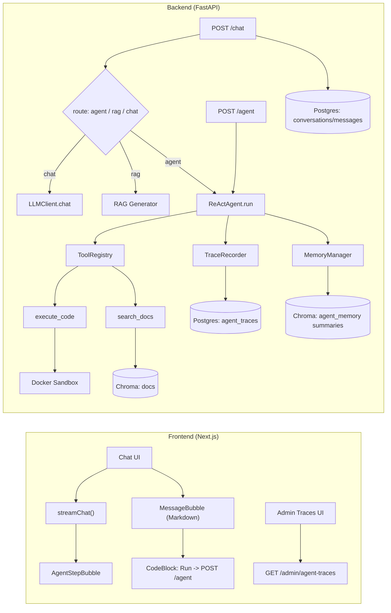
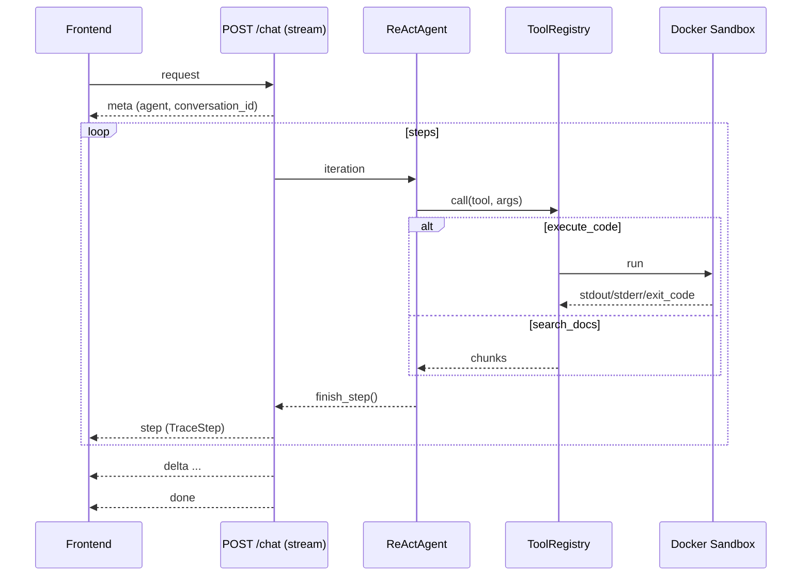

DevAssist Agent 系统通过 **ReAct（Thought→Action→Observation）循环**驱动推理与工具调用；工具由 **ToolRegistry** 统一管理（`search_docs`/`execute_code`）；代码执行走 **Docker Sandbox**；过程用 **Memory + Trace** 记录；`/chat?stream=true` 通过 **SSE** 推送 step 与回复内容。

## 1. 系统长什么样（架构图 + 数据流）

### 1.1 组件架构图（本阶段）



### 1.2 Agent 流式时序（/chat?stream=true）



---

## 2. 模块与接口速查

后端（Agent 核心）：

- 工具系统（Tool/ToolRegistry）：`backend/app/agent/tools.py`
- 内置工具（search_docs/execute_code）：`backend/app/agent/builtin_tools.py`
- ReAct 主循环（解析 + 调工具 + 注入 Observation）：`backend/app/agent/react.py`
- Trace（step 记录结构）：`backend/app/agent/trace.py`
- Sandbox（Docker 隔离执行）：`backend/app/agent/sandbox.py`
- Sandbox 安全扫描：`backend/app/agent/sandbox_safety.py`
- 记忆（短期 LRU + 长期向量 + 摘要）：`backend/app/agent/memory.py`

后端（API）：

- Agent 执行入口：`backend/app/api/agent.py`
- Chat 统一入口（含 Agent 路由 + step SSE）：`backend/app/api/chat.py`
- 管理端 traces API：`backend/app/api/admin_traces.py`

前端：

- SSE 解析（meta/step/delta/done）：`frontend/src/lib/streaming.ts`
- 聊天页（step 消息类型 + 顶部 Agent/RAG badge）：`frontend/src/components/chat/ChatApp.tsx`
- step 卡片组件：`frontend/src/components/chat/AgentStepBubble.tsx`
- CodeBlock Run（通过 /agent 执行）：`frontend/src/components/code/CodeBlock.tsx`
- 管理端 traces UI：`frontend/src/components/admin/TracesPage.tsx`、`frontend/src/components/admin/TraceDetail.tsx`

### 2.1 API 速查（本阶段实际会用到的）

#### 2.1.1 POST /chat（统一入口：chat / rag / agent）

请求：

- URL query：`stream=true|false`（是否启用 SSE；默认 false）
- Body：JSON

最小请求（强制走 Agent）：

```json
{
  "message": "写一个 add(a,b) 并用 execute_code 验证",
  "use_agent": true
}
```

常用请求（带会话与 RAG 参数）：

```json
{
  "conversation_id": "00000000-0000-0000-0000-000000000000",
  "message": "解释 FastAPI 依赖注入的作用，并给一个最小示例",
  "use_rag": true,
  "collection_name": "fastapi_docs"
}
```

字段说明（简表）：

- message: string，必填
- conversation_id: string，可选；传入时服务端优先从 DB 读取历史
- history: Array<{role, content}>，可选；仅在不传 conversation_id 时作为上下文使用
- use_agent/use_rag: boolean|null，可选；显式开关，非空时覆盖启发式路由
- collection_name: string|null，可选；RAG 检索的 collection

本地最小验证（强制走 Agent + SSE）：

```bash
curl -N http://localhost:8000/chat?stream=true \
  -H 'content-type: application/json' \
  -d '{"message":"写一个 add(a,b) 并用 execute_code 验证","use_agent":true}'
```

期望输出包含：

- `type":"meta"`（agent=true）
- 若干 `type":"step"`（其中至少一次 tool_name=execute_code）
- 多个 `type":"delta"` + 结束 `type":"done"`

#### 2.1.2 POST /agent（显式调用 Agent；可限制工具集合）

请求：

- URL query：`stream=true|false`（是否启用 SSE；默认 false）
- Body：JSON

最小请求（限制仅可用 execute_code）：

```json
{
  "message": "你必须调用 execute_code 执行：print(1+1)",
  "tools": ["execute_code"]
}
```

字段说明（简表）：

- message: string，必填
- tools: string[]|null，可选；限制本次可用工具集合（常用于 CodeBlock）
- conversation_id: string|null，可选；挂载到某个会话（便于记忆与追踪）

本地最小验证（只允许 execute_code）：

```bash
curl http://localhost:8000/agent \
  -H 'content-type: application/json' \
  -d '{"message":"你必须调用 execute_code 执行：print(1+1)","tools":["execute_code"]}'
```

#### 2.1.3 GET /admin/agent-traces（管理端回放）

- 用途：查看历史 run 的 steps（thought/action/tool/observation/error/latency_ms）
- 前端入口：`/admin/traces`

---

## 3. 术语简释

本节只覆盖 Agent 系统相关概念。

### 3.1 Agent

- 定义：在固定的输出协议下做多轮推理，必要时调用工具，并生成最终答案。
- 代码：`backend/app/agent/react.py`（ReActAgent）

### 3.2 ReAct（Thought / Action / Observation）

- 定义：把推理过程拆成 Thought/Action/Observation 三段，并把 Observation 回填到上下文继续迭代。
- 代码：`backend/app/agent/react.py`（run + output parser）

### 3.3 Tool（工具）

- 定义：一个具名能力，包含参数 schema 与 handler（同步/异步）。
- 代码：`backend/app/agent/tools.py`（Tool）

### 3.4 ToolRegistry（工具注册表）

- 定义：工具集合的统一入口，提供 register/get/call，并统一记录工具调用日志。
- 代码：`backend/app/agent/tools.py`（ToolRegistry）

### 3.5 JSON Schema（在这里的意义）

- 定义：约束工具入参结构；不符合直接返回 4xx。
- 备注：只实现了够用的子集（未引入 jsonschema 依赖）。
- 代码：`backend/app/agent/tools.py`（schema 校验）

### 3.6 Sandbox（沙箱）

- 定义：在 Docker 容器中隔离执行代码（禁网、只读、限资源）。
- 代码：`backend/app/agent/sandbox.py`（execute_python）

### 3.7 SSE（Server-Sent Events）

- 定义：后端以事件流方式把 meta/step/delta/done 推送给前端。
- 代码：`frontend/src/lib/streaming.ts`（parseSseStream / streamChat）、`backend/app/api/chat.py`（/chat stream）

### 3.8 Trace / Observability（可观测性）

- 定义：记录每一步的 Thought/Action/tool/observation/error/latency，便于回放与排错。
- 代码：`backend/app/agent/trace.py`、`backend/app/api/admin_traces.py`

### 3.9 Memory（短期/长期记忆）

- 定义：短期记忆保存最近 N 轮；长期记忆把溢出的对话做摘要并写入向量库。
- 代码：`backend/app/agent/memory.py`（MemoryManager）

---

## 4. 关键实现摘录

这里不贴全量文件，只贴“理解系统关键点”的最小片段；需要看完整实现就按相对路径打开对应源码文件。

### 4.1 Tool + ToolRegistry（工具如何被校验并执行）

关键点：

1) 工具注册时校验 schema 结构（防止开发者写错 schema）
2) 工具调用前校验 payload 是否符合 schema（防止模型乱传参）
3) ToolRegistry.call 统一打点与日志

关键实现（摘自 `backend/app/agent/tools.py`）：

```python
@dataclass(frozen=True)
class Tool:
    name: str
    description: str
    parameters: JSONSchema
    handler: ToolHandler
    return_schema: JSONSchema | None = None

    def __post_init__(self) -> None:
        if not self.name.strip():
            raise ValueError("tool.name is required")
        if not self.description.strip():
            raise ValueError("tool.description is required")
        _validate_schema_definition(schema=self.parameters, path=f"tool:{self.name}.parameters")
        if self.return_schema is not None:
            _validate_schema_definition(schema=self.return_schema, path=f"tool:{self.name}.return_schema")

    def to_openai_tool(self) -> dict[str, Any]:
        return {
            "type": "function",
            "function": {
                "name": self.name,
                "description": self.description,
                "parameters": self.parameters,
            },
        }

    def validate_input(self, payload: Mapping[str, Any]) -> None:
        if not isinstance(payload, dict):
            raise AppError(
                code="tool_input_invalid",
                message="Tool input must be an object.",
                status_code=400,
                details={"expected_type": "object", "actual_type": type(payload).__name__},
            )
        _validate_instance_against_schema(value=payload, schema=self.parameters, path="$")

    async def call(self, payload: Mapping[str, Any]) -> Any:
        self.validate_input(payload)
        if not isinstance(payload, dict):
            raise AppError(
                code="tool_input_invalid",
                message="Tool input must be an object.",
                status_code=400,
                details={"expected_type": "object", "actual_type": type(payload).__name__},
            )

        if asyncio.iscoroutinefunction(self.handler):
            return await self.handler(**payload)
        result = self.handler(**payload)
        if asyncio.iscoroutine(result):
            return await result
        return result


class ToolRegistry:
    def __init__(self) -> None:
        self._tools: dict[str, Tool] = {}
        self._logger = structlog.get_logger()

    def register(self, tool: Tool) -> None:
        if tool.name in self._tools:
            raise AppError(
                code="tool_already_registered",
                message="Tool is already registered.",
                status_code=409,
                details={"name": tool.name},
            )
        self._tools[tool.name] = tool
        self._logger.info("tool_registered", name=tool.name)

    def get(self, name: str) -> Tool:
        tool = self._tools.get(name)
        if tool is None:
            raise AppError(
                code="tool_not_found",
                message="Tool not found.",
                status_code=404,
                details={"name": name},
            )
        return tool

    def list(self) -> list[Tool]:
        return list(self._tools.values())

    def to_openai_tools(self) -> list[dict[str, Any]]:
        return [t.to_openai_tool() for t in self.list()]

    async def call(self, *, name: str, payload: Mapping[str, Any]) -> Any:
        tool = self.get(name)
        start = time.perf_counter()
        try:
            result = await tool.call(payload)
            self._logger.info(
                "tool_call",
                name=name,
                success=True,
                latency_ms=int((time.perf_counter() - start) * 1000),
            )
            return result
        except Exception as exc:
            self._logger.exception(
                "tool_call",
                name=name,
                success=False,
                latency_ms=int((time.perf_counter() - start) * 1000),
                error=str(exc),
            )
            raise
```

### 4.2 ReActAgent.run（主循环：解析 → 调工具 → 注入 Observation）

主循环里有三个关键点：

1) `_parse_react_output(content)`：模型输出能不能被机器读懂  
2) `tools.call(name=tool_name, payload=tool_args)`：工具执行结果是什么  
3) `messages.append({"role":"user","content": observation_text})`：把证据喂回模型继续下一步  

关键实现（摘自 `backend/app/agent/react.py`）：

```python
system_prompt = _build_system_prompt(tools=self._tools)
messages: list[dict[str, Any]] = [{"role": "system", "content": system_prompt}]
if history_messages:
    messages.extend(list(history_messages))
messages.append({"role": "user", "content": user_input})

steps: list[ReActStep] = []
recorder = trace or TraceRecorder()

for i in range(self._max_iterations):
    started_at_ms = recorder.start_step(step_index=i)
    resp = await self._llm.chat(messages=list(messages), temperature=0.0, stream=False)
    content = str(resp.choices[0].message.content or "")
    messages.append({"role": "assistant", "content": content})

    parsed = _parse_react_output(content)

    if parsed["type"] == "final":
        final_answer = parsed["final"]
        steps.append(
            ReActStep(
                thought=parsed.get("thought", ""),
                action_raw=parsed.get("action_raw", ""),
                tool_name=None,
                tool_args=None,
                observation=None,
            )
        )
        recorder.finish_step(
            step_index=i,
            started_at_ms=started_at_ms,
            thought=parsed.get("thought", ""),
            action_raw=parsed.get("action_raw", ""),
            tool_name=None,
            tool_args=None,
            observation=None,
            error=None,
        )
        return final_answer, steps

    tool_name = parsed["tool_name"]
    tool_args = parsed["tool_args"]
    observation, tool_error = await _call_tool_with_retry(
        tools=self._tools,
        tool_name=tool_name,
        tool_args=tool_args,
        max_retries=TOOL_MAX_RETRIES,
        logger=self._logger,
    )
    recorder.finish_step(
        step_index=i,
        started_at_ms=started_at_ms,
        thought=parsed.get("thought", ""),
        action_raw=parsed.get("action_raw", ""),
        tool_name=tool_name,
        tool_args=tool_args,
        observation=observation,
        error=tool_error,
    )
    steps.append(
        ReActStep(
            thought=parsed.get("thought", ""),
            action_raw=parsed.get("action_raw", ""),
            tool_name=tool_name,
            tool_args=tool_args,
            observation=observation,
        )
    )

    if tool_error is not None:
        observation_text = _format_tool_error_observation(
            tool_name=tool_name,
            tool_args=tool_args,
            error=tool_error,
        )
    else:
        observation_text = _format_tool_observation(
            tool_name=tool_name,
            tool_args=tool_args,
            observation=observation,
        )
    messages.append({"role": "user", "content": observation_text})

raise AppError(
    code="agent_max_iterations",
    message="Agent reached max iterations without producing a final answer.",
    status_code=408,
    details={"max_iterations": self._max_iterations},
)
```

system prompt 里对输出格式的硬约束（同文件）：

```python
return "\n".join(
    [
        "你是 DevAssist 的 ReAct Agent，擅长把复杂问题拆成可执行步骤，并调用工具获取证据。",
        "",
        "可用工具：",
        tool_block,
        "",
        "输出格式要求：",
        "- 你必须输出两段：Thought 与 Action",
        "- Action 只有两种：",
        "  1) tool call:",
        "     Action: tool:<tool_name>",
        "     args: <json object>",
        "  2) final answer:",
        "     Action: final: <final answer text>",
    ]
)
```

### 4.3 execute_code → Docker sandbox（隔离参数与执行链路）

隔离相关的关键参数如下：

- 禁网络：`network_disabled=True`
- 只读根：`read_only=True`
- tmpfs：`tmpfs={"/tmp": "rw,size=64m"}`
- 只读挂载代码：`volumes={tmpdir: {"bind": "/work", "mode": "ro"}}`
- 限内存：`mem_limit=...`
- 超时 kill + remove：`asyncio.wait_for(... timeout_s)` + `container.kill/remove`

execute_code 工具入口（摘自 `backend/app/agent/builtin_tools.py`）：

```python
async def _handler(*, code: str, timeout_s: int = 5) -> dict[str, Any]:
    if timeout_s <= 0:
        raise AppError(
            code="tool_input_invalid",
            message="timeout_s must be a positive integer.",
            status_code=400,
            details={"timeout_s": timeout_s},
        )

    settings = get_settings()
    allowed_paths = (
        [p.strip() for p in settings.sandbox_allowed_paths.split(",") if p.strip()]
        if settings.sandbox_allowed_paths
        else []
    )
    safety = check_code_safety(code=code, allowed_paths=allowed_paths)
    logger = structlog.get_logger()
    if safety.issues:
        report = format_safety_report(safety)
        if safety.is_blocked:
            logger.warning("sandbox_code_blocked", report=report)
            raise AppError(
                code="sandbox_code_blocked",
                message="Code contains dangerous operations and cannot be executed.",
                status_code=400,
                details={"report": report},
            )
        logger.warning("sandbox_code_warning", report=report)

    return await execute_python(code=code, timeout_s=timeout_s)
```

Docker 沙箱的隔离参数（摘自 `backend/app/agent/sandbox.py`）：

```python
container = await asyncio.to_thread(
    client.containers.create,
    image=image,
    command=["python", "main.py"],
    name=f"devassist-sandbox-{uuid4().hex[:12]}",
    detach=True,
    network_disabled=True,
    mem_limit=memory_limit,
    pids_limit=DEFAULT_PIDS_LIMIT,
    read_only=True,
    tmpfs={"/tmp": f"rw,size={DEFAULT_TMPFS_SIZE}"},
    volumes={tmpdir: {"bind": "/work", "mode": "ro"}},
    working_dir="/work",
    environment={"PYTHONDONTWRITEBYTECODE": "1"},
)
await asyncio.to_thread(container.start)
wait_result = await asyncio.wait_for(asyncio.to_thread(container.wait), timeout=timeout_s)
exit_code = int((wait_result or {}).get("StatusCode", 0))

stdout_b = await asyncio.to_thread(container.logs, stdout=True, stderr=False)
stderr_b = await asyncio.to_thread(container.logs, stdout=False, stderr=True)
```

### 4.4 Memory（短期溢出触发摘要 → 写入向量库）

关键实现（摘自 `backend/app/agent/memory.py`）：

```python
async def build_history(self, *, conversation_id: UUID, query: str) -> list[dict[str, str]]:
    history = await self._short.get_history(conversation_id=conversation_id)
    if self._long is None:
        return history

    try:
        memories = await self._long.search(conversation_id=conversation_id, query=query, top_k=3)
    except Exception as exc:
        self._logger.error("long_term_memory_search_failed", conversation_id=str(conversation_id), error=str(exc))
        return history

    if not memories:
        return history
    text = "\n".join([f"- {m.strip()}" for m in memories if m and m.strip()])
    if not text:
        return history
    return [{"role": "system", "content": f"Long-term memory:\n{text}"}] + history


async def add_turn(self, *, conversation_id: UUID, user: str, assistant: str, llm: LLMClient) -> None:
    evicted = await self._short.add_turn(conversation_id=conversation_id, user=user, assistant=assistant)
    if not evicted:
        return
    if self._long is None:
        return

    buf = self._archive_buffers.get(conversation_id)
    if buf is None:
        buf = []
        self._archive_buffers[conversation_id] = buf
    buf.extend(evicted)
    if len(buf) < self._summarize_min_messages:
        return

    summary = await self._summarize_messages(llm=llm, messages=buf)
    buf.clear()
    if not summary.strip():
        return
    try:
        await self._long.add_summary(conversation_id=conversation_id, summary=summary)
    except Exception as exc:
        self._logger.error("long_term_memory_add_failed", conversation_id=str(conversation_id), error=str(exc))
```

关键结论：

- 没配置 embedding（embedding_api_key/model）时，长期记忆会自动禁用（只剩短期记忆）

### 4.5 TraceRecorder（step 的字段长什么样）

这就是你前端 step 卡片和 admin traces 详情页要展示的字段集合：

- `step_index / thought / action_raw / tool_name / tool_args / observation / error / latency_ms`

关键实现（摘自 `backend/app/agent/trace.py`）：

```python
@dataclass(frozen=True)
class TraceStep:
    step_index: int
    thought: str
    action_raw: str
    tool_name: str | None
    tool_args: dict[str, Any] | None
    observation: Any | None
    error: str | None
    started_at_ms: int
    finished_at_ms: int

    @property
    def latency_ms(self) -> int:
        return max(0, self.finished_at_ms - self.started_at_ms)

    def to_dict(self) -> dict[str, Any]:
        return {
            "step_index": self.step_index,
            "thought": self.thought,
            "action_raw": self.action_raw,
            "tool_name": self.tool_name,
            "tool_args": self.tool_args,
            "observation": self.observation,
            "error": self.error,
            "started_at_ms": self.started_at_ms,
            "finished_at_ms": self.finished_at_ms,
            "latency_ms": self.latency_ms,
        }


class TraceRecorder:
    def start_step(self, *, step_index: int) -> int:
        _ = step_index
        return int(time.time() * 1000)

    def finish_step(
        self,
        *,
        step_index: int,
        started_at_ms: int,
        thought: str,
        action_raw: str,
        tool_name: str | None,
        tool_args: dict[str, Any] | None,
        observation: Any | None,
        error: str | None,
    ) -> TraceStep:
        finished_at_ms = int(time.time() * 1000)
        step = TraceStep(
            step_index=step_index,
            thought=thought,
            action_raw=action_raw,
            tool_name=tool_name,
            tool_args=tool_args,
            observation=observation,
            error=error,
            started_at_ms=started_at_ms,
            finished_at_ms=finished_at_ms,
        )
        self._steps.append(step)

        self._logger.info(
            "agent_trace_step",
            run_id=self._run_id,
            step_index=step_index,
            tool_name=tool_name,
            latency_ms=step.latency_ms,
            success=error is None,
        )
        return step
```

额外补一段：/chat 的“实时 step SSE”靠什么实现（摘自 `backend/app/api/chat.py`）：

```python
step_queue: asyncio.Queue[dict[str, object]] = asyncio.Queue()

class _QueueTraceRecorder(TraceRecorder):
    def finish_step(self, **kwargs):  # type: ignore[override]
        step = super().finish_step(**kwargs)
        try:
            step_queue.put_nowait(step.to_dict())
        except Exception:
            pass
        return step

trace = _QueueTraceRecorder(run_id=str(conversation_id))

while True:
    if agent_future.done() and step_queue.empty():
        break

    step_get = asyncio.create_task(step_queue.get())
    done, pending = await asyncio.wait({agent_future, step_get}, return_when=asyncio.FIRST_COMPLETED)

    if step_get in done:
        step = step_get.result()
        yield sse_event(data={"type": "step", **step})
        continue

    step_get.cancel()
```

---

## 5. 核心协议（ReAct 输出协议 + SSE 事件协议）

### 5.1 ReAct 输出协议（模型必须按这个格式输出）

正确的工具调用：

```text
Thought: 需要执行代码拿到可复现输出。
Action: tool:execute_code
args: {"code":"print(1+1)", "timeout_s": 3}
```

正确的结束：

```text
Thought: 已验证通过，可以总结。
Action: final: 这里是最终答案……
```

解析与容错逻辑见：`backend/app/agent/react.py`。

### 5.2 /chat SSE 事件协议（meta/step/delta/done）

事件类型：

- meta：`{"type":"meta","conversation_id":"...","agent":true}`（或 rag=true）
- step：`{"type":"step", ...TraceStep fields... }`
- delta：`{"type":"delta","content":"..."}`
- done：`{"type":"done"}`

前端消费实现见：`frontend/src/lib/streaming.ts`。

### 5.3 step 事件字段（TraceStep 对外形态）

step 事件是 TraceStep 的可序列化版本，字段如下（与 `backend/app/agent/trace.py` 保持一致）：

```json
{
  "type": "step",
  "step_index": 0,
  "thought": "...",
  "action_raw": "...",
  "tool_name": "execute_code",
  "tool_args": {"code": "...", "timeout_s": 5},
  "observation": {"stdout": "...", "stderr": "...", "exit_code": 0, "duration_ms": 12},
  "error": null,
  "started_at_ms": 0,
  "finished_at_ms": 0,
  "latency_ms": 0
}
```

---

## 6. 使用示例

### 6.1 写代码 + 运行验证（带证据）

示例输入：

```text
写一个 Python 函数实现二分查找，并用 execute_code 跑 5 个测试用例验证。最终回答里要包含 stdout/stderr/exit_code 证据。
```

预期：

- 至少 1 个 execute_code step
- observation 里有 stdout + exit_code

### 6.2 先检索资料再总结（前提：已 ingest 文档）

```text
先用 search_docs 检索 fastapi_docs 里关于依赖注入的说明，再用 5 条要点总结，并写出每条要点来自哪个 source/chunk_index。
```

### 6.3 管理端回放一次 Agent 运行

1) 先运行一次 /agent（或 chat 触发 agent）产生 trace  
2) 打开：`/admin/traces` → 点击 Detail  

---

## 7. 常见问题

### 7.1 Docker 启动后前端没变化

原因：compose 没挂载源码卷（`docker-compose.yml` 的 frontend 没有 volumes），容器跑的是镜像 build 时的代码。

解决：

```bash
docker compose up -d --build --force-recreate frontend
```

### 7.2 pnpm install 被阻止（approve-builds）

现象：pnpm 报 Ignored build scripts（例如 sharp）。

解决：

```bash
pnpm approve-builds --all
```

### 7.3 沙箱 import fastapi 失败（演示脚本常见）

原因：默认 `python:3.12-slim` 镜像不带 fastapi。

解决：让 sandbox 镜像用 backend 镜像（它包含 fastapi 依赖）。

```bash
docker compose build backend
```

`backend/.env`：

```bash
SANDBOX_IMAGE=devassist-backend
```

### 7.4 /chat 为什么没走 Agent（看不到 step）

原因：/chat 的 agent 路由是启发式关键词匹配（不是 LLM 分类），实现：`backend/app/api/chat.py`（_should_use_agent）。

解决：

- 在问题里加“写代码/运行/执行/验证/step by step”等关键词
- 或请求体显式 `use_agent=true`

### 7.5 /agent 的 stream 模式 step 不是“实时”

现象：/agent stream 当前不是逐步推送；会在 run 完后把 steps 一次性返回。

原因：实现方式不同（/chat 用 QueueTraceRecorder 实时推送；/agent stream 目前是 await run 结束后遍历 steps yield）。

代码：`backend/app/api/agent.py`

### 7.6 /agent 的 step 字段 vs /chat 的 step 字段不完全一致

现象：前端的 ChatStreamStep 需要 `latency_ms`，但 /agent streaming step 没这个字段。

解决思路：

- chat UI 只消费 /chat 的 step（已做）
- 后续如果要统一协议，需要把 /agent 的 step 也补齐 latency_ms 或另起 type

### 7.7 “python: command not found”

现象：某些环境下只有 python3，没有 python。

解决：命令写 python3（例如 demo 脚本、compileall）。

### 7.8 execute_code 超时 / 输出被截断

默认超时 5 秒、stdout/stderr 最多 20000 字符。

配置项见：`backend/app/core/config.py`（Settings）：

- `SANDBOX_TIMEOUT`
- `SANDBOX_MEMORY_LIMIT`

### 7.9 Docker socket 不可用（在容器内跑后端时常见）

现象：docker.from_env() 失败，execute_code 报 docker_not_available。

解决：

- 本地开发推荐在宿主机运行后端（而不是容器内调用 Docker）
- 或明确挂载 `/var/run/docker.sock`（仅本地调试场景）

### 7.10 长期记忆没生效

原因：embedding 未配置（embedding_api_key/model 为空会禁用 long-term）。

代码：`backend/app/agent/memory.py`（_try_build_long_term_memory）
