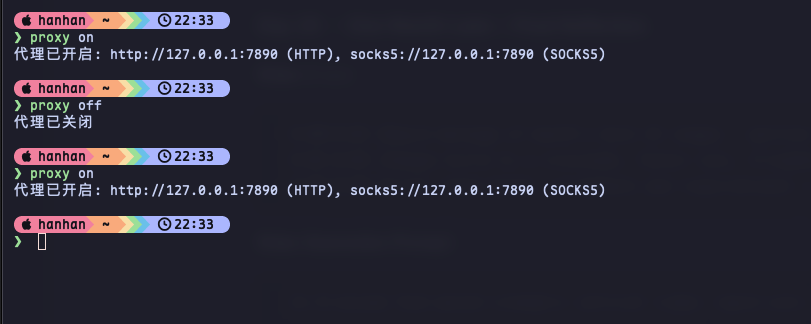

最近`utools`越来越臃肿了，还强制登录了，我一共就用几个功能，所以我就想着自己开发一个，想着使用Rust，就当练手，顺便学习一下

## 遇到下载问题

在下载Rust的时候就遇到问题了😂，官方给了一条安装命令

```bash
curl --proto '=https' --tlsv1.2 -sSf https://sh.rustup.rs | sh
```

但是，当我在终端中执行这条命令的时候，直接没反应了，我估计是下载很慢，主要是连个进度条都没有，我等了10分钟吧，连个反应都没有，我就查了一下，果然都说让替换国内源

## 从源头解决问题

我本地是有代理的，我就想着让终端使用代理吧，查了一下命令挺长，我就弄了个命令行快捷键

```bash
# ==============================================================================
# proxy | 代理开关函数
# ==============================================================================
# 使用方法:
#   proxy on      打开代理
#   proxy off     关闭代理
function proxy() {
  # 代理配置
  local PROXY_HTTP="http://127.0.0.1:7890"
  local PROXY_SOCKS="socks5://127.0.0.1:7890"

  case "$1" in
    on)
      export https_proxy=$PROXY_HTTP
      export http_proxy=$PROXY_HTTP
      export all_proxy=$PROXY_SOCKS
      echo "代理已开启: $PROXY_HTTP (HTTP), $PROXY_SOCKS (SOCKS5)"
      ;;
    off)
      unset https_proxy
      unset http_proxy
      unset all_proxy
      echo "代理已关闭"
      ;;
    *)
      echo "用法: proxy {on|off}"
      ;;
  esac
}
```

将这个 proxy 函数粘贴到你的 `~/.zshrc` 中，重新打开终端即可



加上这个之后，再下载Rust，飞快，哈哈哈哈 