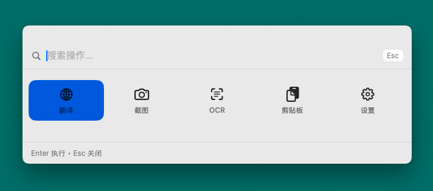

我以前一直用 `uTools`。

说实话，它在我这儿属于那种“装机必备”级别的工具：搜东西、翻译、截图、OCR、剪贴板……一堆日常零碎事，按个热键就能搞定。

但后来 uTools 越来越臃肿，也开始限制插件数量，这我还能忍，毕竟我平时用的插件也不多，最让我绷不住的是：**开始强制登录**了。

我不是说登录就一定不好，我只是很不喜欢“一个本来用来提升效率的小工具”，慢慢变成“需要账号体系才能用”的东西

于是我就去找“uTools 平替”。

我试了 `zTools`，确实和utools差不多，但用了一段时间总觉得有些地方不太对：要么是某个流程不顺手，要么是细节不符合我的习惯。也不是不能用，就是用的时候会忍不住嘀咕一句：“要是这里能这样就好了……”

结果我一想：我每天高频用的功能就那几个，**干脆我自己做一个算了**。

于是就有了 `RKit`。

---

## RKit 是个啥？一句话

`RKit` 就是一个 **macOS 上的命令面板**，有点像 Spotlight：

按热键 → 弹出一个小面板 → 执行动作。

我不想做插件市场，也不想做一堆花里胡哨的功能。  
我就想把我每天用的那几个能力做得**顺手、够快、够稳定**。

---

## 它能干啥？就我常用的这几个

我现在最常用的是这些：

- `截图`：区域截图 → 自动复制到剪贴板 → 顺手还能进内置编辑器改两笔
- `OCR`：对最近一次截图做文字识别（macOS 自带 `Vision`）
- `翻译`：默认 Google GTX（不用 key），也可以配 Deeplx（自己搭个接口那种）
- `剪贴板历史`：文本 + 图片，支持置顶/搜索，还能一键暂停采集 10 分钟
- `设置`：语言、热键录制、开机自启动、清理历史这些

你会发现，它就是“uTools 里我真正每天在用的那几个东西”。



---

## 我做它最在意的点

### 1）快：要像 Spotlight 那样“按下就出来”
默认热键是：

- `Option + Space`：呼出/关闭
- `Esc`：关闭

我希望它是那种你不需要思考的动作：  
手指一按，它就出现；你输入，回车，事情结束。

### 2）别打扰：别把我从当前桌面/当前软件拽走
有些工具的面板会乱跳桌面，或者截图完又把焦点抢回去，这种我很难忍。

RKit 的目标是：**你在哪儿用，它就在哪儿出现**，尽量别干扰你的主工作流。

### 3）本地优先：默认不联网
我个人比较敏感的一点是：  
这种工具一旦开始“强制登录”，我就会下意识担心：我输入的东西、剪贴板、截图，会不会被上传、被统计、被分析？

RKit 的原则很简单：

- 默认本地优先
- 只有“翻译”可能要联网（你选的翻译服务决定）

---

## 怎么装？（现在是未签名 ZIP）

RKit 目前走的是 **未签名 ZIP** 发布（主打一个快，先让大家用起来）。

### 安装步骤
1. 从 GitHub Releases 下载 `RKit.app.zip`
2. 解压得到 `RKit.app`
3. 把 `RKit.app` 拖到 `/Applications`
4. 打开运行

### 如果被 Gatekeeper 拦了（无法打开 / 提示“已损坏”）
先确认你已经把 `RKit.app` 拖到了 `/Applications`，再执行：

```bash
xattr -dr com.apple.quarantine /Applications/RKit.app
```

然后 Finder 里右键 `RKit.app` → `打开`。

---

## 权限这块：截图一定会要“屏幕录制”
截图功能需要 macOS 的“屏幕录制”权限：

`系统设置 → 隐私与安全性 → 屏幕录制 → 勾选 RKit`

这块没啥好绕的，系统规则就是这样。  
我能做的就是把引导写清楚、交互做顺，不搞那些“偷偷申请一堆你用不到的权限”。

---

## 后续计划

我不会把 RKit 做成“全能工具”，我更想把它做成一种**很顺手的日常习惯**：

有什么我高频使用的功能，我会添加进去

也会尽快开发 windows 版本

---

## 致谢

- Deeplx（DeepLX）：<https://github.com/OwO-Network/DLX>

感谢 DeepLX 开源项目：它使得在自建环境中通过本地 API 方式使用 DeepL 的免费网页翻译成为可能。

---
## 最后

做 RKit 的起点其实很简单：

我只是想要一个“不臃肿、不强制登录、只做我常用功能”的工具。

如果你也跟我一样日常使用这几个工具，欢迎来试试看。

如果遇到什么问题，欢迎随时指出。

如果你觉得项目对你有帮助，欢迎点个Star，感谢！！

项目地址：[https://github.com/Han-GR/rkit](https://github.com/Han-GR/rkit)

下载地址：[https://github.com/Han-GR/rkit/releases/download/v1.0.1/RKit.zip](https://github.com/Han-GR/rkit/releases/download/v1.0.1/RKit.zip)
