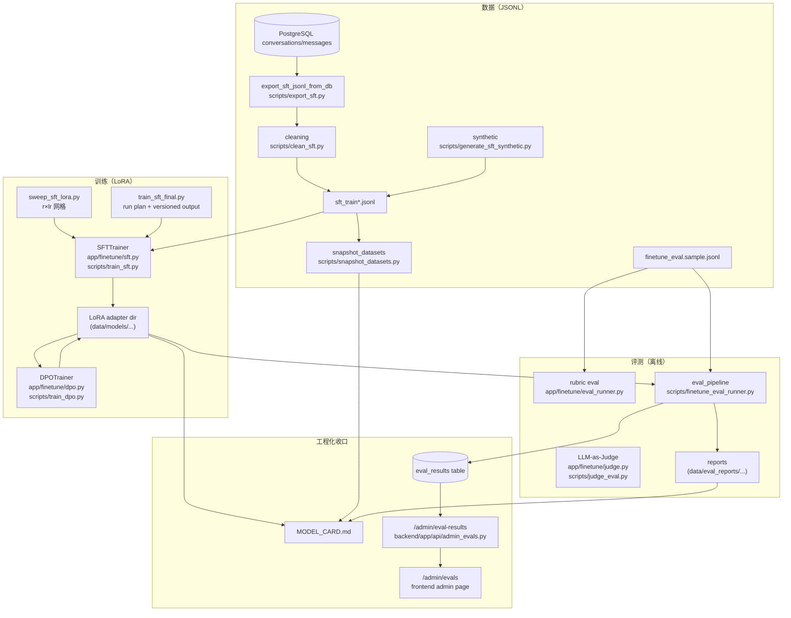

这一阶段做了5件事：

| 模块     | 目标                                     | 代码文件                                                                         |
| ------ | -------------------------------------- | ---------------------------------------------------------------------------- |
| 数据管线   | 把聊天记录/合成数据变成可训练 JSONL                  | `data_pipeline.py` / `cleaning.py` / `synthetic.py`                          |
| 训练起步   | 把 SFT 训练跑起来，并保证“没装 torch 也能 import 验证” | `requirements-finetune.txt` / `check_training_env.py` / `sft.py`             |
| 评测与对齐  | 用 rubric/judge 评测趋势，支持 DPO             | `eval_runner.py` / `judge.py` / `dpo.py`                                     |
| 复现与自动化 | 版本号、数据快照、一键跑评测                         | `versioning.py` / `data_versioning.py` / `eval_pipeline.py`                  |
| 工程化收口  | 把结果变成可展示、可复用的“工程资产”                    | `/admin/evals` / `MODEL_CARD.md` / `train_sft_final.py` / `test_finetune.py` |

## 1. 整条链路在干啥

一句话：**把“可控的数据”喂给模型 → 训练出 LoRA adapter → 用固定题库做对比评测 → 把结果沉淀成可复现资产（版本/快照/模型卡/面板）。**

这条链路里最容易踩坑的点通常不是“怎么训”，而是：

- 训练数据不干净（重复、泄漏 token、极端长文本）
- 每次训练都像一次性的（缺少版本/快照/记录）
- 指标散落在 markdown 里，没法快速对比

在 DevAssist 里，这条链路对应的“主干”就是：

1. 数据：导出 + 清洗 + 合成 + 评测集
2. 训练：SFT（可选再做 DPO）
3. 评测：rubric / judge / 汇总报告
4. 复现：snapshot + version + run plan + model card
5. 展示：管理端 /admin/evals

### 1.1 架构图

下面这张图把阶段产物和数据流串在一起，后文所有章节都可以在图上找到对应位置。



---

## 2. 一些名词定义

### 2.1 SFT 是什么？

SFT（Supervised Fine-Tuning）就是“有监督微调”：给模型喂一堆 (instruction + input) → output 的样本，让它学会在同类输入下更倾向输出你想要的答案。

在本项目中，SFT 数据是一行一个 JSON（JSONL），每行至少三件事：

- `instruction`：系统设定（希望模型的口吻/约束）
- `input`：用户问题
- `output`：理想回答

规范写在：`backend/app/finetune/README.md`

先看一个最小示例（就是一行 JSON）：

```json
{"instruction":"你是一个资深工程师，回答要简洁可复现。","input":"FastAPI 怎么写一个 POST + Pydantic 校验？","output":"下面给一个最小可运行示例..."}
```

### 2.2 LoRA 是什么？

LoRA 可以把它理解成“可插拔的小参数增量”：

- base model（大模型本体）不动
- 只训练一个 adapter（参数量小很多）
- 训练快、存储小、方便版本管理与回滚

训练出来的产物就是一个目录（adapter + tokenizer 等），比如 `data/models/...`

SFT 训练实现：`backend/app/finetune/sft.py`

### 2.3 DPO 是什么？

DPO（Direct Preference Optimization）是偏好对齐：不给“唯一标准答案”，而是给“更好/更差”两份候选，让模型学会更偏好 chosen、避开 rejected。

所以 DPO 数据格式是：

- `prompt`：问题（一般是完整 prompt）
- `chosen`：更好的回答
- `rejected`：更差的回答

生成与训练入口在：

- 生成偏好对：`backend/scripts/generate_dpo_pairs.py`
- DPO 训练：`backend/scripts/train_dpo.py`

### 2.4 rubric / judge 分别是什么？

rubric（规则评测）是“快而粗”的方式：

- 题目自带 `must_include` / `must_not_include`
- 评测就是做“大小写不敏感的子串匹配”
- 优点：快、稳定、便于对比趋势
- 缺点：不理解语义，容易误判

核心实现：`backend/app/finetune/eval_runner.py`

rubric 的“本质”就是这几行（大小写不敏感子串匹配）：

```python
text = (answer or "").strip().lower()
missing = [t for t in must_include if t.lower() not in text]
violated = [t for t in must_not_include if t.lower() in text]
passed = (not missing) and (not violated)
```

judge（LLM-as-Judge）是“慢但更像人”的方式：

- 让另一个模型扮演裁判
- 强制输出 JSON 分数 + 理由
- 优点：更接近真实质量
- 缺点：花钱、受裁判模型波动影响

核心实现：`backend/app/finetune/judge.py`

---

## 3. 仓库里的这些目录分别负责什么

这部分可以用一个“低成本的心智模型”来理解：**app 里放能力，scripts 里放入口，data 里放资产。**

- `backend/app/finetune/`：核心能力（数据解析/清洗/训练封装/评测封装）。要读“实现细节”，一般从这里开始。
- `backend/scripts/`：命令行入口（参数解析 + 组装配置 + 调用 app 里的能力）。要跑实验、改默认参数，一般从这里入手。
- `data/`：可复现资产（训练数据、评测集、模型 adapter、评测报告、快照、manifest）。要找“这次跑出来的东西在哪”，就看这里。

把它再具体一点，按“想做什么”来索引会更好用：

| 想做的事                     | 入口（先看这个）                                  | 核心逻辑（想深入再看）                             | 产物通常落在哪里                                    |
| ------------------------ | ----------------------------------------- | --------------------------------------- | ------------------------------------------- |
| 导出训练集（把对话变成 JSONL）       | `backend/scripts/export_sft.py`           | `backend/app/finetune/data_pipeline.py` | `data/datasets/*.jsonl`                     |
| 清洗训练集（去重/密钥/长度/质量）       | `backend/scripts/clean_sft.py`            | `backend/app/finetune/cleaning.py`      | `data/datasets/*.cleaned.jsonl`             |
| 跑 SFT（LoRA）训练            | `backend/scripts/train_sft.py`            | `backend/app/finetune/sft.py`           | `data/models/<adapter>/`                    |
| 快速试跑（小样本）                | `backend/scripts/run_sft_500.py`          | `backend/app/finetune/sft.py`           | `data/models/<adapter>/`                    |
| 跑离线评测（rubric/judge）      | `backend/scripts/finetune_eval_runner.py` | `backend/app/finetune/eval_pipeline.py` | `data/eval_reports/...`                     |
| 做超参搜索（r × lr）            | `backend/scripts/sweep_sft_lora.py`       | （主要是编排命令）                               | `data/datasets/sweeps/...manifest.jsonl`    |
| 固化最终产物（run plan + final） | `backend/scripts/train_sft_final.py`      | （主要是编排命令）                               | `data/models/...` + `data/eval_reports/...` |
| 把指标放进管理端面板               | `backend/app/api/admin_evals.py`          | `backend/app/db/models.py`              | DB 表 `eval_results`                         |

另外两份“发布/复现相关”的资产也放在这里，属于工程收口的一部分：

- `backend/app/finetune/MODEL_CARD.md`：模型卡模板（写清楚数据、超参、指标与限制）
- `backend/app/finetune/versioning.py`：生成版本化目录名（避免手工命名导致不可追溯）

### 3.1 只需要记住的 3 个入口

如果只是想把这套流程用起来，其实不需要“读源码路线”。记住下面三个入口就够了：

1. 数据怎么来：`backend/scripts/export_sft.py`（把对话导出成训练 JSONL）
2. 模型怎么训：`backend/scripts/train_sft.py`（LoRA SFT 训练）
3. 效果怎么看：`backend/scripts/finetune_eval_runner.py`（离线评测 + 出报告）

这三个脚本基本覆盖了“数据 → 训练 → 评测”的最小闭环。

### 3.2 两类一定会遇到的产物

跑完训练/评测后，主要会看到两类目录。看懂它们，就不会在终端输出里迷路。

1）LoRA adapter 目录：`data/models/<adapter>/`

- 里面是 LoRA 的权重与配置（不是完整大模型）
- 典型文件名包括：`adapter_config.json`、`adapter_model.safetensors` 等

2）评测报告目录：`data/eval_reports/...`

- 里面是本次评测的汇总结果（通常是 markdown + 一些中间 JSON）
- 在管理端面板看到的指标，本质上也是从这些评测结果聚合出来的

---

## 4. 数据阶段（规范 → 导出 → 清洗 → 合成 → 评测集）

这一段的目标很明确：**把数据整理成“可训练、可对比、可追溯”的形态**。后续训练能否稳定迭代，取决于这里打的地基。

### 4.1 数据规范（SFT JSONL）

训练代码最怕 schema 漂移。先把字段固定下来，后面每一步（清洗、合成、训练、评测）都能复用同一套解析与校验逻辑。

文档位置：`backend/app/finetune/README.md`

### 4.2 从数据库导出聊天记录

这里做了两件事：

1. 把 message 列表按时间排序，把 `user -> assistant` 配成一条训练样本
2. 再从 DB 拉取 conversations/messages，批量导出 JSONL

核心函数：`backend/app/finetune/data_pipeline.py::build_sft_samples_from_messages`

这个函数真正做的事非常“工程化”：按顺序扫描消息，遇到 user 就暂存，紧跟着遇到 assistant 就配成一对；如果中间插了别的角色/缺失，就跳过（保证样本干净）。

```python
def build_sft_samples_from_messages(
    *,
    messages: Sequence[Mapping[str, Any]],
    instruction: str,
    conversation_id: str | None = None,
    include_meta: bool = True,
) -> list[SFTSample]:
    """
    从一段消息序列构造 SFT 样本（user -> assistant 配对）。

    Args:
        messages: 按时间顺序排列的消息列表。每条至少包含 role/content，可选 id/created_at 等字段。
        instruction: SFT 的系统指令（建议统一且短）。
        conversation_id: 可选，会写入 meta，便于追踪来源。
        include_meta: 是否输出 meta 字段。

    Returns:
        SFTSample 列表，每个样本由一对 user/assistant 消息组成。

    Raises:
        ValueError: instruction 为空，或 messages 结构不合法。

    Notes:
        - 仅处理 role 为 user/assistant 的消息。
        - 如果 user 后面没有紧跟 assistant，会跳过该 user。
    """

    inst = (instruction or "").strip()
    if not inst:
        raise ValueError("instruction must not be empty")

    items: list[tuple[Mapping[str, Any], Mapping[str, Any]]] = []
    prev_user: Mapping[str, Any] | None = None

    for m in messages:
        role = str(m.get("role") or "").strip()
        if role == "user":
            prev_user = m
            continue
        if role == "assistant" and prev_user is not None:
            items.append((prev_user, m))
            prev_user = None

    samples: list[SFTSample] = []
    for user_msg, assistant_msg in items:
        user_text = str(user_msg.get("content") or "").strip()
        assistant_text = str(assistant_msg.get("content") or "").strip()
        if not user_text or not assistant_text:
            continue

        meta: dict[str, Any] | None = None
        if include_meta:
            meta = {
                "source": str(user_msg.get("source") or "chat_export"),
                "conversation_id": conversation_id,
                "message_ids": [
                    str(user_msg.get("id") or ""),
                    str(assistant_msg.get("id") or ""),
                ],
                "created_at": str(assistant_msg.get("created_at") or user_msg.get("created_at") or ""),
            }
            meta = {k: v for k, v in meta.items() if v not in (None, "", [])}

        samples.append(SFTSample(instruction=inst, input=user_text, output=assistant_text, meta=meta))

    return samples
```

CLI 入口：`backend/scripts/export_sft.py`

### 4.3 清洗（去重 / 长度 / 密钥 / 质量）

清洗不是“可选项”，而是训练稳定性的前置条件：脏数据会把模型带偏，甚至把敏感信息写进权重里。

这里采用的是“可解释、可复现”的策略：

- 去重：避免同一条样本反复出现（模型会背答案）
- 长度过滤：避免极端长样本拖垮训练
- 密钥检测：防止把 `sk-` 之类的东西训练进去
- 质量打分：把明显垃圾样本踢掉

核心实现：`backend/app/finetune/cleaning.py`

比较重要的是：**密钥模式**和**去重指纹**。

1）密钥检测：用一组正则去扫常见 token 形态（宁可误杀，不要泄漏）。在 `backend/app/finetune/cleaning.py` 里长这样：

```python
_SECRET_PATTERNS: list[re.Pattern[str]] = [
    re.compile(r"\bsk-[A-Za-z0-9]{16,}\b"),
    re.compile(r"\bAKIA[0-9A-Z]{16}\b"),
    re.compile(r"\bBearer\s+[A-Za-z0-9\-_\.]{10,}\b", re.IGNORECASE),
    re.compile(r"\bxox[baprs]-[A-Za-z0-9-]{10,}\b"),
]

def contains_secrets(text: str) -> bool:
    for p in _SECRET_PATTERNS:
        if p.search(text):
            return True
    return False
```

2）去重：不是 “set(input)” 这种粗暴去重，而是把 instruction/input/output 规范化后做 sha256 指纹；重复样本直接跳过：

```python
if deduplicate:
    fp = _hash_sample(
        instruction=cleaned["instruction"],
        input=cleaned["input"],
        output=cleaned["output"],
    )
    if fp in seen:
        deduped += 1
        continue
    seen.add(fp)
```

CLI：`backend/scripts/clean_sft.py`

### 4.4 合成数据

合成数据不是为了“造假”，而是为了补齐覆盖面：

- 真实日志可能偏某些领域（比如最近都在写 FastAPI）
- 合成数据可以按 topic 定向补缺（比如补一些 Docker、DB、Agent 相关题）

关键点是：**要有稳定的解析器**，因为模型经常输出“不太标准的 JSON”。

核心实现：`backend/app/finetune/synthetic.py`

### 4.5 评测集

评测集很关键：它是长期对比“变好了没”的标尺。

数据文件：`data/datasets/finetune_eval.sample.jsonl`

解析与校验：`backend/app/finetune/eval_dataset.py`

---

## 5. 训练起步（依赖隔离 → 环境检查 → baseline 推理 → SFT 训练 → 小样本试跑）

### 5.1 为什么要“训练依赖”和“运行依赖”分离？

很现实：

- 后端运行需要 FastAPI、SQLAlchemy
- 训练需要 torch、transformers、trl（又大又重，还经常和系统环境打架）

所以项目把训练依赖单独放在：

- `backend/requirements-finetune.txt`

### 5.2 环境检查：先别急着训练

脚本会检查 torch、CUDA 等：`backend/scripts/check_training_env.py`

### 5.3 baseline 推理：确认“模型能跑”

这一步是推理链路的最小验证：

- tokenizer 能不能加载
- 模型能不能生成一段文本

入口：`backend/scripts/baseline_infer.py`

### 5.4 SFT 训练：LoRA + TRL SFTTrainer

核心实现（延迟导入训练依赖，避免没装 torch 时 import 崩掉）：`backend/app/finetune/sft.py`

训练代码里最重要的两块（都在 `backend/app/finetune/sft.py`）：

1）LoRA 怎么挂上去（核心是 `LoraConfig` + `get_peft_model`）：

```python
lora = LoraConfig(
    r=int(config.lora_r),
    lora_alpha=int(config.lora_alpha),
    lora_dropout=float(config.lora_dropout),
    target_modules=list(config.target_modules),
    bias="none",
    task_type="CAUSAL_LM",
)
model = get_peft_model(model, lora)
```

2）训练参数怎么进 `TrainingArguments`（learning_rate/epochs/grad_accum 这类参数会直接影响训练成本与收敛行为）：

```python
args = TrainingArguments(
    output_dir=str(config.output_dir),
    per_device_train_batch_size=int(config.per_device_train_batch_size),
    gradient_accumulation_steps=int(config.gradient_accumulation_steps),
    num_train_epochs=float(config.num_train_epochs),
    learning_rate=float(config.learning_rate),
    warmup_ratio=float(config.warmup_ratio),
    logging_steps=int(config.logging_steps),
    save_steps=int(config.save_steps),
    eval_steps=int(config.eval_steps),
    evaluation_strategy="steps",
    save_strategy="steps",
)
```

入口脚本：`backend/scripts/train_sft.py`

### 5.5 小样本试跑（500 条）

这一步用来尽早暴露问题：避免直接上全量数据训练很久之后才发现数据格式/路径/超参配置有误。

入口脚本：`backend/scripts/run_sft_500.py`

---

## 6. 评测与对齐（rubric → DPO 数据 → DPO 训练 → 三方对比 → LLM-as-Judge）

### 6.1 rubric 评测：先把趋势跑起来

rubric 的核心逻辑非常直白：

函数 `evaluate_with_rubric` 在 `backend/app/finetune/eval_runner.py`
```python
def evaluate_with_rubric(*, case: EvalCase, answer: str) -> RubricResult:
    """
    使用 EvalCase.rubric 对生成答案做轻量规则评测。

    Args:
        case: 评测用例（包含 must_include/must_not_include）。
        answer: 模型输出文本。

    Returns:
        RubricResult：包含 include_rate、缺失项、违规项与是否通过。

    Raises:
        ValueError: answer 为空。

    Notes:
        - 这是启发式评测，目标是快速对比“是否变好”，不追求严格语义等价。
        - 匹配规则为“大小写不敏感的子串包含”。
    """

    text = (answer or "").strip()
    if not text:
        raise ValueError("answer must not be empty")

    lower = text.lower()
    must_include = case.rubric.must_include
    must_not_include = case.rubric.must_not_include

    missing: list[str] = [t for t in must_include if t.strip() and t.strip().lower() not in lower]
    violated: list[str] = [t for t in must_not_include if t.strip() and t.strip().lower() in lower]
    include_rate = 1.0 if not must_include else (len(must_include) - len(missing)) / len(must_include)
    passed = (len(missing) == 0) and (len(violated) == 0)

    return RubricResult(
        include_rate=float(include_rate),
        missing_terms=missing,
        violated_terms=violated,
        passed=bool(passed),
    )
```

对比脚本：

- base vs sft：`backend/scripts/eval_sft_vs_base.py`
- base vs sft vs dpo：`backend/scripts/eval_base_sft_dpo.py`

### 6.2 生成 DPO 偏好对

一句话解释 DPO 数据在干嘛：\*\*同一个问题，准备两份候选回答（A/B），然后明确告诉模型“更应该偏好哪一份”。\*\*训练时模型会被推向 chosen，远离 rejected。

在 DevAssist 里，这一步不是人工写 chosen/rejected，而是让 LLM 生成两条候选，再用 rubric + 安全规则自动选优，最后落成 JSONL。

#### 6.2.1 DPO 数据长什么样（要输出的就是这个）

一行一个 JSON（JSONL），字段固定：

```json
{"prompt":"system:\n... \n\nuser:\n...","chosen":"...","rejected":"...","meta":{"reason":"rubric","case_id":"...","category":"..."}}
```

真正训练时读的就是 `prompt/chosen/rejected`，`meta` 只是为了之后排查“为什么选了这条”。

#### 6.2.2 生成候选：一次 LLM 调用返回两份答案

在 `backend/app/finetune/dpo_data.py` 里，`generate_dpo_pair_from_case` 会要求模型**只返回一个 JSON object**：

```json
{"a":"...","b":"..."}
```

这样做的目的是省调用次数，也更稳定（不接受 markdown code fence，避免解析地狱）：

```python
obj = json.loads(raw)
a = obj.get("a")
b = obj.get("b")
if not isinstance(a, str) or not isinstance(b, str):
    raise ValueError("model output must contain string fields a and b")
```

#### 6.2.3 选优规则：不是“凭感觉”，是可解释的排序

选优逻辑在 `pick_preference`，顺序是：

1. 先做安全过滤：候选里如果命中密钥模式（`sk-` / `AKIA...` / `Bearer ...`），直接判为 rejected（安全优先）
2. 再做 rubric：passed 优先，其次 include\_rate 更高，其次 violated\_terms 更少
3. 如果 rubric 打平，用启发式质量分 `score_sample` 兜底

代码里就是这么写的（核心排序键）：

```python
def _key(r) -> tuple[int, float, int]:
    return (1 if r.passed else 0, float(r.include_rate), -len(r.violated_terms))
```

meta 会把这次选择的原因一起写进去，后面看一条 DPO pair 就能回答“为什么选 A 不选 B”：

```python
meta = {
    "reason": "rubric",
    "a": {"passed": ra.passed, "include_rate": ra.include_rate, "violated": ra.violated_terms},
    "b": {"passed": rb.passed, "include_rate": rb.include_rate, "violated": rb.violated_terms},
}
```

#### 6.2.4 怎么跑（命令 + 输出）

生成脚本入口：`backend/scripts/generate_dpo_pairs.py`

```bash
cd backend
python3 scripts/generate_dpo_pairs.py \
  --evalset data/datasets/finetune_eval.sample.jsonl \
  --output data/datasets/dpo_pairs.jsonl \
  --count 300 \
  --temperature 0.7
```

应该看到类似输出：

```text
written=300 output=data/datasets/dpo_pairs.jsonl
```

产物：

- `data/datasets/dpo_pairs.jsonl`：DPO 训练数据（每行一个 prompt/chosen/rejected）

### 6.3 DPO 训练

这一段解决的问题是：**给定 dpo\_pairs.jsonl，把 LoRA adapter 从 “SFT 版本”继续优化到 “更符合偏好” 的版本。**

训练实现：`backend/app/finetune/dpo.py`
入口脚本：`backend/scripts/train_dpo.py`

#### 6.3.1 最关键的一个开关：init\_adapter\_path（从 SFT 接着训）

如果传了 `--init-adapter`，训练不会从空 LoRA 开始，而是把 SFT 的 adapter 当作初始权重加载进来，然后继续 DPO：

```python
if config.init_adapter_path is not None:
    model = PeftModel.from_pretrained(model, str(config.init_adapter_path), is_trainable=True)
    peft_config = None
else:
    peft_config = LoraConfig(...)
```

这件事的直觉是：SFT 先把“答题基本功”学起来，DPO 再把“偏好与风格”往你想要的方向推。

#### 6.3.2 怎么跑（命令 + 产物）

1）从零开始跑一个 DPO（不推荐长期用，适合验证流程）：

```bash
cd backend
python3 scripts/train_dpo.py \
  --pairs data/datasets/dpo_pairs.jsonl \
  --output data/models/qwen2.5-7b-dpo-lora \
  --epochs 1 \
  --lr 1e-5 \
  --beta 0.1
```

2）从 SFT adapter 接着训（更常用）：

```bash
cd backend
python3 scripts/train_dpo.py \
  --pairs data/datasets/dpo_pairs.jsonl \
  --init-adapter data/models/<your-sft-adapter> \
  --versioned-output \
  --output-root data/models \
  --epochs 1 \
  --lr 1e-5 \
  --beta 0.1
```

应该看到类似输出：

```text
output_dir=data/models/qwen2.5-7b-dpo-lora-YYYYMMDD-<commit>
```

产物（都在 output\_dir 下）：

- LoRA adapter 文件（训练结果）
- `train_log_history.json`：训练过程日志（用于看 loss/metrics 走势）

### 6.4 LLM-as-Judge

rubric 的定位是“稳定、快速、适合做趋势对比”；LLM-as-Judge 的定位是“更像人工，但成本更高”。

这一步做的是：对同一套 evalset，先让被评模型回答，再让一个“裁判模型”给分，并输出结构化 JSON 报告。

入口脚本：`backend/scripts/judge_eval.py`

#### 6.4.1 输出长什么样（最终会拿到一份 JSON 报告）

脚本会写一个 JSON，包含总分、通过率、每题的 reasons：

```json
{
  "target": "lora",
  "count": 50,
  "avg_score": 3.8,
  "pass_rate": 0.74,
  "rows": [
    {"id":"...","category":"...","score":4,"passed":true,"reasons":["..."]}
  ]
}
```

#### 6.4.2 怎么跑（命令 + 输出）

评 base 模型：

```bash
cd backend
python3 scripts/judge_eval.py \
  --evalset data/datasets/finetune_eval.sample.jsonl \
  --base-model Qwen/Qwen2.5-7B-Instruct \
  --limit 50 \
  --judge-provider deepseek \
  --output-json data/eval_reports/judge_report.base.json
```

评 LoRA adapter：

```bash
cd backend
python3 scripts/judge_eval.py \
  --evalset data/datasets/finetune_eval.sample.jsonl \
  --base-model Qwen/Qwen2.5-7B-Instruct \
  --adapter data/models/<your-adapter> \
  --limit 50 \
  --judge-provider deepseek \
  --output-json data/eval_reports/judge_report.lora.json
```

应该看到两行关键输出：

- 一行 JSON 总结（avg\_score/pass\_rate/count）
- `output_json=...`（报告在哪）

***

## 7. 复现与自动化（实验记录 → 版本号 → 数据快照 → 一键评测流水线）

### 7.1 实验记录：finetune\_runs 表

如果只在本地跑一次训练，这张表看起来“可有可无”。但一旦开始做：

- 多次实验对比（r/lr/数据版本不同）
- 多模型对比（base vs sft vs dpo）
- 管理端展示/趋势图

就需要一个地方把“配置 + 指标 + 状态”落下来，避免散落在终端输出或手写笔记里。

表定义在 `backend/app/db/models.py` 的 `FinetuneRun`：

```python
class FinetuneRun(TimestampMixin, Base):
    __tablename__ = "finetune_runs"
    base_model: Mapped[str]
    lora_config: Mapped[dict[str, Any]]
    metrics: Mapped[dict[str, Any]]
    status: Mapped[str]
```

这张表的设计取向很简单：字段少、JSONB 多，方便先把实验记录“存起来”，后面再演进成更细的结构。

### 7.2 版本号：让训练产物可追溯

训练产物如果只用 `output/`、`output2/` 这种目录名，过几天就很难回答三个问题：

1. 这个 adapter 是基于哪个 base model？
2. 它属于哪类实验（sft-lora / dpo-lora / final）？
3. 它对应仓库哪次提交？

所以 `backend/app/finetune/versioning.py` 做了两件事：

1）把 base model 名称变成稳定的短字符串（比如 `"Qwen/Qwen2.5-7B-Instruct"` → `qwen2.5-7b`）：

```python
last = raw.split("/")[-1]
s = _slugify(last)
for suffix in ("-instruct", "-chat", "-base"):
    if s.endswith(suffix):
        s = s[: -len(suffix)]
```

2）不依赖 `git` 命令读取 commit（直接读 `.git/HEAD` / packed-refs），拼出版本字段：

```python
commit = detect_git_commit_short(repo_root=repo_root) or "unknown"
return ModelVersionSpec(base_model=..., variant=..., date=..., commit=...)
```

最后得到的目录名就是：

- `{base}-{variant}-{YYYYMMDD}-{commit}`

在 `scripts/train_dpo.py` 里看到的 `--versioned-output` 就是用这套逻辑生成 output\_dir。

### 7.3 数据快照：训练前先“拍照”

模型训练的复现，本质上依赖三件事：代码版本、超参、数据版本。前两件相对好解决，最容易失控的是“数据版本”。

所以这里提供了一个快照机制：把指定的 JSONL 文件复制一份到 snapshots 目录，并写一个 `manifest.json`，里面记录：

- 文件的相对路径（relative\_path，跨机器也能对上）
- sha256（内容指纹）
- size\_bytes / non\_empty\_lines（辅助排查）

核心实现：`backend/app/finetune/data_versioning.py`
脚本入口：`backend/scripts/snapshot_datasets.py`

manifest 的关键字段来自 `DatasetFileFingerprint`：

```python
return DatasetFileFingerprint(
    relative_path=str(rel).replace("\\", "/"),
    sha256=_sha256_file(p),
    size_bytes=int(stat.st_size),
    non_empty_lines=_count_non_empty_lines(p),
)
```

怎么跑（命令）：

```bash
cd backend
python3 scripts/snapshot_datasets.py \
  --inputs data/datasets/sft_train.jsonl,data/datasets/sft_train.cleaned.jsonl,data/datasets/dpo_pairs.jsonl,data/datasets/finetune_eval.sample.jsonl \
  --label pre-final
```

会看到（输出）：

```text
snapshot_dir=data/datasets/snapshots/YYYYMMDD-<commit>
```

然后可以打开：

- `data/datasets/snapshots/YYYYMMDD-<commit>/manifest.json`

这份 manifest 是“复现用的指纹”

### 7.4 一键评测流水线

评测脚本多了以后，最烦的不是“跑不跑得动”，而是“结果散”：跑了 base vs sft，又跑了 three-way，又跑了 judge，最后产物落在不同目录，只能靠手动整理。

`backend/app/finetune/eval_pipeline.py` 做的事就是把这些步骤**编排成一次运行**，最后输出一个统一的 markdown 报告（总表），并尽量做到 best-effort：某一步失败不影响其他步骤。

它的技术实现其实很具体：

1）把某个脚本当模块加载进来（不靠 shell 调用，避免跨平台问题）：

```python
spec = importlib.util.spec_from_file_location(module_name, str(script_path))
module = importlib.util.module_from_spec(spec)
spec.loader.exec_module(module)
```

2）临时替换 `sys.argv`，捕获 stdout（这样可以复用脚本的 argparse + main）：

```python
old_argv = sys.argv[:]
sys.argv = argv[:]
with redirect_stdout(buf):
    code = int(fn())
sys.argv = old_argv
```

3）从 stdout 里提取两类信息：

- 第一行 JSON（脚本通常会打印一个 summary JSON）
- `key=value` 行（比如 `report_md=...` / `output_json=...`）

```python
if "=" in raw:
    k, v = raw.split("=", 1)
    kv[k.strip()] = v.strip()
```

4）最后写一个总报告 `finetune_eval_pipeline_report.md`，里面有一个 steps 表：

```text
| step | status | outputs |
|---|---|---|
| rubric_sft_vs_base | ok | `report_md`=... |
| rubric_three_way | ok | `report_md`=... |
| judge_base | skipped | (none) |
```

入口脚本是 `backend/scripts/finetune_eval_runner.py`。跑完后只需要盯一个文件：

- `data/eval_reports/.../finetune_eval_pipeline_report.md`

***

## 8. 工程化收口（管理端面板 → sweep → 最终训练编排 → 模型卡 → 单测闭环）

### 8.1 管理端 Evals 面板（把指标聚合成“可对比的视图”）

后端：

- API：`backend/app/api/admin_evals.py`
- 表：`eval_results`（ORM 在 models.py 里）

前端：

- 页面：`frontend/src/app/admin/evals/page.tsx`
- 组件：`frontend/src/components/admin/EvalsPage.tsx`

后端返回的数据长这样（每条一行指标），前端会按 `eval_type + metric_name + scope` 聚合，再取每个 `model_key` 最新一条做对比图：

```json
{
  "id": "uuid",
  "eval_type": "finetune_rubric",
  "model_key": "sft_lora",
  "metric_name": "pass_rate",
  "scope": "all",
  "score": 0.72,
  "created_at": "2026-07-18T00:00:00+00:00"
}
```

这个面板的意义是：不用翻一堆 markdown，也能快速看“base / sft / dpo 谁更好”。

### 8.2 超参 sweep：系统性搜索 r / lr

脚本：`backend/scripts/sweep_sft_lora.py`

它会把每个实验的“命令与产物路径”写进 manifest（JSONL 追加写），这点很重要：跑到一半断了，也能知道跑过哪些组合。

默认 dry-run，会把训练命令和评测命令都打印出来，同时写一份 manifest，方便批量跑 / 批量对比。

### 8.3 最终训练编排：把“最佳超参”固化成正式产物

脚本：`backend/scripts/train_sft_final.py`

最终训练会额外写一个 run plan JSON（把关键字段固化下来），以后排查“这个 adapter 到底怎么训出来的”就靠它：

```json
{
  "base_model": "Qwen/Qwen2.5-7B-Instruct",
  "lora_r": 16,
  "lora_alpha": 32,
  "learning_rate": 0.0002,
  "output_dir": "data/models/...",
  "report_dir": "data/eval_reports/final/..."
}
```

特点：

- 默认 dry-run（防误触）
- 写 run plan JSON（把这次训练的关键参数和产物路径都记录下来）
- 可选 `--execute` 串联训练 + 评测

### 8.4 模型卡：发布说明与复现元数据

模板：`backend/app/finetune/MODEL_CARD.md`

这份东西的用处很现实：

过两周再回来看某个模型，模型卡能回答：

- 它用什么数据训的？
- 超参是什么？
- 指标多少？报告在哪？
- 有什么已知限制？

### 8.5 单测闭环：评测链路的回归保障

新增了一个轻量端到端单测，专门覆盖：

finetune\_eval JSONL 读取 → rubric 打分 → 汇总统计

文件：`backend/tests/test_finetune.py`

它不依赖 torch，所以 CI/本地都能跑，属于“最低成本的安全网”。

***

## 9. 跟着跑一遍：最小可复现实验（建议路线）

下面这条路线的目标是“先跑通闭环”。不追求训练效果，只验证：数据→训练→评测→报告 这一整套链路是可用的。

1）准备训练依赖（训练机器上）

```bash
cd backend
uv pip install -r requirements-finetune.txt
python3 scripts/check_training_env.py
```

应该看到：torch/CUDA/transformers 等依赖检测通过（失败就先处理环境问题，不要硬跑训练）。

2）先做 baseline 推理（确认能生成）

```bash
cd backend
python3 scripts/baseline_infer.py --model Qwen/Qwen2.5-7B-Instruct --prompt "Explain what SSE is in one paragraph."
```

应该得到：一段正常文本输出（说明模型与 tokenizer 能加载，推理链路可用）。

3）清洗训练集（如果有原始导出的 sft\_train.jsonl）

```bash
cd backend
python3 scripts/clean_sft.py --input data/datasets/sft_train.jsonl --output data/datasets/sft_train.cleaned.jsonl
```

产物：`data/datasets/sft_train.cleaned.jsonl`

4）先跑 500 条试验（尽早暴露问题）

```bash
cd backend
python3 scripts/run_sft_500.py --epochs 1 --output data/models/qwen2.5-7b-lora-500
```

产物：`data/models/qwen2.5-7b-lora-500/`（LoRA adapter 目录）

5）跑 rubric 评测（确认评测链路）

```bash
cd backend
python3 scripts/finetune_eval_runner.py --sft-adapter data/models/qwen2.5-7b-lora-500 --enable-rubric --limit 50
```

产物：`data/eval_reports/.../finetune_eval_pipeline_report.md`（路径以脚本输出为准）

6）想开始认真调参：先 dry-run 看命令对不对

```bash
cd backend
python3 scripts/sweep_sft_lora.py
```

产物：manifest JSONL（记录每个组合的命令与输出目录），便于断点续跑与对比。

7）选定最佳配置后，跑 final（依然建议先 dry-run）

```bash
cd backend
python3 scripts/train_sft_final.py --tag final --lora-r 16 --lr 2e-4
```

产物：run plan JSON + versioned adapter 目录 + 对应的评测报告目录。

***

## 10. 常见问题（FAQ）与排查思路

### 10.1 `python` / `pytest` / `ruff` 找不到

有些环境没有 `python` 这个 alias；同理 `pytest`、`ruff` 也可能不在 PATH。

经验做法：

- 永远用 `python3 ...`
- pytest 用 `python3 -m pytest ...`

### 10.2 本地 macOS 跑训练很慢

是正常的：

- CPU 跑 7B 训练基本属于“等到天荒地老”
- macOS 主要用于：数据处理、脚本 dry-run、解析逻辑、单测

真正训练建议 Linux + NVIDIA GPU。

### 10.3 `torch` / `CUDA` 不匹配或直接报错

优先思路是“先让环境可控”：

- 用 `python3 scripts/check_training_env.py` 定位问题点（是 torch 没装、CUDA 不可用、还是版本冲突）
- 训练依赖只装在训练机环境（Linux + GPU），macOS 本地主要用于写脚本、处理数据、dry-run

### 10.3 rubric 指标看起来“很奇怪”

rubric 是子串匹配，它不会理解语义。

排查建议：

- 看 `violated_terms` 是否误触发（比如回答里提到了 “AKIA” 作为反例，也会被判违规）
- 手动抽查几条样本，别只信平均数
