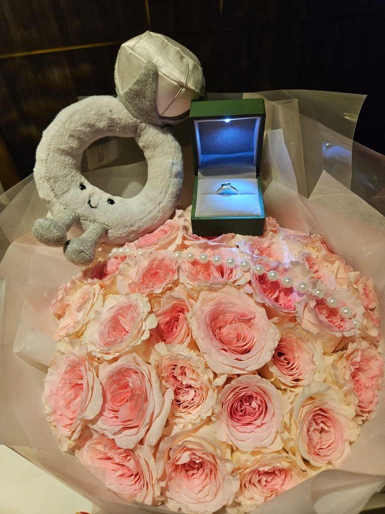
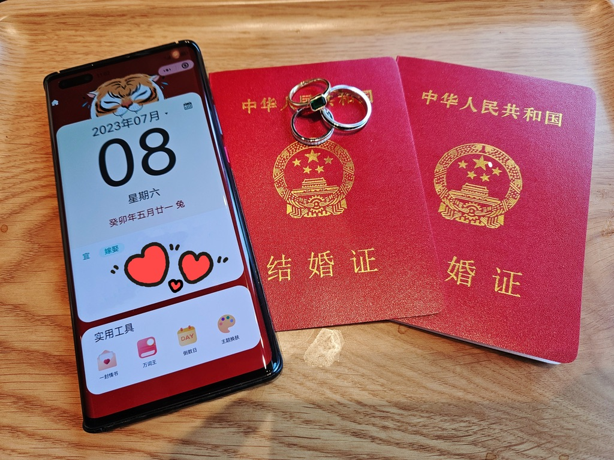
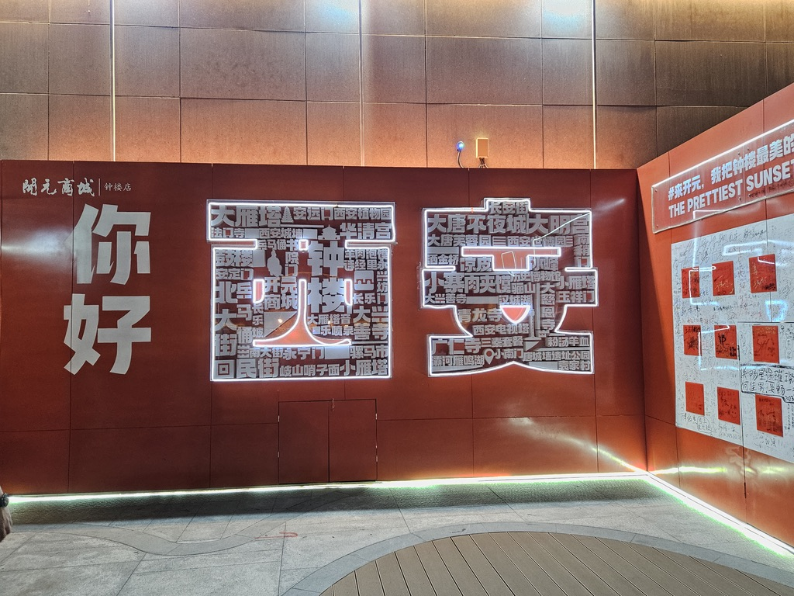
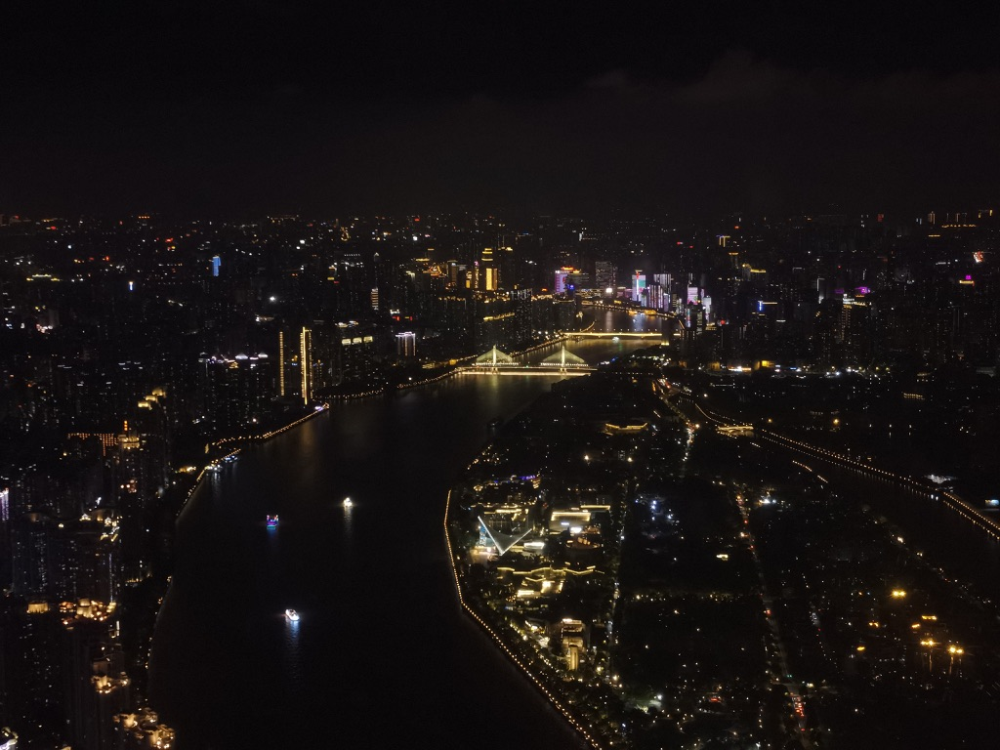
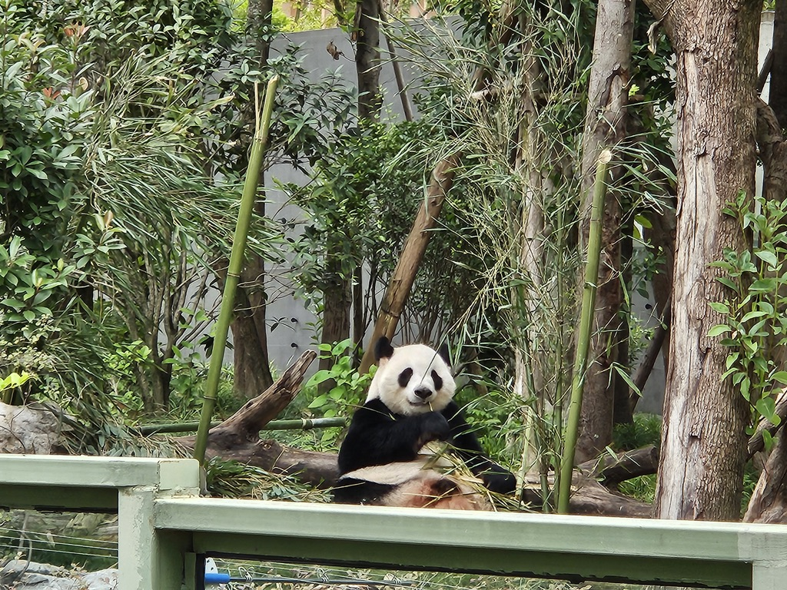

2023 年，是人生密度最大的一年。

## 春节：带她回家

年初，久违地回了趟家。疫情这几年都没回家，这次回去，不只是我一个人——带着女朋友。

见家长的时候，真的紧张的要死，手都不知道往哪放。她爸坐在沙发上看着我，我坐得笔直，说话都不敢大声。好在后来慢慢放松了，聊了聊工作、聊了聊以后，气氛就缓和了。出门的时候手心全是汗，晚上还见到了她的其他长辈，也都聊的很好。

我们是一个地方的，这是件很幸运的事。

## 4 月到 7 月：结婚了

4 月开始准备结婚，领证的日子都是我们自己定的。没办婚礼，这是我们商量好的。仪式感不等于形式感，与其请一堆人吃饭、走流程，不如把钱花在更值得的地方。

7 月，正式领证。从民政局出来的时候，手里拿着两个红本本，阳光很好，我们站在路边互相看了一眼，笑了。

那一刻，她是我的妻子了。

## 工作：越来越好，然后戛然而止

上半年工作一直很顺利。好几个新项目都是我负责的，又涨了一次工资。从 2021 年那个还在自学的小白，到 2023 年能独立带项目的开发，这条路走了两年，我觉得自己在往上走。

但 9 月份，一切都变了。

父亲病重。我接到电话的时候正在上班，挂了电话就去找组长请假。情况不确定，不知道要多久，我只能做出最坏的决定——离职。临走前我和组长说，希望等事情处理完再回来。组长说好，都等你回来。

那时候我真的以为还会回去。桌上东西都没收拾完，心想反正很快就回来了。

但生活就是这样，有些事情不是你计划的。虽然后来没有再回去，但我一直记得组长那句话。有句话叫"后会无期"，但有些告别本身就是带着期待的，只是后来各自的轨迹不同了而已。

## 旅行：答应你的，都做到

结婚旅行还是如期出发了。

去了好几个城市，每到一个地方就慢悠悠地逛，不赶景点，不赶时间。在陌生的城市牵着手走路，吃路边摊，拍游客照，累了就找家咖啡馆坐一下午。那段时间真的很开心，是那种什么都不用想、只需要享受当下的开心。

答应她 30 岁之前带她去迪士尼，也做到了。那天她戴着米妮发箍，在城堡前面拍照，笑得像个小孩。我站在旁边看着她，心想，这可能就是结婚的意义吧——你答应过的事情，一件一件去兑现。

## 年末：痛风，和没看成的打铁花

年末本来答应她去看打铁花的。冬天的晚上，铁水洒向天空，像烟花一样四散，想想就很浪漫。

但痛风突然来了。

那半个月真的很煎熬，脚肿得走不了路，疼得晚上睡不着。她就坐在床边给我敷毛巾，一边敷一边说"让你平时减减肥，太胖了吧"。

打铁花没看成，但我答应她，明年一定补上。

## 写在最后

2023 年，有好有坏。

好的地方是——结婚了，旅行了，兑现了迪士尼的承诺，工作也一度很顺利。

坏的地方是——父亲病重，被迫离职，告别了那些以为还会再见的人和事，年末还被痛风折磨了半个月。

但回过头看，这一年有一个最大的收获：无论发生什么，身边都有一个人陪着。开心的时候一起笑，难过的时候一起扛，疼的时候有人给你敷毛巾。

2023，谢谢你让我拥有了一个家，也让我学会了面对失去。
