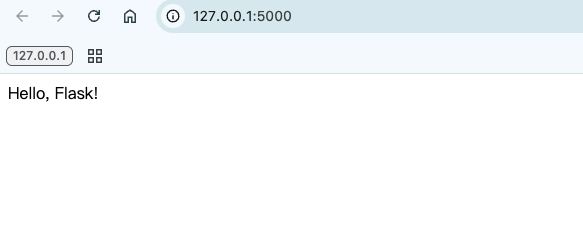
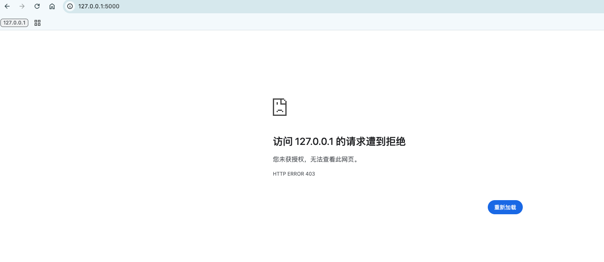
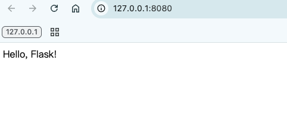
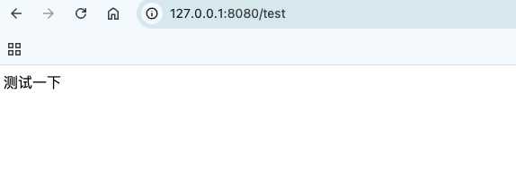
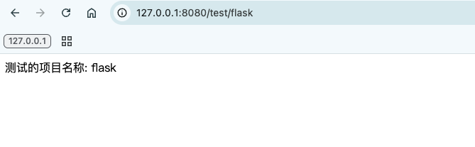
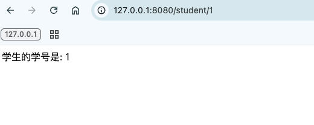
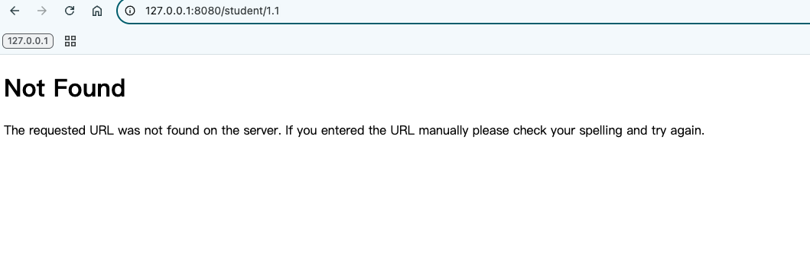
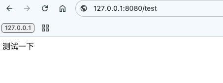
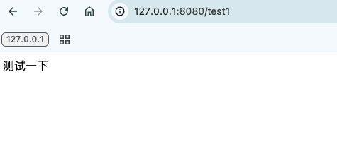

### Flask基本信息

Flask 是一个轻量级 WSGI 网络应用框架，旨在让用户 快速、轻松上手，并能扩展到复杂的应用程序。

##### 安装Flask

首先，通过pip3安装Flask：

```python
pip3 install flask
```

##### 最小应用示例

创建一个名为`app.py`的文件，写入以下代码：

```python
from flask import Flask  
  
# 创建Flask应用实例  
app = Flask(__name__)  
  
# 定义路由和视图函数  
@app.route('/')  
def hello_flask():  
    return 'Hello, Flask!'  
  
# 启动应用  
if __name__ == '__main__':  
    app.run()
```

运行这个应用并打开浏览器访问`http://127.0.0.1:5000/`，你将看到"Hello, Flask!"的欢迎信息。



#### debug、host和port的配置

Flask提供了一些方便的配置选项来调整开发服务器的行为。

##### 调试模式(debug)

调试模式非常有用，它提供：

-   自动重载代码更改
-   详细的错误页面
-   调试控制台

启用方式：

```python
if __name__ == '__main__':
    app.run(debug=True)
```

##### 修改主机和端口

默认情况下，Flask运行在`127.0.0.1:5000`。你可以这样修改：

```python
if __name__ == '__main__':
    app.run(host='0.0.0.0', port=8080, debug=True)
```

这样配置后：

-   服务器将监听所有公共IP(`0.0.0.0`)
-   端口改为8080
-   同时开启调试模式

此时再访问 `http://127.0.0.1:5000/` ，将被拒绝



将访问端口改为8080，就可以访问成功了



#### URL与视图的映射

Flask使用路由装饰器`@app.route()`将URL与视图函数关联起来。

##### 基本路由

```python
@app.route('/test')  
def test():  
    return '测试一下'
```

访问`http://127.0.0.1:8080/test`将显示"测试一下"。


##### 带变量的路由

```python
@app.route('/test/<project_name>')
def test_project(project_name):
    return f'测试的项目名称: {project_name}'
```

访问`http://127.0.0.1:8080/test/flask`将显示"测试的项目名称: flask"。



##### 指定变量类型

```python
@app.route('/student/<int:student_id>')
def student_info(student_id):
    return f'学生的学号是: {student_id}'
```

	这里`<int:student_id>`指定student_id必须是整数。

访问 `http://127.0.0.1:8080/student/1`，会成功返回结果



访问 `http://127.0.0.1:8080/student/1.1`，由于1.1不是整数，所以会报错


##### 多个路由指向同一视图

```python
@app.route('/test')  
@app.route('/test1')  
def test():  
    return '测试一下'
```

这样`http://127.0.0.1:8080/test`和`http://127.0.0.1:8080/test1`都会调用同一个视图函数，返回相同的结果




##### HTTP方法

默认只响应GET请求，可以指定其他方法：

```python
@app.route('/login', methods=['GET', 'POST'])
def login():
    if request.method == 'POST':
        return '请求登录'
    else:
        return '登录表单'
```

