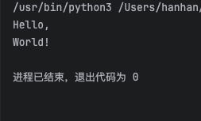
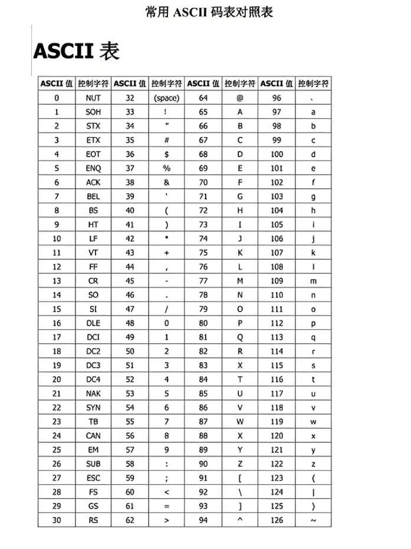
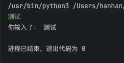
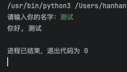
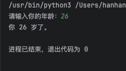
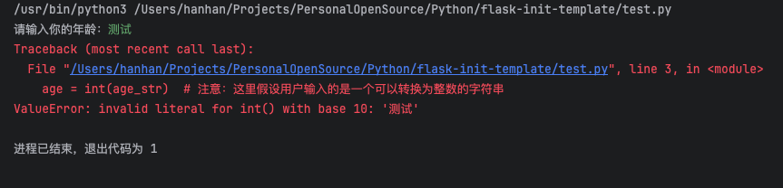
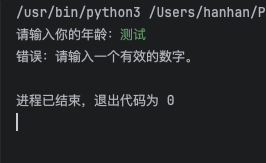

### 一、Python基本概念

Python是一种高级的、解释型、动态类型的编程语言，由Guido van Rossum（吉多·范罗苏姆）于1989年首次发布。Python以其简洁性、易读性和可扩展性而广受欢迎，被广泛应用于各个领域。

1.  **变量与数据类型**
    *   Python是动态类型的语言，变量无需声明即可直接赋值，其类型由赋值时的表达式确定。
    *   常见的数据类型包括整型（int）、浮点型（float）、复数型（complex）、布尔型（bool）、字符串（str）等，以及复合数据类型如列表（list）、元组（tuple）、字典（dict）、集合（set）等。
2.  **控制结构**
    *   Python支持条件语句（如if-else）、循环语句（如for和while）等控制结构，用于实现程序的逻辑判断和循环执行。
3.  **函数**
    *   函数是执行特定任务的独立代码块，可以接受输入参数并返回结果。Python中的函数定义以`def`关键字开始。
4.  **模块与包**
    *   模块是包含Python代码的文件，可以被其他文件导入并使用其中的函数和变量。
    *   包是一组模块的集合，用于组织和管理模块。
5.  **异常处理**
    *   Python提供了异常处理机制，允许程序在遇到错误时执行特定的代码块，而不是直接崩溃。`try-except`语句用于捕获和处理异常。
6.  **动态类型与解释型语言**
    *   Python是动态类型的语言，变量的类型可以在运行时改变。
    *   Python是解释型语言，源代码可以直接由Python解释器执行，无需编译成机器码。

#### 1、重点部分

1.  **列表（List）**
    *   列表是Python中最常用的复合数据类型之一，可以包含任意类型的数据。
    *   支持使用下标和切片访问元素，常用方法包括`append`、`insert`、`remove`、`pop`等。
2.  **字典（Dict）**
    *   字典用于存储键值对，其中键必须是可哈希的（如字符串、数字、元组等），且每个键在字典中是唯一的。
    *   支持通过键快速访问值，常用于实现映射关系或对应关系。
3.  **函数与模块**
    *   函数是Python编程中的基础构建块，用于封装重复的代码逻辑。
    *   模块和包用于组织和管理Python代码，提高代码的可重用性和可维护性。
4.  **异常处理**
    *   异常处理是Python编程中的重要部分，用于处理程序运行时可能出现的错误情况。
    *   通过`try-except`语句捕获和处理异常，可以使程序更加健壮和可靠。

#### 2、常用领域

1.  **Web应用开发**
    *   Python拥有多个优秀的Web开发框架，如Django、Flask等，可以快速实现Web应用的开发和部署。
2.  **数据分析**与**科学计算**
    *   Python在科学计算和数据分析领域具有广泛应用，拥有NumPy、SciPy、Pandas等强大的科学计算库和Pandas等数据处理库。
3.  **人工智能**与**机器学习**
    *   Python是人工智能和机器学习领域的首选编程语言之一，拥有TensorFlow、PyTorch等流行的深度学习框架。
4.  **自动化运维**与**云计算**
    *   Python在自动化运维和云计算领域也具有重要地位，可以编写自动化脚本管理服务器和云资源。
5.  **图形界面开发**
    *   Python支持使用Tkinter、wxPython、PyQt等GUI工具集开发跨平台的桌面应用程序。

#### 3、新手学习建议

1.  **掌握基础语法**
    *   从Python的变量、数据类型、控制结构、函数等基本概念入手，逐步掌握Python的基础语法。
2.  **实践编程**
    *   通过编写简单的程序来巩固所学知识，如实现简单的计算器、文本处理等。
3.  **学习标准库与第三方库**
    *   Python的标准库提供了丰富的模块和函数，可以帮助解决各种问题。同时，也要学习一些常用的第三方库，如NumPy、Pandas等。
4.  **阅读官方文档与教程**
    *   Python的官方文档是学习Python的重要资源之一，提供了详细的语法说明和示例代码。此外，还可以阅读一些优质的在线教程和书籍来加深对Python的理解。
5.  **参与社区与项目**
    *   加入Python社区可以与其他开发者交流学习心得和经验。同时，参与一些开源项目或自己动手编写一些小项目也是提升编程能力的好方法。

### 二、print输出

Python中的`print()`函数是一个非常基础且强大的工具，用于在屏幕上显示信息。它不仅可以输出文本字符串，还可以输出其他数据类型（如数字、列表、元组、字典等），并且支持格式化输出，使得输出的信息更加清晰、易读。

#### 1、基本语法

##### 语法参数：

```python
print(*objects, sep=' ', end='\n', file=sys.stdout, flush=False)
```

##### 参数详解

1.  **`*objects`**（可变参数）:
    *   这是一个可变参数列表，表示要打印的所有对象。`print()`会将这些对象转换为字符串（通过调用它们的`__str__()`方法），然后输出。如果`objects`为空，则输出一个空行。
2.  **`sep`**（可选）:
    *   用于指定多个对象之间的分隔符。默认值是空格`' '`。如果你希望在对象之间使用不同的分隔符，可以通过此参数指定。
3.  **`end`**（可选）:
    *   用于指定输出的末尾应添加什么字符串。默认值是换行符`'\n'`，意味着`print()`调用后会换到下一行。如果你不想在输出后换行，可以将此参数设置为空字符串`''`。
4.  **`file`**（可选）:
    *   用于指定一个文件对象，输出将被发送到该文件。如果未指定，则默认发送到`sys.stdout`（标准输出，通常是屏幕）。这允许你将输出重定向到文件或其他类似文件的对象。
5.  **`flush`**（可选）:
    *   一个布尔值，用于指定是否强制立即将输出写入文件或`sys.stdout`。默认情况下，`flush`是`False`，意味着输出可能会被缓冲在内存中，直到缓冲区满或遇到换行符时才实际写入。将`flush`设置为`True`可以确保输出立即被写出，这在需要即时反馈的场景中很有用。

#### 2、案例

##### 输出文本

这是`print()`函数最基本的用法，它会在屏幕上输出`Hello, World!`。

```python
print("Hello, World!")
```

##### 输出多个值(不设置sep参数)

`print()`函数可以一次性输出多个值，这些值之间默认用空格分隔。

```python
print("Hello", "World", "!")  
# 输出: Hello World !
```

##### 输出多个值(设置sep参数为逗号)

```python
#打印多个对象，设置sep参数为逗号分隔
print("Hello", "World", "!",sep=',')
# 输出: Hello,World,!
```

##### 输出变量和值

```python
#定义变量
name = "张三"
#输出字符串加变量，将变量跟字符串合并输出，两者使用逗号分隔连接
print('我的名字叫做：',name)
#输出结果：我的名字叫做： 张三
```

##### 换行输出

默认情况下，`print()`函数在输出完内容后会换行。

```python
# 使用默认end参数就是换行
print("Hello, ")
print("World!")  
```


##### 不换行输出

如果你希望在同一行输出多个`print()`的结果，可以使用`end`参数来指定结束符，比如使用空字符串`""`来避免换行。

```python
# 设置end参数为换行，当第一个print执行后，就会以空格进行结尾，下一个print继续输出
print("Hello, ",end=" ")
print("World!")  
#输出： Hello,  World!


print('北京',end='--->')
print('欢迎你')
#输出：北京--->欢迎你
```

##### 输出内容到指定的文件

这是将输出结果写入到文件中，写入到当前.py文件所在的目录下，一个名叫output.txt的文件，如果该文件不存在则会自动创建

```python
# 将输出重定向到文件，open是打开文件，但是这里使用了with上下文管理器，不需要关闭文件，会自动关闭
with open('output.txt', 'w') as f:  
    print("这是一个测试，我正在将输出结果写入到文件", file=f) 
```

使用print进行数学运算

```python
#使用print输出进行数学运算
print(1+2) # 3
print(10*10) # 100
print((4+1)*5) # 25
print(10/5*2) # 4.0
```

##### 使用 + 连接多个字符

```python
print('张三'+'李四') # 输出：张三李四

#如果是多个数字连接起来的话 会默认为加法运算，所以需要把数字变成字符串
print(1+2) # 输出：3 变成了加法运算了

#需要把数字变成字符串输出
print('1'+'2') # 12

#如果让字符和数据使用+连接会报错，无法识别类型
print('北京'+2022) 
# 报错：TypeError: can only concatenate str (not "int") to str 
# 正确应该是print('北京'+'2022')
```

#### 3、chr和ord字符和ASCII的相互转换

**ASCII表**


```python
#使用chr 输出转换ASCII码

#输出字符串b
print('b')
#数字98在ASCII码表中对应的就是b，使用chr将98转换成ASCII中对应的结果
print(chr(98)) # b

#使用ord将字符转换成ASCII码 跟chr是相反的
#注意ord中只能放一个字符
print(ord('b')) # 98
```

#### 4、格式化输出

下面这个案例的意思就是通过使用{0}{1}在字符串中占住一个位置，后面使用.format进行补充，将变量根据占位符的顺序进行填充

```python
#设置变量name
name = "张三"
#设置变量age
age = 19
print('我的名字叫做{0},我今年{1}岁了'.format(name,age)) # 我的名字叫做张三,我今年19岁了
```

#### 注意事项

*   `print()`函数虽然功能强大且灵活，但在编写面向生产环境的代码时，应当谨慎使用，尤其是在涉及大量输出或需要高性能的情况下。过多的打印调用可能会影响程序的性能，并且可能导致难以处理的日志文件。
*   对于更复杂的输出格式化需求，可能需要考虑使用Python的字符串格式化功能（如`str.format()`或f-strings）或专门的日志记录库（如`logging`）。

### 三、输入input

在Python中，`input()` 函数是一个非常基础且常用的内置函数，它允许程序暂停执行并等待用户从标准输入（通常是键盘）输入一些文本。然而，需要注意的是，Python的`input()`函数在其标准形式下并不接受任何参数（除了可选的提示字符串），并且它总是将输入作为字符串返回，无论用户输入的是什么。

#### 1、基本语法：

```python
input([prompt])
```

*   `prompt`（可选）：一个字符串，用作向用户显示的提示信息。如果提供了这个参数，那么它会在等待用户输入之前显示在控制台上。如果省略了这个参数，`input()`函数将不会显示任何提示信息。

##### 返回值

`input()`函数返回用户输入的字符串。这意味着，如果用户输入了一个数字并按下了回车键，`input()`函数仍然会将这个输入作为字符串返回。如果你需要将这个字符串转换为其他类型（如整数或浮点数），你需要使用适当的类型转换函数（如`int()`或`float()`）。

#### 2、案例

##### 基本的`input()`使用

```python
# 简单的input函数使用，没有提示信息  
user_input = input()  
print("你输入了：", user_input)  
  
# 运行这段代码后，程序将等待用户输入一些文本，然后按回车键。输入的内容将被打印出来。
```

运行结果：



##### 带有提示信息的`input()`

```python
# 使用提示信息的input函数  
name = input("请输入你的名字：")  
print("你好,", name)  
  
# 运行这段代码后，程序将显示“请输入你的名字：”作为提示，等待用户输入名字，然后打印出问候语。
```



##### 将输入转换为整数

```python
# 将输入转换为整数  
age_str = input("请输入你的年龄：")  
age = int(age_str)  # 注意：这里假设用户输入的是一个可以转换为整数的字符串  
print("你", age, "岁了。")  
  
# 注意：如果用户输入的不是一个可以转换为整数的字符串（比如字母或特殊字符），这段代码将抛出一个ValueError异常。  
# 在实际应用中，你可能需要添加异常处理来捕获这种情况。
```

输入整数：



输入字符串：



##### 异常处理

```python
try:
    age_str = input("请输入你的年龄：")
    age = int(age_str)
    print("你", age, "岁了。")
except ValueError:
    print("错误：请输入一个有效的数字。")

    # 这个例子展示了如何使用try-except语句来捕获并处理用户输入非数字时可能发生的ValueError异常。
```



#### 总结

Python的`input()`函数是一个简单但强大的工具，用于从用户那里获取文本输入。虽然它本身不接受除提示字符串以外的任何参数，但你可以通过类型转换和异常处理来扩展其功能，以处理各种类型的输入并优雅地处理错误情况。

### 四、注释

Python中的注释是编写代码时添加的文本，这些文本会被Python解释器忽略，不会执行任何操作。注释的主要目的是为了提高代码的可读性，帮助开发者或其他阅读代码的人理解代码的意图和功能。Python支持两种主要类型的注释：单行注释和多行注释（也被称为块注释）。

#### 1、单行注释

单行注释以井号（`#`）开头，井号后面的所有内容都被视为注释，直到该行的末尾。Python解释器会忽略这些内容。

**语法示例**：

```python
# 这是一个单行注释  
print("Hello, World!")  # 这行代码后面的也是注释
```

在上面的例子中，第一行完全是一个注释，它不会影响程序的执行。第二行包含了一个Python语句（打印`Hello, World!`）和一个位于语句末尾的注释，用于解释该语句的意图或提供额外的信息。

#### 2、多行注释

Python官方并没有直接提供多行注释的语法（如其他某些编程语言中的`/* ... */`）。但是，你可以通过几种方式来实现多行注释的效果。

##### 使用多个单行注释

这是最直接的方法，通过在每行的开始都添加`#`来创建多行注释。

```python
# 这是一个多行注释的示例  
# 使用多个单行注释来实现  
# 每行都以 # 开头
```

##### 使用三引号字符串

另一种常见的方法是使用三引号（`'''` 或 `"""`）来定义多行字符串，但由于我们实际上并不打算使用这个字符串，所以它起到了类似多行注释的效果。需要注意的是，这种方法在技术上不是注释，因为Python确实会处理这个字符串（尽管在很多情况下，这种处理对程序没有影响）。但是，如果你不小心在字符串中引用了变量或调用了函数，它们将被求值，这可能会导致意外的结果。

```python
'''  
这是一个多行字符串，但它经常被用作多行注释  
因为它在代码执行时不会做任何事情  
但请注意，如果你在字符串中引用了变量或调用了函数，它们将被执行  
'''  
  
"""  
另一种使用三引号的多行字符串（或注释）  
这种方式与上面的相同  
"""
```

##### 注释的最佳实践

*   **保持简洁**：注释应该简短而清晰，直接指出代码段的目的或工作方式。
*   **不要注释代码如何工作**：好的代码应该自我解释。如果代码难以理解，可能需要重构而不是添加注释。
*   **注释复杂的逻辑**：对于复杂的算法或逻辑，注释可以帮助理解其工作原理。
*   **注释公共****API**：如果你正在编写一个库或模块，并且希望其他人使用它，那么对你的公共API进行良好的注释是非常重要的。
*   **避免自解释的代码**：如果代码本身已经足够清晰，那么就不需要注释。

总之，注释是Python（和任何编程语言）中非常重要的部分，它们有助于提高代码的可读性和可维护性。但是，过多的或不必要的注释也可能使代码变得难以阅读和维护。因此，应该谨慎使用注释，并确保它们提供了有用的信息。

#### 3、中文声明注释

在Python中，`# coding:utf-8`、`#coding=utf-8`和`-*- coding:utf-8 -*-`这几种形式都是用来指定文件编码的，但它们的使用场景和含义略有不同。不过，首先需要明确的是，从Python 3.0开始，源文件的默认编码已经是UTF-8，因此在大多数情况下，你不需要显式地指定编码（除非你的文件实际上使用了不同的编码，或者你想要确保与Python 2.x版本的兼容性）。

##### `# coding:utf-8`

这是最常见的一种形式，用于指定文件的编码为UTF-8。它通常放在Python文件的第一行或第二行（如果第一行是`#!`开头的shebang行）。Python解释器会读取这个声明，并使用指定的编码来解析源文件中的字符。然而，需要注意的是，这个声明并不是Python语法的一部分，而是一个被广泛接受的约定。因此，即使没有这个声明，如果你的文件是用UTF-8编码的，并且没有包含非ASCII字符（或者在Python 3中），那么它仍然可以正常工作。

##### `#coding=utf-8`

这种形式是`# coding:utf-8`的一个变体，主要区别在于等号（`=`）的使用。虽然大多数Python解释器和编辑器都能识别这种变体，但根据PEP 263（定义Python源文件编码的规范），推荐使用冒号（`:`）而不是等号（`=`）来分隔“coding”和编码名称。因此，虽然`#coding=utf-8`在技术上可能有效，但`# coding:utf-8`是更推荐的做法。

##### `#-*- coding:utf-8 -*-`

这种形式是Emacs特有的，用于在Emacs文本编辑器中指定文件的编码。Emacs会在文件的开头和结尾查找这种特定的注释行，以确定文件的编码。然而，这并不是Python官方推荐的做法，也不是Python语法的一部分。如果你的代码只会在Python解释器中运行，并且不使用Emacs作为编辑器，那么你没有必要使用这种形式的编码声明。

##### 总结

*   对于大多数现代Python项目（特别是Python 3项目），你不需要显式地在文件中指定编码，因为UTF-8是默认编码。
*   如果你确实需要指定编码（例如，为了与Python 2.x兼容或处理非UTF-8编码的文件），请使用`# coding:utf-8`（或其他适当的编码名称）作为推荐的做法。
*   `#coding=utf-8`是`# coding:utf-8`的一个变体，虽然可能有效，但不建议使用。
*   `#-*- coding:utf-8 -*-`是Emacs特有的，不是Python官方推荐的编码声明方式。

### 五、代码缩进

Python中的代码缩进是Python语法的一个重要组成部分，它用于区分代码块。在Python中，代码块是通过缩进来定义的，而不是像其他许多编程语言那样使用大括号`{}`。这意味着Python对缩进的敏感度非常高，错误的缩进会导致语法错误（IndentationError）。

#### 为什么需要缩进？

Python使用缩进来组织代码块，这种方式有几个好处：

1.  **提高代码可读性**：通过缩进来区分代码块，使得代码的结构更加清晰，易于阅读和理解。
2.  **减少语法符号**：不需要额外的符号（如大括号）来定义代码块，使得代码更加简洁。
3.  **强制一致性**：由于Python解释器强制要求正确的缩进，这有助于保持代码风格的一致性。

#### 缩进规则

1.  **使用空格或制表符**：Python官方推荐使用空格进行缩进，通常是4个空格（尽管这不是强制的，但保持一致很重要）。尽管Python解释器允许使用制表符（Tab）进行缩进，但混合使用空格和制表符可能会导致难以发现的错误。
2.  **一致性**：在同一个代码块中，必须使用相同数量的空格或制表符来进行缩进。这意味着你不能在一个代码块中使用4个空格进行缩进，而在另一个代码块中使用2个空格。
3.  **逻辑层次**：缩进级别表示了代码的逻辑层次。每增加一层缩进，就表示进入了一个新的代码块。减少缩进则表示退出了当前的代码块。

#### 正确的缩进示例

if判断中一定要有内容,if这一行换行之后让print使用tab进行缩进，就表示print实在if语句中

```python
# 正确的缩进示例
if 10 > 3:
    print('正确')
```

#### 错误的缩进示例

if判断中一定要有内容,由于print没有进行缩进而是跟if语句平行，那么就表示不在if语句中，if语句中没有代码就会报错

```python
# 错误的缩进示例
if 10 > 3:
print('错误')

#报错信息：IndentationError: expected an indented block
```

### 六、标识符

在Python中，标识符是用来给变量、函数、类、模块等命名的。标识符的命名需要遵循一定的规则，以确保它们既有效又易于理解。下面详细解释Python中标识符的命名规则以及列举一些常用的命名规范。

#### 标识符的命名规则

1.  **字母、数字和下划线**：标识符可以由字母（A-Z, a-z）、数字（0-9）以及下划线（\_）组成。但是，标识符不能以数字开头。
2.  **区分大小写**：Python是大小写敏感的，因此`myVar`和`myvar`会被视为两个不同的标识符。
3.  **避免保留字**：不能使用Python的保留字（关键字）作为标识符。例如，`if`、`else`、`for`、`while`等都是保留字，不能用作变量名、函数名等。
4.  **Unicode字符**：从Python 3开始，标识符中还可以使用Unicode字符（包括中文等非ASCII字符），但这通常不推荐，因为这样做可能会降低代码的可读性和可移植性。

#### 常用的命名规范

Python社区形成了一套广泛接受的命名规范，称为PEP 8。PEP 8是关于Python代码风格的官方指南，其中包含了关于标识符命名的详细建议。以下是一些常用的命名规范：

1.  **变量命名**：
    *   使用小写字母和下划线（snake\_case）的方式命名变量。
    *   例如：`my_variable`、`number_of_users`。
2.  **函数命名**：
    *   同样使用小写字母和下划线的方式命名函数。
    *   如果函数名较长或需要表明其用途，可以使用动词或动词短语。
    *   例如：`calculate_sum()`、`is_valid_input()`。
3.  **类命名**：
    *   使用驼峰式命名法（CamelCase），但首字母大写（PascalCase）。
    *   例如：`MyClass`、`DatabaseConnection`。
4.  **模块命名**：
    *   模块名通常是小写字母，并且尽量简短，以便易于记忆和输入。
    *   如果模块名由多个单词组成，可以使用下划线分隔。
    *   例如：`mymodule`、`my_custom_module`。
5.  **常量命名**：
    *   如果需要定义常量（虽然Python本身没有常量的概念，但可以通过命名约定来模拟），通常使用全部大写字母和下划线的方式。
    *   例如：`MAX_USERS`、`PI`。
6.  **布尔值命名**：
    *   对于布尔值变量，通常使用`is_`或`has_`等前缀，后面跟上描述性的名称。
    *   例如：`is_valid`、`has_permission`。
7.  **避免使用单字符命名**：
    *   除非在循环或函数参数中用作临时变量（如`i`、`j`用于循环索引），否则避免使用单字符命名。
8.  **保持命名的一致性**：
    *   在整个项目中保持命名风格的一致性，以提高代码的可读性和可维护性。

遵循这些命名规范可以帮助你编写出更加清晰、易于理解和维护的Python代码。不过，需要注意的是，这些规范并不是强制性的，你可以根据自己的喜好和项目的实际情况进行适当调整。但是，在团队项目中，遵循统一的命名规范是非常重要的。

### 七、保留字

Python中的保留字（也称为关键字）是Python语言中具有特殊意义的标识符，它们被Python语言本身用作语法的一部分，因此不能用作变量名、函数名、类名或其他任何标识符的名称。Python的保留字在编写代码时具有固定的含义，它们定义了程序的结构和控制流。

#### 列出所有保留字：

```python
#输出保留字列表
import keyword #import是导入包的意思，

print(keyword.kwlist) # 输出保留字列表
```

所有保留字：

```python
False       class       finally     is            return  
None        continue    for         lambda        try  
True        def         from        nonlocal      while  
and         del         global      not           with  
as          elif        if          or            yield  
assert      else        import      pass  
break       except      in          raise
```

这些保留字各自具有特定的用途，例如：

*   `def` 用于定义函数。
*   `class` 用于定义类。
*   `if`, `elif`, `else` 用于条件语句。
*   `for`, `while` 用于循环语句。
*   `try`, `except`, `finally` 用于异常处理。
*   `import` 用于导入模块或包。
*   `True`, `False` 表示布尔值真和假。
*   `None` 表示空值或无值。
*   `and`, `or`, `not` 是逻辑运算符。
*   `is`, `in`, `not in` 是比较运算符或成员测试运算符。
*   `pass` 是一个空操作语句，用作占位符。
*   `lambda` 用于定义匿名函数（即没有名称的函数）。
*   `assert` 用于断言，用于调试目的。
*   `yield` 用于在函数内部生成值（在生成器函数中）。
*   `global` 和 `nonlocal` 用于声明变量是在全局作用域或嵌套作用域中定义的。

由于这些保留字具有特殊的语法意义，因此不能将它们用作变量名、函数名、类名等标识符。如果你尝试这样做，Python解释器会抛出一个`SyntaxError`异常，指出该标识符是保留字。

随着Python版本的更新，可能会有新的保留字被添加到语言中，或者现有的保留字可能会失去其特殊意义，建议查阅使用的Python版本的官方文档，以获取最新的保留字列表。
