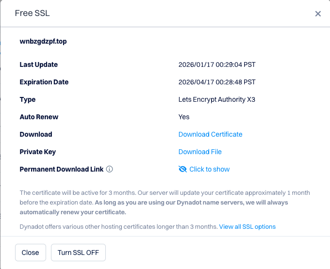

## 介绍

> [!abstract]
> - 新的海外IP部署v2ray,达到访问外网的目的

## 方法

### 资源准备  

#### 1. 一个海外服务器
- 推荐网站: [SSD VPS Servers, Cloud Servers and Cloud Hosting - Vultr.com](https://www.vultr.com/)
- 购买一个目标地域的服务器,便宜的就可以(1C0.5G),大概$3每月
- 新建安全组,放行需要的TCP端口

#### 2. 一个域名
- 推荐网站: [购买域名 - 注册、管理并节省更多 \| Dynadot](https://www.dynadot.com/)
- 随便购买一个域名就可,大概30一年

#### 3. 获取域名的ssl证书
- 管理域名->购买的域名->设置->免费ssl
- 下载 Private Key, 并保存到服务器上或者oss上(我是放在oss上，方便脚本中直接下载)
- 保存永久下载链接(可在脚本中使用,自动申请最新的证书)
- 

#### 4.将购买的服务器IP解析到域名
- 在购买域名的网站操作,管理域名->购买的域名->设置->DNS设置->子域名记录
- 子域名: 随便输
- 记录类型: A
- IP地址: 服务器IP地址

### 部署流程

#### 1. 使用ssh连接海外服务器

#### 2. 新建脚本 build_v2ray_v2.sh
```bash
#!/bin/bash

# 安装和更新v2ray
bash <(curl -L https://raw.githubusercontent.com/v2fly/fhs-install-v2ray/master/install-release.sh)


# 安裝最新发行的 geoip.dat 和 geosite.dat
bash <(curl -L https://raw.githubusercontent.com/v2fly/fhs-install-v2ray/master/install-dat-release.sh)


# 开机启动v2ray
systemctl enable v2ray

# 启动v2ray
systemctl start v2ray

# 查看v2ray状态
systemctl status v2ray


# 下载证书

mkdir /etc/v2ray

# dynadot提供的永久链接
wget "https://www.dynadot.com/letsencrypt/download_cert?key=<LETSENCRYPT_DOWNLOAD_KEY>&domain=example.com" -O /etc/v2ray/v2ray.cert

# 自己存放私钥的地址
wget "https://example.com/ssl/example.com.key" -O /etc/v2ray/v2ray.key


cat > /usr/local/etc/v2ray/config.json <<EOF
{
    "log": {
        "loglevel": "warning",
        "access": "/var/log/v2ray/access.log",
        "error": "/var/log/v2ray/error.log"
    },
    "inbounds": [
        {
            "tag": "trojan-in",
            "port": 1996,
            "protocol": "trojan",
            "listen": "0.0.0.0",
            "settings": {
                "clients": [
                    {
                        "password": "<YOUR_UUID>",
                        "flow": "xtls-rprx-vision",
                        "email": "trojan-user@example.com"
                    }
                ],
                "fallbacks": []
            },
            "streamSettings": {
                "network": "tcp",
                "security": "tls",
                "tlsSettings": {
                    "serverName": "node1.example.com",
                    "alpn": [
                        "http/1.1"
                    ],
                    "certificates": [
                        {
                            "certificateFile": "/etc/v2ray/v2ray.cert",
                            "keyFile": "/etc/v2ray/v2ray.key"
                        }
                    ]
                }
            }
        },
        {
            "tag": "vless-in",
            "port": 1998,
            "protocol": "vless",
            "listen": "0.0.0.0",
            "settings": {
                "clients": [
                    {
                        "id": "<YOUR_UUID>",
                        "flow": "xtls-rprx-vision",
                        "email": "vless-user@example.com",
                        "level": 0
                    }
                ],
                "decryption": "none"
            },
            "streamSettings": {
                "network": "tcp",
                "security": "tls",
                "tlsSettings": {
                    "serverName": "node1.example.com",
                    "alpn": [
                        "http/1.1"
                    ],
                    "certificates": [
                        {
                            "certificateFile": "/etc/v2ray/v2ray.cert",
                            "keyFile": "/etc/v2ray/v2ray.key"
                        }
                    ]
                }
            }
        }
    ],
    "outbounds": [
        {
            "protocol": "freedom",
            "settings": {}
        },
        {
            "protocol": "blackhole",
            "settings": {},
            "tag": "blocked"
        }
    ],
    "routing": {
        "domainStrategy": "IPIfNonMatch",
        "rules": [
            {
                "type": "field",
                "ip": [
                    "geoip:private"
                ],
                "outboundTag": "freedom"
            }
        ]
    }
}
EOF


# 防火墙放行端口
sudo ufw allow 1996/tcp
sudo ufw allow 1998/tcp


# 重启服务
sudo systemctl daemon-reload
sudo systemctl restart v2ray
sudo systemctl status v2ray
```
#### 3. 运行脚本
```bash
bash build_v2ray_v2.sh
```
#### 4. 新建清理日志脚本 clean_log.sh
- 因为服务器配置较低,不及时清理日志就会卡
```bash
# 清理超过指定时间的日志（保留最近7天）
sudo journalctl --vacuum-time=7d

# 清空日志文件而非删除（避免服务崩溃）
sudo find /var/log -type f -name "*.log" -exec truncate -s 0 {} \;
```
#### 5. 设置定时任务
 - 域名的免费证书每隔3个月就会失效,需要重新部署
 - 日志也需要定时清理
 ```bash
 # 每月2号0点执行v2ray部署脚本
0 16 1 * * /root/build_v2ray_v2.sh >> /var/log/v2ray/script.log 2>&1

# 每天1点执行清理日志脚本
0 17 * * * /root/clean_log.sh
 ```

### 使用

#### clash verge (macOS和Windows)
 - Github: [GitHub - clash-verge-rev/clash-verge-rev: A modern GUI client based on Tauri, designed to run in Windows, macOS and Linux for tailored proxy experience](https://github.com/clash-verge-rev/clash-verge-rev)

#### 新建配置文件
```yaml
# HTTP 端口

port: 7890

  

# SOCKS5 端口

socks-port: 7891

  

# Linux 及 macOS 的 redir 端口

redir-port: 7892

  

allow-lan: false

  

# Rule / Global / Direct (默认为 Rule 模式)

mode: Rule

  

# 设置输出日志的等级 (默认为 info)

# info / warning / error / debug / silent

log-level: info

  
  

# 实验性功能

experimental:

ignore-resolve-fail: true # 忽略 DNS 解析失败，默认值为true

  
  

proxies:

# 支持的协议及加密算法示例请查阅 Clash 项目 README 以使用最新格式：https://github.com/Dreamacro/clash/blob/master/README.md

  

# Vless

- name: "vless" # 节点名称

type: vless

server: node1.example.com # 域名

port: 1998 # VLESS端口

uuid: <YOUR_UUID> # 与服务端VLESS的id一致

servername: example.com # 证书域名（同sni）

flow: "xtls-rprx-vision" # 与服务端flow一致（增强模式）

tls: true # 启用TLS加密

skip-cert-verify: false

  
  

# Trojan

- name: "trojan" # 代理名称（自定义）

type: trojan # 协议类型：trojan（必须与服务端一致）

server: node1.example.com # 服务器域名（已解析到您的Vultr IP）

port: 1996 # 服务器端口（与服务端port一致）

password: <YOUR_UUID> # 与服务端password一致

sni: example.com # 与服务端serverName一致（证书域名）

skip-cert-verify: false # 关闭证书跳过（必须验证证书）

# udp: true # 可选：启用UDP转发（如游戏、直播）

  

# 代理组策略

# 策略组示例请查阅 Clash 项目 README 以使用最新格式：https://github.com/Dreamacro/clash/blob/master/README.md

proxy-groups:

  

# url-test 通过指定的 URL 测试并选择延迟最低的节点

- name: "自动选择快速节点"

type: url-test

proxies:

- "vless"

- "trojan"

url: 'http://www.gstatic.com/generate_204'

interval: 300

  
  

# 代理节点选择

- name: "PROXY"

type: select

proxies:

- "自动选择快速节点"

- "vless"

- "trojan"

  
  

# 规则

rules:

- DOMAIN-SUFFIX,google.com,PROXY

- GEOIP,CN,DIRECT

- MATCH,PROXY
```

#### 将 yaml 文件放到 clash verge 的订阅中
- 直接拖拽到订阅中就行

#### 更改 clash verge 默认端口为 7890

#### 启动系统代理、并开机启动
