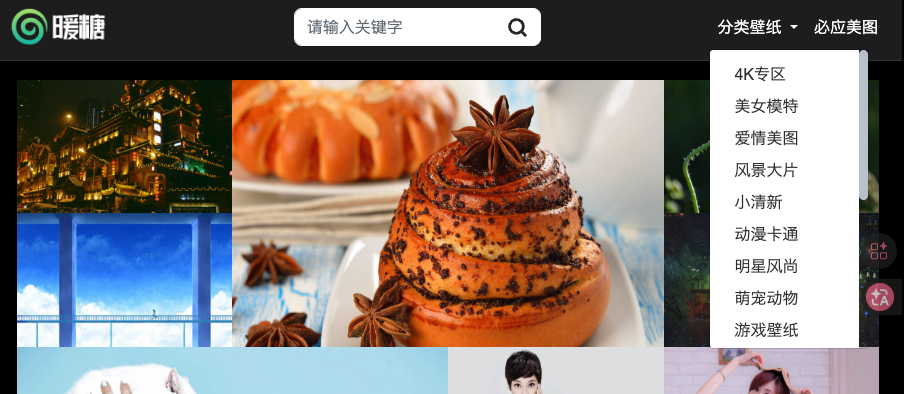
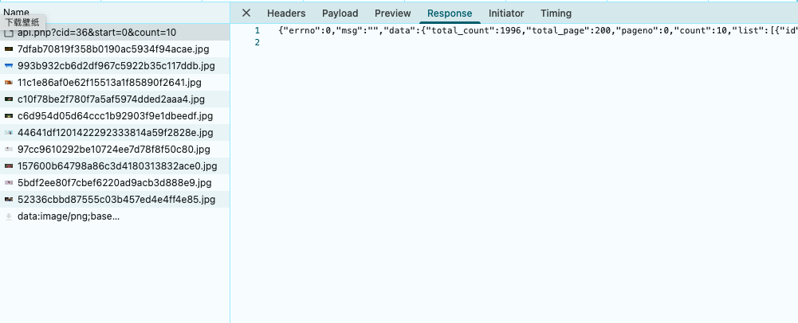
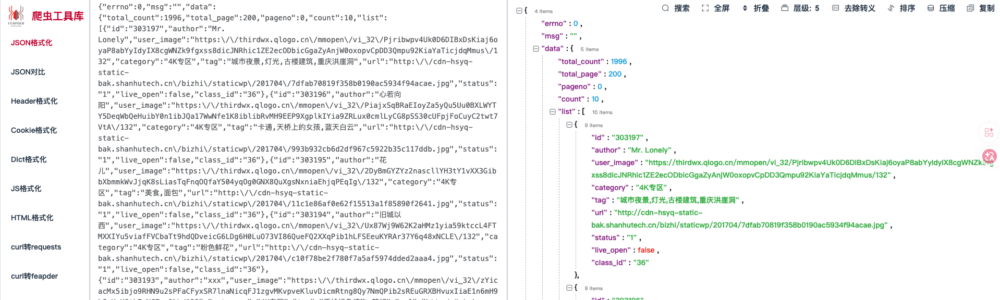
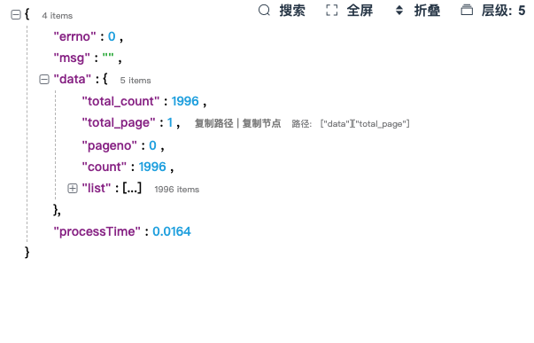
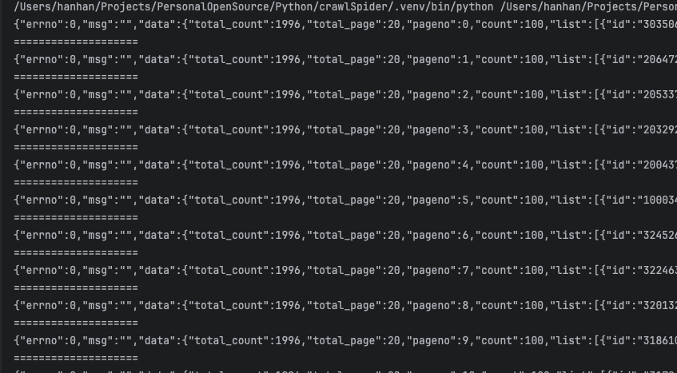
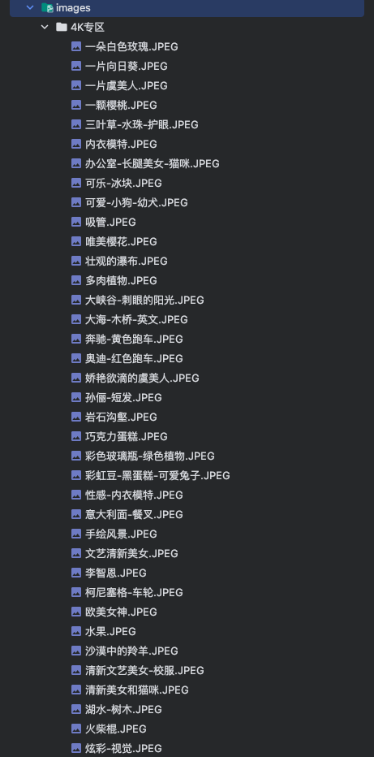

## API

API（Application Programming Interface，应用程序编程接口）是一组规定和协议，它定义了不同软件应用或组件之间如何相互沟通和交互的方法。API可以视为一个中间件，它允许开发者访问和使用某些功能或数据，而无需了解背后的详细实现。

## 怎样使用

有些网站的会有对外的api接口供开发者调用，还有一些需要自己寻找

## 实操

以 [图片网站](https://www.nuantang.net/) 为例

### 获取请求地址

打开网站，可以看到有很多分类



选择一个分类，F12 打开控制台(开发者调用工具)，点进Network，点击清空，点击刷新，查看请求的Url信息


### 获取返回数据

在请求的同时，会返回数据，也就是Response，点击Response，可以看到返回了一个Json



这个Json不太好看，需要使用Json格式化工具，我这里使用的是[爬虫工具库](https://spidertools.cn)，把Json粘贴进去，可以看到已经格式化了



```json
	{
    "errno": 0,
    "msg": "",
    "data": {
        "total_count": 1996,
        "total_page": 200,
        "pageno": 0,
        "count": 10,
        "list": [
            {
                "id": "303197",
                "author": "Mr. Lonely",
                "user_image": "https://thirdwx.qlogo.cn/mmopen/vi_32/Pjribwpv4Uk0D6DIBxDsKiaj6oyaP8abYyIdyIX8cgWNZk9fgxss8dicJNRhic1ZE2ecODbicGgaZyAnjW0oxopvCpDD3Qmpu92KiaYaTicjdqMmus/132",
                "category": "4K专区",
                "tag": "城市夜景,灯光,古楼建筑,重庆洪崖洞",
                "url": "http://cdn-hsyq-static-bak.shanhutech.cn/bizhi/staticwp/201704/7dfab70819f358b0190ac5934f94acae.jpg",
                "status": "1",
                "live_open": false,
                "class_id": "36"
            },
            {
                "id": "303196",
                "author": "心若向阳",
                "user_image": "https://thirdwx.qlogo.cn/mmopen/vi_32/PiajxSqBRaEIoyZa5yQu5Uu0BXLWYTY5DeqWbQeHuibY0n1ibJQa17WwNfe1K8iblibRvMH9EEP9XgplkIYia9ZRLux0cmlLyCG8pSS30cUFpjFoCuyC2twt7VtA/132",
                "category": "4K专区",
                "tag": "卡通,天桥上的女孩,蓝天白云",
                "url": "http://cdn-hsyq-static-bak.shanhutech.cn/bizhi/staticwp/201704/993b932cb6d2df967c5922b35c117ddb.jpg",
                "status": "1",
                "live_open": false,
                "class_id": "36"
            },
            {
                "id": "303195",
                "author": "花儿",
                "user_image": "https://thirdwx.qlogo.cn/mmopen/vi_32/2DyBmGYZYz2nascllYH3tY1vXX3GibbXbmmkWvJjqK8sLiasTqFnqOQfaY504yqOg0GNX8QuXgsNxniaEhjqPEqIg/132",
                "category": "4K专区",
                "tag": "美食,面包",
                "url": "http://cdn-hsyq-static-bak.shanhutech.cn/bizhi/staticwp/201704/11c1e86af0e62f15513a1f85890f2641.jpg",
                "status": "1",
                "live_open": false,
                "class_id": "36"
            },
            {
                "id": "303194",
                "author": "旧城以西",
                "user_image": "https://thirdwx.qlogo.cn/mmopen/vi_32/Ux87Wj9W62K2aHMz1yia59ktccL4FTMXXIYu5viafFVCbaTt9hdQDveicG6LDg6H0LuO73VI86QueFQ2XXqPib1hLFSEeuKYRAr37Y6q48xNCLE/132",
                "category": "4K专区",
                "tag": "粉色鲜花",
                "url": "http://cdn-hsyq-static-bak.shanhutech.cn/bizhi/staticwp/201704/c10f78be2f780f7a5af5974dded2aaa4.jpg",
                "status": "1",
                "live_open": false,
                "class_id": "36"
            },
            {
                "id": "303193",
                "author": "xxx",
                "user_image": "https://thirdwx.qlogo.cn/mmopen/vi_32/zYicacMx5ibjo9RHN9u2sPFaCFyxSR7lnaNicqFJ1zgvMKvpveKluvDicmRtng8Qy7NmQPib2sREuGRXBHvuxIiaE1n6mH9hSxKuXGth7gNCZepOk/132",
                "category": "4K专区",
                "tag": "手绘绿色植物,梦幻",
                "url": "http://cdn-hsyq-static-bak.shanhutech.cn/bizhi/staticwp/201704/c6d954d05d64ccc1b92903f9e1dbeedf.jpg",
                "status": "1",
                "live_open": false,
                "class_id": "36"
            },
            {
                "id": "303192",
                "author": "绝版自我",
                "user_image": "https://thirdwx.qlogo.cn/mmopen/vi_32/V6RyaF0FIPmrBFZCLoGq7pkIZnSqJUr1YGC6aEjstLPMf87bhQ93do4Ba8fWE5aZYJXRfa4wPVZyz7sibiaYxlpMzEdt58sWticDsD2Q6MZs9s/132",
                "category": "4K专区",
                "tag": "美女和白猫",
                "url": "http://cdn-hsyq-static-bak.shanhutech.cn/bizhi/staticwp/201704/44641df1201422292333814a59f2828e.jpg",
                "status": "1",
                "live_open": false,
                "class_id": "36"
            },
            {
                "id": "303191",
                "author": "不发脾气",
                "user_image": "https://thirdwx.qlogo.cn/mmopen/vi_32/lLjNEmtiacOgicrFeJATGgAjL50EpBYV4hE8BbQUq4qlicERibkSPicPYSaOK44r1Pvgwz0icaW2xGg37wPfDabBwiaicicqXPhOPgc73gQpYTXCdkWs/132",
                "category": "4K专区",
                "tag": "短发美女",
                "url": "http://cdn-hsyq-static-bak.shanhutech.cn/bizhi/staticwp/201704/97cc9610292be10724ee7d78f8f50c80.jpg",
                "status": "1",
                "live_open": false,
                "class_id": "36"
            },
            {
                "id": "303190",
                "author": "ono",
                "user_image": "https://thirdwx.qlogo.cn/mmopen/vi_32/EKagrrV6YQV5MOfGKAeTM9piaKicvrFu6MbmoB1rS3mwIFjcQ6zaQtzVVBj3aynQoDtDU7ZQHWGogg6PRtdicFdWiaYSIvEnO5b7I5A2UN3etYE/132",
                "category": "4K专区",
                "tag": "时尚美女,写真",
                "url": "http://cdn-hsyq-static-bak.shanhutech.cn/bizhi/staticwp/201704/157600b64798a86c3d4180313832ace0.jpg",
                "status": "1",
                "live_open": false,
                "class_id": "36"
            },
            {
                "id": "303189",
                "author": "张一一",
                "user_image": "https://thirdwx.qlogo.cn/mmopen/vi_32/PiajxSqBRaEIiaarFR3aPOSj1d65tcQqlHCzJMdPIreZeRXkNnoGianicPDXRRuQSjFUwmv4V7TVMl4YyJBUYUiapvgk85IgwaibcjF5rGcyYqXrTVtUhmnZF35A/132",
                "category": "4K专区",
                "tag": "清纯女孩",
                "url": "http://cdn-hsyq-static-bak.shanhutech.cn/bizhi/staticwp/201704/5bdf2ee80f7cbef6220ad9acb3d888e9.jpg",
                "status": "1",
                "live_open": false,
                "class_id": "36"
            },
            {
                "id": "303188",
                "author": "晓燕",
                "user_image": "https://thirdwx.qlogo.cn/mmopen/vi_32/PiajxSqBRaELicjIBesHecRucVeNmDZMFOgcbdFpFn6YBsak7jV7cOhBDbpvibKsFhKxJ6iaqYdSAVmqtG3HeaZBadHQs8TeC0I9BMj8agffoPHTZEcVys2mHQ/132",
                "category": "4K专区",
                "tag": "孙俪,街拍",
                "url": "http://cdn-hsyq-static-bak.shanhutech.cn/bizhi/staticwp/201704/52336cbbd87555c03b457ed4e4ff4e85.jpg",
                "status": "1",
                "live_open": false,
                "class_id": "36"
            }
        ]
    },
    "processTime": 0.012
	}
	```


### 分析请求地址

可以看到，我选择4K专区，请求的地址是：https://www.nuantang.net/api.php?cid=36&start=0&count=10

根据参数猜测

```text
cid=36.   可能是4K专区的分类id
start=0.   从第一页开始获取
count=10.   每次请求数量是10个
```

### 分析返回数据

因为返回的数据是10组，所以只分析一组即可

```json
{
"errno": 0,
"msg": "",
"data": {
	"total_count": 1996,
	"total_page": 200,
	"pageno": 0,
	"count": 10,
	"list": [
		{
			"id": "303197",
			"author": "Mr. Lonely",
			"user_image": "https://thirdwx.qlogo.cn/mmopen/vi_32/Pjribwpv4Uk0D6DIBxDsKiaj6oyaP8abYyIdyIX8cgWNZk9fgxss8dicJNRhic1ZE2ecODbicGgaZyAnjW0oxopvCpDD3Qmpu92KiaYaTicjdqMmus/132",
			"category": "4K专区",
			"tag": "城市夜景,灯光,古楼建筑,重庆洪崖洞",
			"url": "http://cdn-hsyq-static-bak.shanhutech.cn/bizhi/staticwp/201704/7dfab70819f358b0190ac5934f94acae.jpg",
			"status": "1",
			"live_open": false,
			"class_id": "36"
		}
	]
},
"processTime": 0.012
}
	```

根据返回参数猜测

```text
公共数据：
"total_count": 1996    可能是4K专区的总数有1996张图片
"total_page": 200      总页数有200页
"pageno": 0            当前页数
"count": 10            当前页图片数量


图片数据：
"id": ""                   图片id
"author": ""               图片作者或者上传者
"user_image": ""           可能是作者头像
"category": ""             图片分类
"tag": ""                  图片标签
"url": ""                  图片链接
"status": ""               图片状态，目前不知什么用
"live_open":               不知道什么意思
"class_id": ""             应该是4K专区的分类id，和上面猜测的一致
```

### 代码测试

#### 一次获取所有数据（不推荐）

```python
import requests  
  
  
url = "https://www.nuantang.net/api.php?cid=36&start=0&count=2000"  
  
resp = requests.get(url)  
  
print(resp.text)
```



根据测试，只要改变参数 count 的值，就可以直接把该分类下的所有图片获取到，但是一次获取大量数据，可能会被禁止访问，所以不推荐

#### 分多次获取数据（推荐）

```python
from time import sleep  
  
import requests  

pages = 20  # 分20页  
count = 100  # 每次请求100个  
  
for i in range(pages + 1):  
    url = f"https://www.nuantang.net/api.php?cid=36&start={i}&count={count}"  
  
    resp = requests.get(url)  
  
    print(resp.text)  
  
    print("=" * 20)  
  
    sleep(1)  # 暂停1秒
```



根据测试，每页请求100张图片，可以分20次返回，数据也很全面，并且每次暂停一秒，也不会因为过快请求被禁止访问

#### 完整版代码

```python
import os  
from time import sleep  
from PIL import Image  
from io import BytesIO  
  
import requests  
  
  
def get_images():  
      
    pages = 20  # 分20页  
    count = 100  # 每次请求100个  
  
    for i in range(pages + 1):  
        url = f"https://www.nuantang.net/api.php?cid=36&start={i}&count={count}"  
        resp = requests.get(url)  
  
        img_datas = resp.json()  
  
        for img_data in img_datas["data"]["list"]:  
  
            img_url, save_path = get_img_info(img_data)  
  
            download_image(img_url, save_path)  
  
            sleep(1)  
  
        sleep(1)  # 暂停1秒  
  
  
def get_img_info(img_data):  
    img_url = img_data["url"]  
  
    category = img_data["category"]  
  
    tag = img_data["tag"]  
  
    img_name = tag.replace(",", "-")  
  
    # 判断目录是否存在  
    save_dir = f"./images/{category}"  
    if not os.path.exists(save_dir):  
        os.makedirs(save_dir)  
  
    save_path = f"./images/{category}/{img_name}"  
  
    return img_url, save_path  
  
  
def download_image(img_url, save_path):  
    try:  
  
        img_resp = requests.get(img_url)  
        # 获取图片文件格式  
        image = Image.open(BytesIO(img_resp.content))  
  
        img_save_path= f"{save_path}.{image.format}"  
  
        with open(img_save_path, 'wb') as f:  
            f.write(img_resp.content)  
  
    except Exception as e:  
        print(f"下载失败: {e}")  
  
  
if __name__ == '__main__':  
    get_images()

```

