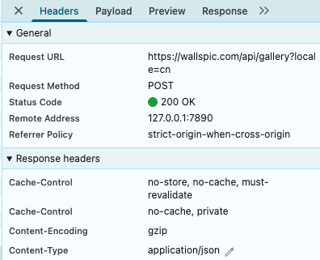
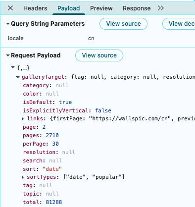
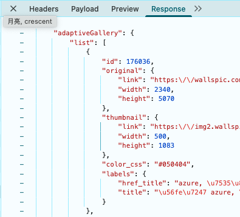
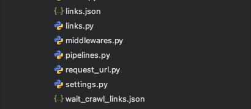
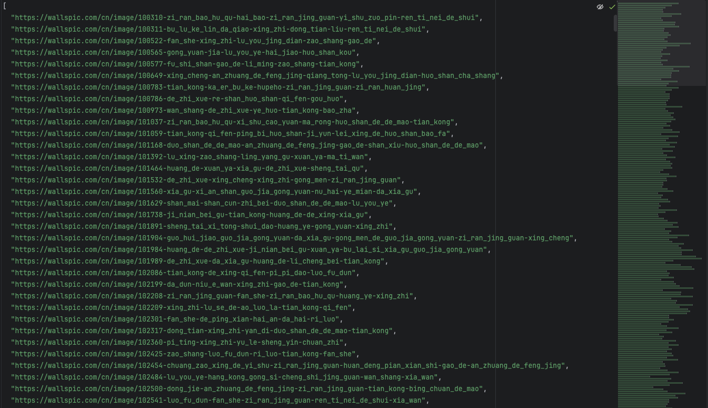
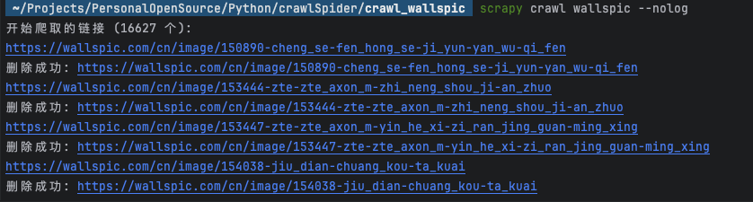
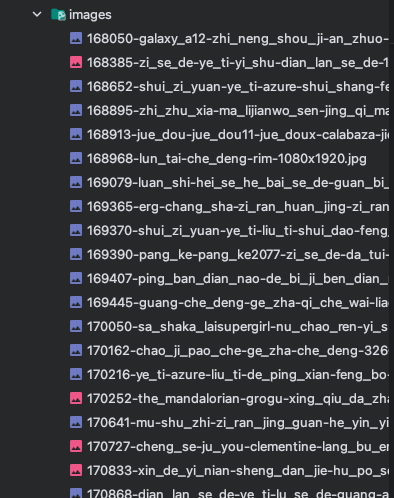

### 意外发现

在 [上一篇笔记](https://han-gr.github.io/p/2022-07-11-%E7%88%AC%E8%99%AB%E5%AD%A6%E4%B9%A0%E7%AC%94%E8%AE%B05-selenium/) 中，我抓取了一个  [图片网站](https://wallspic.com/cn) ，当时说的是网站是动态的，所以得使用selenium，也确实实现了，但是效率实在是有点慢，我今天又去访问了一下，当我打开控制台，下拉图片列表的时候，突然发现每下拉一段距离，后台就会发送一个新的请求，研究了一下，有新发现

### 分析请求头



分析截图可知，请求的 url 是 `https://wallspic.com/api/gallery?locale=cn` ， 请求类型是 P OST

### 分析请求参数



分析截图可知，请求的 payload 如下

```json
{
    "galleryTarget": {
        "tag": null,
        "category": null,
        "resolution": null,
        "topic": null,
        "color": null,
        "search": null,
        "sort": "date",
        "page": 2,
        "perPage": 30,
        "total": 81288,
        "isDefault": true,
        "isExplicitlyVertical": false,
        "pages": 2710,
        "sortTypes": [
            "date",
            "popular"
        ],
        "links": {
            "firstPage": "https://wallspic.com/cn",
            "previousPage": null,
            "nextPage": "https://wallspic.com/cn?page=2",
            "sort": {
                "date": "https://wallspic.com/cn",
                "popular": "https://wallspic.com/cn/album/popular"
            }
        }
    }
}
```

### 分析返回参数



分析截图可知，请求返回的 response 如下， 列表里有30项，这里只放了一项，可以看到返回的内容中有图片的各种信息，我们需要的就是图片的 `["original"]["link"]`

```json
{
    "adaptiveGallery": {
        "list": [
            {
                "id": 176036,
                "original": {
                    "link": "https:\\/\\/wallspic.com\\/cn\\/image\\/176036-azure-dian_lan_se_de-yuan_quan-fu_hao-yi_shu",
                    "width": 2340,
                    "height": 5070
                },
                "thumbnail": {
                    "link": "https:\\/\\/img2.wallspic.com\\/previews\\/6\\/3\\/0\\/6\\/7\\/176036\\/176036-azure-dian_lan_se_de-yuan_quan-fu_hao-yi_shu-500x.jpg",
                    "width": 500,
                    "height": 1083
                },
                "color_css": "#050404",
                "labels": {
                    "href_title": "azure, 电蓝色的, 圆圈, 符号, 艺术",
                    "title": "图片 azure, 电蓝色的, 圆圈, 符号, 艺术"
                }
            }
        ],
        "resolution": null
    },
    "galleryTarget": {
        "tag": null,
        "category": null,
        "resolution": null,
        "topic": null,
        "color": null,
        "search": null,
        "sort": "date",
        "page": 2,
        "perPage": 30,
        "total": 81288,
        "isDefault": true,
        "isExplicitlyVertical": false,
        "pages": 2710,
        "sortTypes": [
            "date",
            "popular"
        ],
        "links": {
            "firstPage": "https:\\/\\/wallspic.com\\/cn",
            "previousPage": "https:\\/\\/wallspic.com\\/cn",
            "nextPage": "https:\\/\\/wallspic.com\\/cn?page=3",
            "sort": {
                "date": "https:\\/\\/wallspic.com\\/cn",
                "popular": "https:\\/\\/wallspic.com\\/cn\\/album\\/popular"
            }
        }
    }
}
```

### 编写获取图片链接的代码

#### 保存链接的工具类

```python
import json  
import os  
  
  
class LinkManager:  
  
    def __init__(self, json_file="links.json"):  
        self.json_file = json_file  
        self.links = set()  # 使用集合存储以快速去重  
        self.load_links()  
  
    def load_links(self):  
        """从 JSON 文件加载链接"""  
        if os.path.exists(self.json_file):  
            try:  
                with open(self.json_file, 'r', encoding='utf-8') as f:  
                    data = json.load(f)  
                    # 确保数据是列表  
                    if isinstance(data, list):  
                        self.links = set(data)  
                    else:  
                        self.links = set()  
            except (json.JSONDecodeError, FileNotFoundError):  
                self.links = set()  
        else:  
            self.links = set()  
  
    def save_links(self):  
        """保存链接到 JSON 文件"""  
        # 将集合转换为排序后的列表，以便阅读  
        sorted_links = sorted(list(self.links))  
        with open(self.json_file, 'w', encoding='utf-8') as f:  
            json.dump(sorted_links, f, ensure_ascii=False, indent=2)  
  
    def add_link(self, new_link):  
        """  
        添加新链接  
  
        返回:  
            bool: True 如果添加成功，False 如果链接已存在  
        """
        if not isinstance(new_link, str):  
            raise ValueError("链接必须是字符串")  
  
        # 标准化链接（移除末尾斜杠）  
        normalized_link = new_link.rstrip('/')  
  
        if normalized_link in self.links:  
            print(f"链接已存在: {new_link}")  
            return False  
  
        self.links.add(normalized_link)  
        self.save_links()  
        print(f"成功添加链接: {new_link}")  
        return True  
  
    def add_links_batch(self, links_list):  
        """  
        批量添加多个链接  
  
        返回:  
            int: 实际添加的新链接数量  
        """
        added_count = 0  
        for link in links_list:  
            if self.add_link(link):  
                added_count += 1  
        print(f"批量添加完成: {added_count} 个新链接")  
        return added_count  
  
    def get_all_links(self):  
        """获取所有链接"""  
        return sorted(list(self.links))  
  
    def count_links(self):  
        """获取链接总数"""  
        return len(self.links)  
  
    def delete_link(self, link):  
        """删除链接后自动保存回文件"""  
        try:  
            self.links.remove(link)  
            print(f"删除成功: {link}")  
            # 删除后立刻保存回文件  
            self.save_links()  
            return True  
        except ValueError:  
            print(f"链接不存在，无需删除: {link}")  
            return False  
```  

#### 获取图片链接并写入文件

```python
import time  
  
import requests  
  
from links import LinkManager  
  
for i in range(0, 2711):  
    print(f"=========================当前第{i}页=========================")  
    
    payLoad = {  
        "galleryTarget":  
            {  
                "sort": "date",  
                "page": i,  
                "perPage": 30,  
                "total": 81288,  
                "isDefault": True,  
                "isExplicitlyVertical": False,  
                "pages": 2710,  
                "sortTypes": [  
                    "date",  
                    "popular"  
                ],  
                "links": {  
                    "firstPage": "https://wallspic.com/cn",  
                    "nextPage": f"https://wallspic.com/cn?page={i}",  
                    "sort": {  
                        "date": "https://wallspic.com/cn",  
                        "popular": "https://wallspic.com/cn/album/popular"  
                    }  
                }  
            }  
    }  
  
    url = "https://wallspic.com/api/gallery?locale=cn"  
  
    response = requests.post(url, json=payLoad)  
  
    img_info_list = response.json()["adaptiveGallery"]["list"]  
  
    links = [_["original"]["link"] for _ in img_info_list]  
  
    manager = LinkManager("links.json")  
  
    count = manager.add_links_batch(links)  
  
    if count > 0:  
        manager = LinkManager("wait_crawl_links.json")  
        manager.add_links_batch(links)  
  
        print(f"新增{count}条待爬取的链接")  
  
    time.sleep(2)
```

#### 运行结果



在文件夹下生成了两个json文件，一个是所有图片的链接集合，一个是待爬取的图片链接集合



### 使用scrapy

现在有了很多链接，直接使用scrapy抓取详情页中的下载链接就可以了

#### 使用命令生成项目

```python
scrapy startproject crawl_wallspic
```

#### 进入项目，生成spider

```python
cd crawl_wallspic
scrapy genspider wallspic https://wallspic.com/cn 
```

#### 编写spider代码

```python
import os  
  
import requests  
import scrapy  
  
from ..links import LinkManager  
  
  
class WallspicSpider(scrapy.Spider):  
  
    name = "wallspic"  
  
  
    def start_requests(self):  
  
        file_path = "wait_crawl_links.json"  
  
        # 使用路径初始化  
        link_manager = LinkManager(json_file=file_path)  
        links = link_manager.get_all_links()  
  
        print(f"开始爬取的链接 ({len(links)} 个):")  
  
        # 为每个链接生成请求  
        for url in links:  
            yield scrapy.Request(url=url, callback=self.parse)  
  
  
  
    def parse(self, response):  
  
        print(response.url)  
  
        img_url = response.xpath('//div[@class="wallpaper__buttons"]//a/@href').get()  
  
        if img_url:  
  
            try:  
  
                # 判断目录是否存在  
                save_dir = f"./images/"    
                if not os.path.exists(save_dir):  
                    os.makedirs(save_dir)  
  
                # 下载图片  
                img_resp = requests.get(img_url)  
  
                # 获取图片名称  
                img_name = img_url.split("/")[-1]  
  
                # 拼接保存路径  
                save_path = os.path.join(save_dir, img_name)  
  
                # 保存图片  
                with open(save_path, 'wb') as f:  
                    f.write(img_resp.content)  
				
				# 下载完成，将链接删除
                file_path = "wait_crawl_links.json"  
  
                manager = LinkManager(json_file=file_path)  
                manager.delete_link(response.url)  
  
            except Exception as e:  
                print(f"下载失败: {e}")
```

#### 启动爬虫

```python
scrapy crawl wallspic --nolog
```

#### 运行结果



